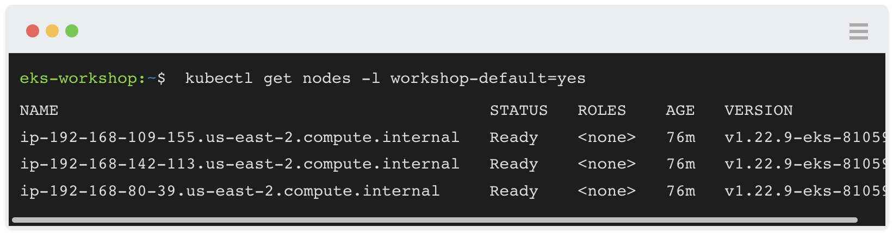
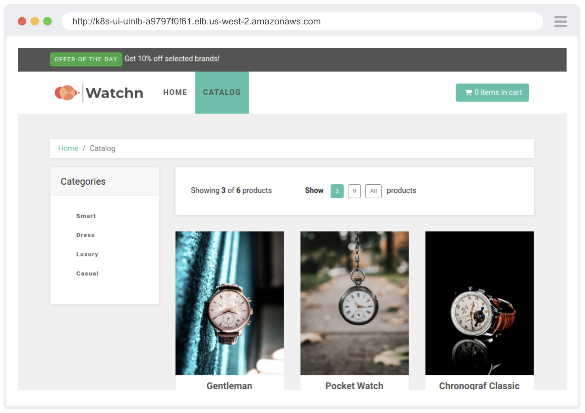

# EKS Workshop - UI Components

Docusaurus provides the framework for building the front-end of the workshop content, and this allows us to dynamically generate/modify the content and create custom components. This page documents the mechanisms available.

## Terminal Window



The terminal window component is designed to display commands that participants should run, as well as optionally it associated output.

It provides the following features:
- Supports multi-line commands using `\`
- Scrolls for content too large to display
- 'Click to copy' function which copies the command to the clipboard when clicking anywhere on the component (ignoring output)

The component will automatically render for any `code` fence in Markdown that has `bash` as the language. All commands to be run should be prefixed with `$ ` so the components can interpret what are commands and what is output:

````
```bash
$ this will display as a command
and this will be output
```
````

It will also handle this:

````
```bash
$ first line of command \
second line \
third line
this is output
```
````

## Browser Window



The browser window component is designed to display screenshots of web pages that the participants will visit during the content.

The component is used like so:

```
<browser url='http://google.com'>

</browser>
```

> NOTE: For this component to display your Markdown must use the extension `.mdx`
