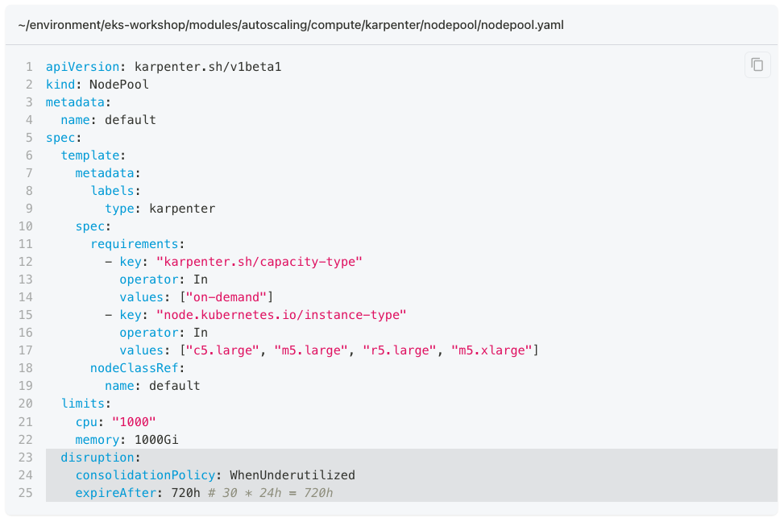
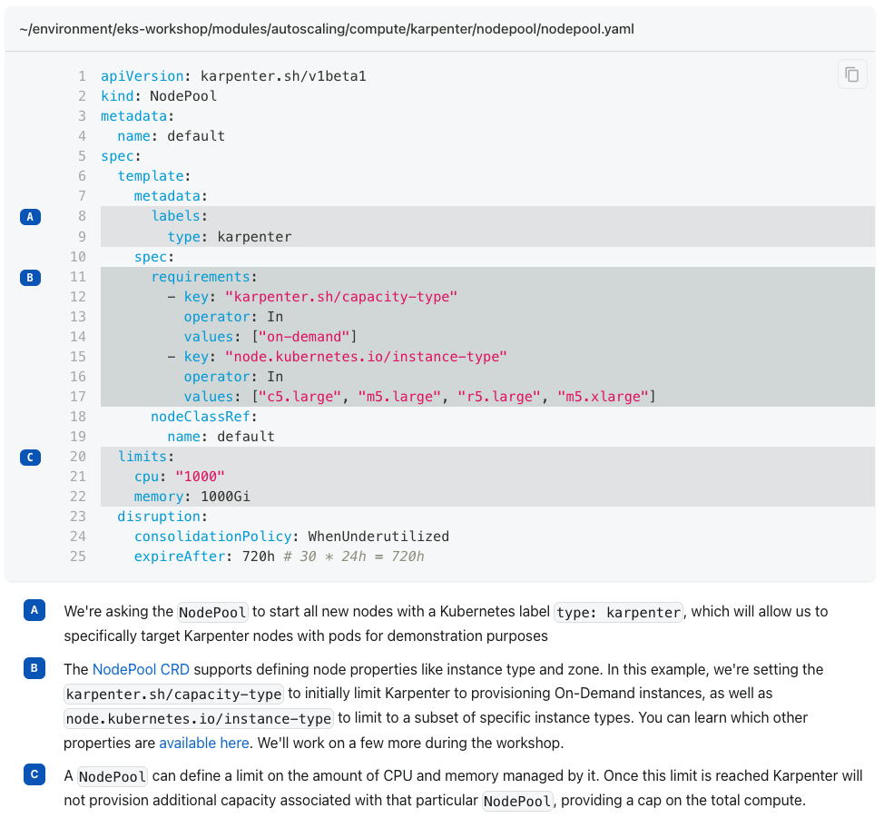

# EKS Workshop - UI Components

Docusaurus provides the framework for building the front-end of the workshop content, and this allows us to dynamically generate/modify the content and create custom components. This page documents the mechanisms available.

## Terminal Window


The terminal window component is designed to display commands that participants should run, as well as optionally it associated output.

It provides the following features:

- Supports multi-line commands using `\`
- Scrolls for content too large to display
- 'Click to copy' function which copies the command to the clipboard when clicking anywhere on the component (ignoring output)

The component will automatically render for any `code` fence in Markdown that has `bash` as the language. All commands to be run should be prefixed with `$ ` so the components can interpret what are commands and what is output:

````
```bash
$ this will display as a command
and this will be output
```
````

It will also handle this:

````
```bash
$ first line of command \
second line \
third line
this is output
```
````

Multiple commands can be displayed in the same terminal window:

````
```bash
$ first command
output of the first command
$ second command
output of the second command
```
````

## YAML file



Working with Kubernetes involves a lot of YAML and this can be challenging to explain to a participant, especially for larger blocks of YAML. The YAML file component is intended to provide a mechanism to make this easier for content authors both in terms of breaking down complex YAML as well as for maintainability.

The above screenshot would be accomplish with something like this:

```bash
::yaml{file="manifests/modules/autoscaling/compute/karpenter/nodepool/nodepool.yaml" paths="spec.disruption"}
```

This consists of two parts:

1. The `file` attribute is file path to an existing YAML file somewhere in the project
2. The `paths` attribute a YAML path within the file to lookup one or more parts of the file, it can be comma-separated

The paths attribute can display individual fields, sections or items in an array, see these examples related to the above YAML:

1. `paths="spec.disruption.consolidationPolicy"` would only highlight the `consolidationPolicy` field instead of the entire `disruption` block
2. `paths="spec.template.spec.requirements[0]"` would highlight the first element of the requirements array
3. `paths="spec.template.spec.requirements[0].values"` would highlight the `values` field of the first element of the requirements array

Using the `paths` attribute has several advantanges over the typical Docusaurus highlighting:

1. Using hard-coded line numbers can become out-of-sync with the content of a file if it is changed
2. Using comments in the YAML file pollutes the file itself, and makes it harder for the participant to inspect the file on their own

You can optionally provide "annotations" for the respective `paths` to provide call-outs to explain each path that is highlights:



This is done by adding an ordered markdown list immediately after the `::yaml` directive:

```
::yaml{file="manifests/modules/autoscaling/compute/karpenter/nodepool/nodepool.yaml" paths="spec.template.metadata.labels,spec.template.spec.requirements, spec.limits"}

1. We're asking the `NodePool` to start all new nodes with a Kubernetes label `type: karpenter`, which will allow us to specifically target Karpenter nodes with pods for demonstration purposes
2. The [NodePool CRD](https://karpenter.sh/docs/concepts/nodepools/) supports defining node properties like instance type and zone. In this example, we're setting the `karpenter.sh/capacity-type` to initially limit Karpenter to provisioning On-Demand instances, as well as `node.kubernetes.io/instance-type` to limit to a subset of specific instance types. You can learn which other properties are [available here](https://karpenter.sh/docs/concepts/scheduling/#selecting-nodes). We'll work on a few more during the workshop.
3. A `NodePool` can define a limit on the amount of CPU and memory managed by it. Once this limit is reached Karpenter will not provision additional capacity associated with that particular `NodePool`, providing a cap on the total compute.
```

If using annotations then all paths should have a corresponding list entry, and the code lines will always be annotated in the order of the paths as listed in the attribute.

## Console button


The console button component is designed to provide a consistent way to link to the AWS console.

The component is used like so:

```jsx
<ConsoleButton
  url="https://console.aws.amazon.com/cloudwatch/home#dashboards"
  service="cloudwatch"
  label="Open CloudWatch console"
/>
```

The `service` parameter dictates the icon that is shown, and the corresponding image must exist in `website/static/img/services`.

## Browser Window


The browser window component is designed to display screenshots of web pages that the participants will visit during the content.

The component is used like so:

```
<browser url='http://google.com'>

</browser>
```

> NOTE: For this component to display your Markdown must use the extension `.mdx`
