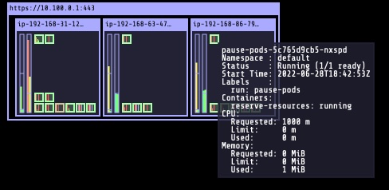
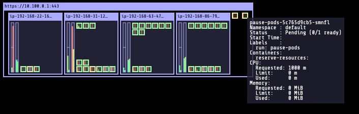

# Configuring Over Provisioning with Cluster Autoscaler

## Create Default Priority Class 

It is best practice to create appropriate PriorityClass for your applications. A global default priority class can be created with the flag **`globalDefault:true`**. This default PriorityClass will be assigned pods/deployments that don’t specify a `PriorityClassName`.

```bash
# Create a Directory
mkdir -p ~/environment/overprovision-lab

# Create the PriorityClass yaml file for Global Default
cat <<EOF > default-priorityclass.yaml
---
apiVersion: scheduling.k8s.io/v1
kind: PriorityClass
metadata:
   name: default
value: 0
globalDefault: true
description: "Default Priority class."
EOF

# Apply and Create the object in the cluster
kubectl apply -f default-priorityclass.yaml
```

## Create Over provisioning Pod’s Priority Class

Next create PriorityClass that will be assigned to Pause containers used for over provisioning.

```bash

# Create the PriorityClass yaml file for overprovisioned pause container 
cat <<EOF > ~/environment/overprovision-lab/pause-priorityclass.yaml
---
apiVersion: scheduling.k8s.io/v1
kind: PriorityClass
metadata:
   name: pause-pods
value: -1
globalDefault: false
description: "Priority class used by pause-pods for overprovisioning."
EOF

# Apply and Create the object in the cluster
kubectl apply -f ~/environment/overprovision-lab/pause-priorityclass.yaml
```

Verify priority classes using the command (output shows system default priority classes as well).

```bash
kubectl get priorityclass
```

The output will show the PriortyClass created with appropriate values

```
NAME                      VALUE        GLOBAL-DEFAULT   AGE
default                   0            true             82s
pause-pods                -1           false            9s
system-cluster-critical   2000000000   false            17d
system-node-critical      2000001000   false            17d
```

## Configure Cluster Autoscaler to allow for “best-effort” pod based scaling

Patch Cluster Autoscaler to set flag **`expendable-pods-priority-cutoff`** to value **`-10`** so Pause pods are taken into consideration when Cluster Autoscaler does the scaling operation.

```bash

# Patch the Cluster Autoscaler so it takes expendable pod into account for making scaling decisions
kubectl patch deployment cluster-autoscaler -n kube-system \
-p '{"spec": {"template": {"spec": {"containers": [{"name": "cluster-autoscaler","command": ["./cluster-autoscaler","--v=4","--stderrthreshold=info","--cloud-provider=aws","--skip-nodes-with-local-storage=false","--expander=least-waste","--node-group-auto-discovery=asg:tag=k8s.io/cluster-autoscaler/enabled,k8s.io/cluster-autoscaler/eksworkshop-eksctl","--balance-similar-node-groups","--skip-nodes-with-system-pods=false","--expendable-pods-priority-cutoff=-10"]}]}}}}'
```

## Configure AWS AutoScaling Group (ASG)

Configure the ASG’s max-size to be a value that will accommodate your over provisioning needs. Here we are configuring `—max-size` to 4 and the current cluster has 3 nodes (*`—desired-capacity 3`*).

```bash
# Get ASG name
export ASG_NAME=$(aws autoscaling describe-auto-scaling-groups --query "AutoScalingGroups[? Tags[? (Key=='eks:cluster-name') && Value=='eksworkshop-eksctl']].AutoScalingGroupName" --output text)

# increase max capacity up to 4
aws autoscaling \
    update-auto-scaling-group \
    --auto-scaling-group-name ${ASG_NAME} \
    --min-size 3 \
    --desired-capacity 3 \
    --max-size 4

# Check new values
aws autoscaling \
    describe-auto-scaling-groups \
    --query "AutoScalingGroups[? Tags[? (Key=='eks:cluster-name') && Value=='eksworkshop-eksctl']].[AutoScalingGroupName, MinSize, MaxSize,DesiredCapacity]" \
    --output table
```

## Create Over provisioning Pause container deployment

Create pause containers to make sure there are enough nodes that are available based on how much over provisioning is needed for your environment. Keep in mind the `—max-size` parameter in ASG (of EKS node group). Cluster Autoscaler won’t increase number of nodes beyond this maximum specified in the ASG

```bash

# Create the deployment file for Pause Container pods
cat <<EOF > ~/environment/overprovision-lab/pause-deploy.yaml
---
apiVersion: apps/v1
kind: Deployment
metadata:
   name: pause-pods
   namespace: default
spec:
   replicas: 2
   selector:
      matchLabels:
        run: pause-pods
   template:
      metadata:
        labels:
          run: pause-pods
      spec:
        priorityClassName: pause-pods
        containers:
        - name: reserve-resources
          image: k8s.gcr.io/pause
          resources:
            requests:
              cpu: "1.5"
              memory: "1G"
EOF

# Apply and create Pause container pods
kubectl apply -f ~/environment/overprovision-lab/pause-deploy.yaml
```

## Monitoring Pod Provisioning Kube-Ops-View


We will use [kube-ops-view](https://codeberg.org/hjacobs/kube-ops-view) that was installed in the previous lab to view the eviction of Pause Pods and Critical Application containers getting deployed.

>**Note**: If you note deployed kube-ops-view install it here

Lets get the URL for kube-ops-view using the following command and open the URL in a brower

```
kubectl get svc kube-ops-view | tail -n 1 | awk '{ print "Kube-ops-view URL = http://"$4 }'
```

## Application Scaling (TODO - change based on application)

Now that we have deployed the pause pods and can see the kube-ops-view let us scale up the application.
Here is the kube-ops-view showing the Pause pods running on one of the cluster node. 

The following command shows the Pause container pods running in 2 nodes

```bash
kubectl get pods -o wide -l run=pause-pods
```

The output should show

```
NAME                          READY   STATUS    RESTARTS   AGE     IP               NODE                                          NOMINATED NODE   READINESS GATES
pause-pods-5c765d9cb5-h87hj   1/1     Running   0          7m35s   192.168.56.218   ip-192-168-63-47.us-west-2.compute.internal   <none>           <none>
pause-pods-5c765d9cb5-nxspd   1/1     Running   0          4h36m   192.168.68.232   ip-192-168-86-79.us-west-2.compute.internal   <none>           <none>
admin:~/environment $ 
```

Currently 3rd cluster node is running the pause pod and there `—max-size` of the ASG is 4, lets scale up the application.

```bash
# Create a deployment
kubectl create deployment nginx ``--``image``=``nginx #``(``TODO``:`` ``Change to app``)

# Scale the deployment
kubectl scale deployment --replicas=17 nginx
```

On the kube-ops-view browser page you should see the application scaled and the pause pods evicted. Next the Cluster Autoscaler will kick in and provision a new worked node (using the ASG) and pending Pause container pod will get deployed, this will take a few minutes.

The following command shows that the applications pods have been deployed and Pause container pods have been evicted and are in pending state.

```bash
kubectl get pods
```

The output of the above command should be similar to this

```
NAME                            READY   STATUS    RESTARTS   AGE
kube-ops-view-894bc75fb-gcw9b   1/1     Running   0          42h
nginx-6799fc88d8-2srf4          1/1     Running   0          59s
nginx-6799fc88d8-48c66          1/1     Running   0          32s
nginx-6799fc88d8-5vbfp          1/1     Running   0          59s
nginx-6799fc88d8-62xh4          1/1     Running   0          47s
nginx-6799fc88d8-67hsk          1/1     Running   0          59s
nginx-6799fc88d8-8nqjs          1/1     Running   0          59s
nginx-6799fc88d8-b988b          1/1     Running   0          32s
nginx-6799fc88d8-cfn96          1/1     Running   0          59s
nginx-6799fc88d8-d7vcp          1/1     Running   0          32s
nginx-6799fc88d8-hnkdm          1/1     Running   0          4h51m
nginx-6799fc88d8-hnkjb          1/1     Running   0          32s
nginx-6799fc88d8-jhbbt          1/1     Running   0          60s
nginx-6799fc88d8-lc69l          1/1     Running   0          47s
nginx-6799fc88d8-pkq92          1/1     Running   0          59s
nginx-6799fc88d8-pqz47          1/1     Running   0          59s
nginx-6799fc88d8-q2t5r          1/1     Running   0          60s
pause-pods-5c765d9cb5-6c82d     0/1     Pending   0          32s
pause-pods-5c765d9cb5-smnfl     0/1     Pending   0          32s
```


The screenshot shows the Pause container pods evicted and waiting to be scheduled and a new node has been added by Cluster Autoscaler, once the new node is available the Pause container pods will be scheduled.


In this workshop we have shown how to over provision your cluster to scale your critical applications immediately.

