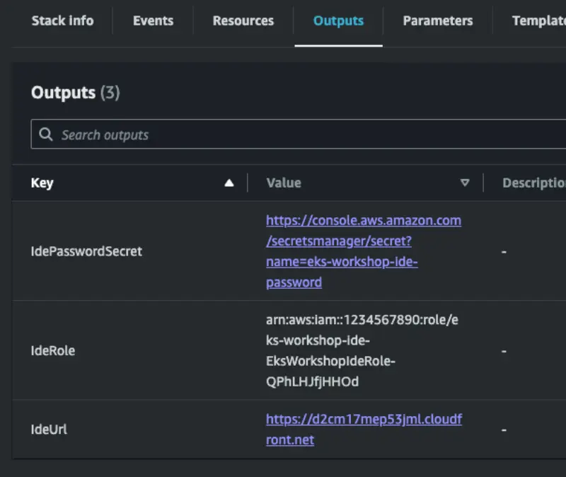
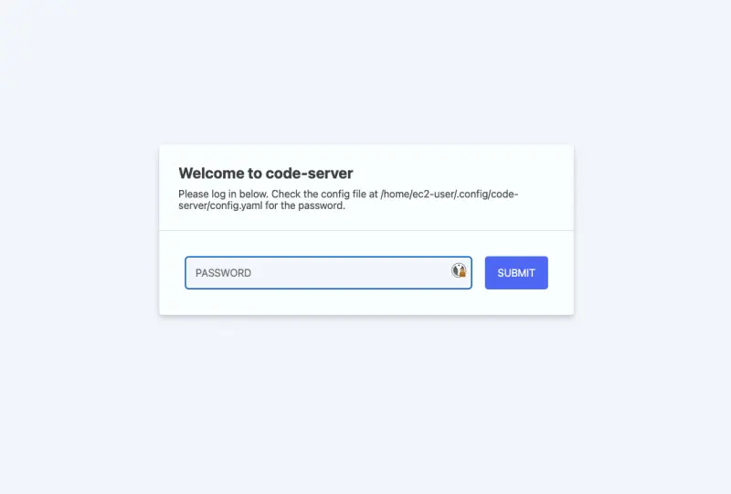

The first step is to create an IDE with the provided CloudFormation templates. Use the AWS CloudFormation quick-create links below to launch the desired template in the appropriate AWS region.

| Region           | Link                                                                                                                                                                                                                                                                                                                              |
| ---------------- | --------------------------------------------------------------------------------------------------------------------------------------------------------------------------------------------------------------------------------------------------------------------------------------------------------------------------------- |
| `us-west-2`      | [Launch](https://us-west-2.console.aws.amazon.com/cloudformation/home#/stacks/quickcreate?templateUrl=https://ws-assets-prod-iad-r-pdx-f3b3f9f1a7d6a3d0.s3.us-west-2.amazonaws.com/39146514-f6d5-41cb-86ef-359f9d2f7265/eks-workshop-vscode-cfn.yaml&stackName=eks-workshop-ide&param_RepositoryRef=VAR::MANIFESTS_REF)           |
| `eu-west-1`      | [Launch](https://eu-west-1.console.aws.amazon.com/cloudformation/home#/stacks/quickcreate?templateUrl=https://ws-assets-prod-iad-r-dub-85e3be25bd827406.s3.eu-west-1.amazonaws.com/39146514-f6d5-41cb-86ef-359f9d2f7265/eks-workshop-vscode-cfn.yaml&stackName=eks-workshop-ide&param_RepositoryRef=VAR::MANIFESTS_REF)           |
| `ap-southeast-1` | [Launch](https://ap-southeast-1.console.aws.amazon.com/cloudformation/home#/stacks/quickcreate?templateUrl=https://ws-assets-prod-iad-r-sin-694a125e41645312.s3.ap-southeast-1.amazonaws.com/39146514-f6d5-41cb-86ef-359f9d2f7265/eks-workshop-vscode-cfn.yaml&stackName=eks-workshop-ide&param_RepositoryRef=VAR::MANIFESTS_REF) |

These instructions have been tested in the AWS regions listed above and are not guaranteed to work in others without modification.

:::warning

The nature of the workshop material means that the IDE EC2 instance requires broad IAM permissions in your account, for example creating IAM roles. Before continuing please review the IAM permissions that will be provided to the IDE instance in the CloudFormation template.

We are continuously working to optimize the IAM permissions. Please raise a [GitHub issue](https://github.com/aws-samples/eks-workshop-v2/issues) with any suggestions for improvement.

:::

Scroll to the bottom of the screen and acknowledge the IAM notice:

Then click the **Create stack** button:

The CloudFormation stack will take roughly 5 minutes to deploy, and once completed you can retrieve information required to continue from the **Outputs** tab:

The `IdeUrl` output contains the URL to enter in your browser to access the IDE. The `IdePasswordSecret` contains a link to an AWS Secrets Manager secret that contains a generated password for the IDE.

To retrieve the password open the `IdePasswordSecret` URL and click the **Retrieve** button:

The password will then be available for you to copy:

Open the IDE URL provided and you will be prompted for the password:

After submitting your password you will be presented with the initial IDE screen:

