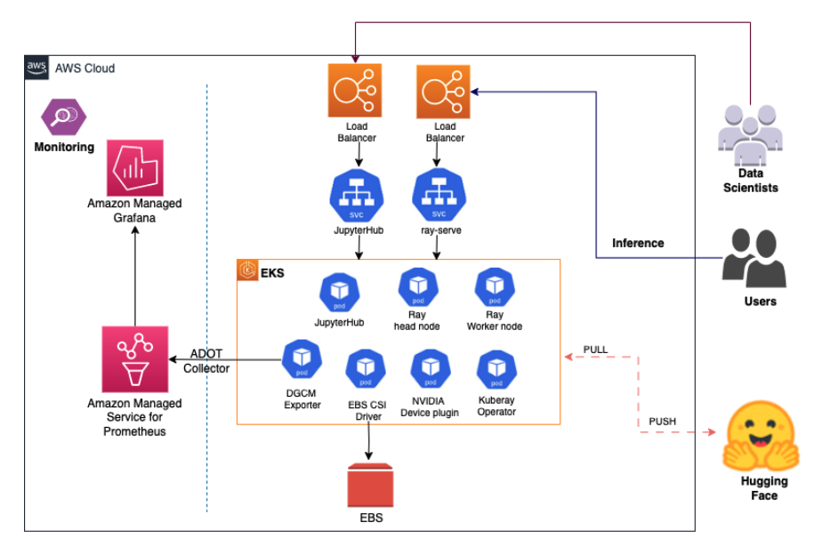

# GenAI on EKS 

Welcome to the "GenAI on Amazon EKS" workshop! In this workshop, we'll cover aspects, from creating an EKS cluster with GPU nodes to model training, inference with Ray, and real-time monitoring using Amazon Managed Prometheus and Grafana.

## High level overview 

 1. Create an EKS cluster, install EBS CSI driver & AWS Load Balancer controller, Amazon Managed Prometheus, Granfana and an AWS managed collector
 2. Install Karpenter, Nvidia device plugin and Ray cluster 
 2. Install, configure and train the model using Jupyterhub notebook 
 4. Create an Inference service using KubeRay service
 5. Monitor the GPU metrics using the Amazon Managed Prometheus and Grafana 
