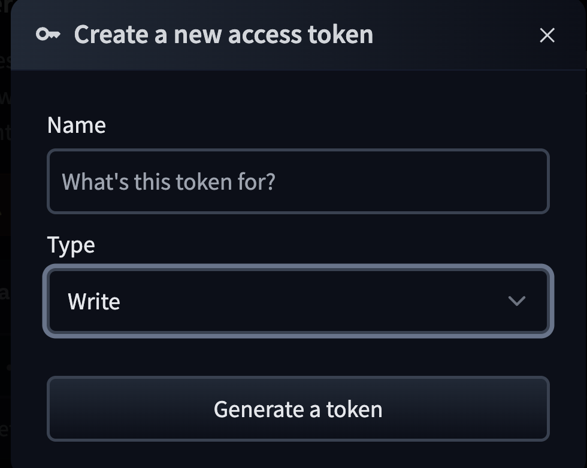
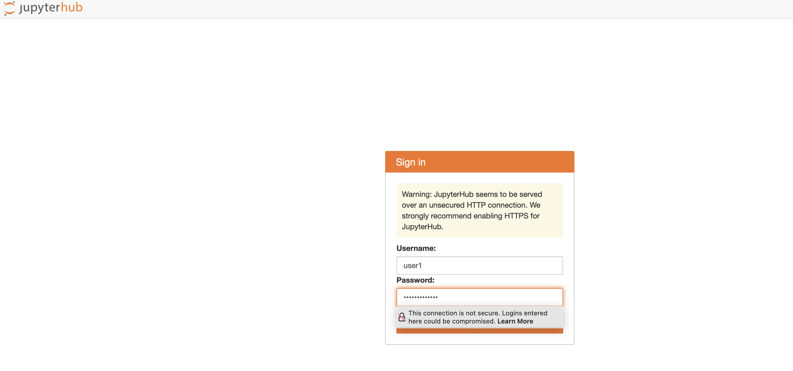
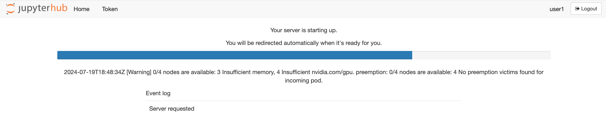
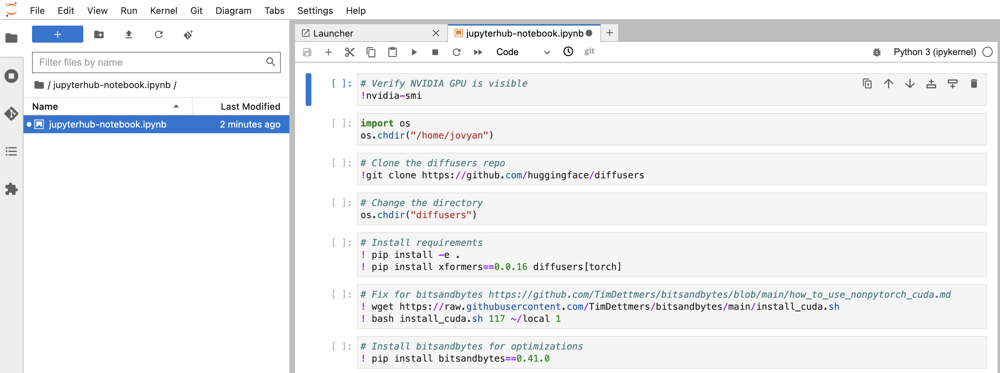

Lets train a model to make efficient inference. We will be using huggingface's diffusers, which is a good pretrained diffusion model for generating images, audio and 3D structures.

This particular lab will focus on text to image creation, upload the trained model to huggingface repository. Let's start.

### Create a Huggingface token 

Create a huggingface token with `write` permission which would allow to upload the trained model. Save the token, we will use this token in the jupyterhub notebook while training the model

- [Signup a huggingface account](https://huggingface.co/join)
- [Create huggingface user token](https://huggingface.co/docs/hub/en/security-tokens#user-access-tokens)




### Accessing the notebook

We will be using the Jupyterhub's notebook created in the previous section to train the model. 

The Jupyterhub UI is exposed using proxy and can be retrieved using the below command:


```bash timeout=300 wait=60
$ kubectl  get svc proxy-public -n jupyterhub    

NAME           TYPE           CLUSTER-IP    EXTERNAL-IP                                                                     PORT(S)        AGE
proxy-public   LoadBalancer   10.100.4.40   k8s-jupyterh-proxypub-f09eec1e26-6209b7ae072999d6.elb.us-west-2.amazonaws.com   80:30941/TCP   6d4h
```

### Train the model using the notebook

Use your browser and paste the loadbalancer url obtained in the previous step to access the notebook

Login using the username "user1" and the password as specified in the jupyterhub-values.yaml. 
 


Upon successful login, a jupyterhub-user1 pod will have to launch on a GPU instance-type, so karpenter would launch a new GPU instance-type. If the request timesout after, please relaunch the server. Note: This step could take about 10 mins to download the image and to launch the pod. 




After a successful jupyterhub-user1 server launch, you should see a jupyterhub-notebook.ipynb file is already created through a configmap and mounted as a volume inside the jupyterhub-user1 pod




### Jupyter Notebook commands

This code is a set of instructions for setting up and running a Dreambooth training script using the Hugging Face Diffusers library. Dreambooth is a technique for fine-tuning a pre-trained text-to-image model, like Stable Diffusion, to generate images of a specific subject or object. Here's a breakdown of what the code is doing:

Follow the commands and run each commands in the notebook from the top


```file
manifests/modules/aiml/deploy-monitor-genai-model/jupyterhub/jupyter.py
```


This should take approximately 90 mins to run and the model will be uploaded to your huggingface account, after successful upload, you should see the uploaded model in your hugging face profile page.

We will now proceed to inference stage and run a sample inference
