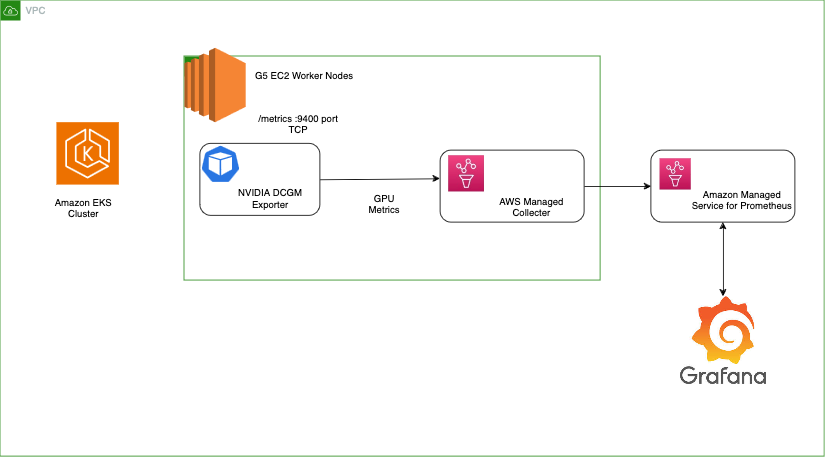
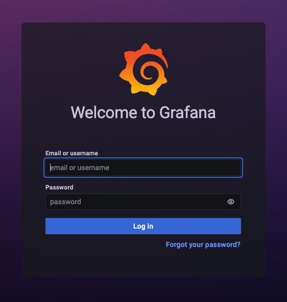
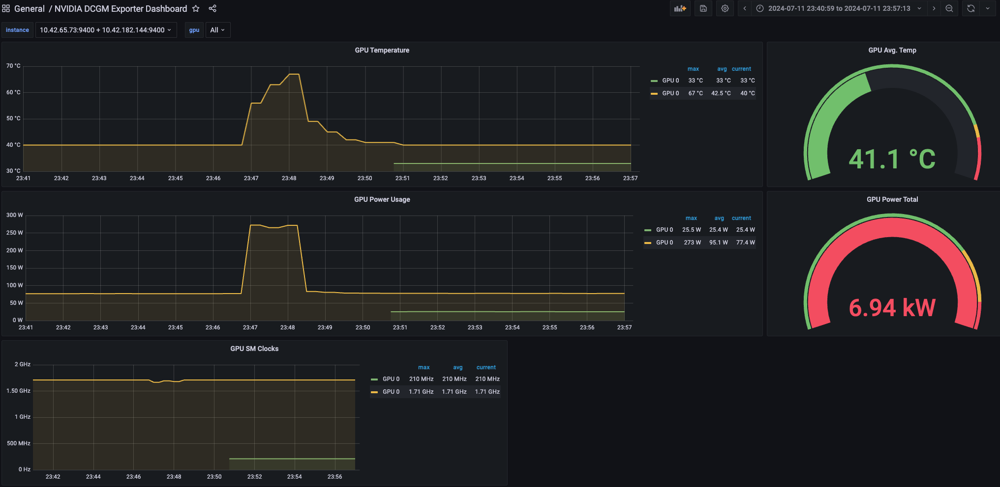

### INTRODUCTION

Monitoring GPUs is critical for infrastructure or site reliability engineering (SRE) teams who manage large-scale GPU clusters for AI or HPC workloads. GPU metrics allow teams to understand workload behavior and thus optimize resource allocation and utilization, diagnose anomalies, and increase overall data center efficiency.




### NVIDIA GPU Operator with DCGM exporter

The NVIDIA GPU Operator includes the [Data Center GPU Manager(DCGM)](https://developer.nvidia.com/dcgm) exporter that allows users to gather GPU metrics and understand workload behavior or monitor GPUs in clusters. DCGM Exporter is written in Go and exposes GPU metrics at an HTTP endpoint (/metrics) for monitoring solutions such as Prometheus.

List the DCGM exporter which was installed with the NVIDIA GPU Operator

```bash timeout=300 wait=60
$  k get po -l app=nvidia-dcgm-exporter -n gpu-operator
NAME                         READY   STATUS    RESTARTS   AGE
nvidia-dcgm-exporter-7kv5m   1/1     Running   0          7m17s
nvidia-dcgm-exporter-dzz7f   1/1     Running   0          7m15s
```


###  Amazon Managed Prometheus and AWS managed collectors

Amazon Managed Service for Prometheus provides a fully managed, agentless scraper, or collector, that automatically discovers and pulls Prometheus-compatible metrics. An Amazon Managed Service for Prometheus collector provides reliable, stable, highly available, automatically scaled collection of metrics for your Amazon EKS cluster. 

Amazon Managed Service for Prometheus and Scraper config is installed as a part of `prepare-environment` 


```bash timeout=300 wait=60
$ aws amp list-workspaces
{
    "workspaces": [
        {
            "alias": "eks-workshop",
            "arn": "arn:aws:aps:us-west-2:xxxxxxx:workspace/ws-7fc19106-a435-4dfc-8eb5-85adab4fd8fb",
            "createdAt": "2024-07-14T19:38:47.569000+00:00",
            "status": {
                "statusCode": "ACTIVE"
            },
            "tags": {
                "AMPAgentlessScraper": ""
            },
            "workspaceId": "ws-7fc19106-a435-4dfc-8eb5-85adab4fd8fb"
        }
    ]
}
```


```bash timeout=300 wait=60
$ aws amp list-scrapers
{
    "scrapers": [
        {
            "arn": "arn:aws:aps:us-west-2:xxxxxxxxxx    :scraper/s-d68e97b6-91e7-4669-8430-ea7899d95861",
            "createdAt": "2024-07-14T18:29:31.380000+00:00",
            "destination": {
                "ampConfiguration": {
                    "workspaceArn": "arn:aws:aps:us-west-2:xxxxxxxxx:workspace/ws-84ed8c27-64e8-460f-8fc0-2cf9b014e05e"
                }
            },
            "lastModifiedAt": "2024-07-14T18:48:22.262000+00:00",
            "roleArn": "arn:aws:iam::xxxxxxxx:role/aws-service-role/scraper.aps.amazonaws.com/AWSServiceRoleForAmazonPrometheusScraper_94e9c92f-32c2-4",
            "scraperId": "s-d68e97b6-91e7-4669-8430-ea7899d95861",
            "source": {
                "eksConfiguration": {
                    "clusterArn": "arn:aws:eks:us-west-2:xxxxxxxx:cluster/eks-workshop",
......

```


### Visualize the GPU metrics from Grafana

An instance of Grafana has been pre-installed in your EKS cluster. To access it you first need to retrieve the URL:

```bash hook=check-grafana
$ kubectl get ingress -n grafana grafana -o=jsonpath='{.status.loadBalancer.ingress[0].hostname}{"\n"}'
k8s-grafana-grafana-58ac8e1da0-1223202662.us-west-2.elb.amazonaws.com
```

Opening this URL in a browser will bring up a login screen.



To retrieve the credentials for the user query the secret created by the Grafana helm chart:

```bash
$ kubectl get -n grafana secrets/grafana -o=jsonpath='{.data.admin-user}' | base64 -d; printf "\n"
$ kubectl get -n grafana secrets/grafana -o=jsonpath='{.data.admin-password}' | base64 -d; printf "\n"
```

After logging into the Grafana console, let's take a look at the datasources section. You should see the Amazon Managed Service for Prometheus workspace configured as a datasource already.

NVIDIA

To now start a Grafana dashboard for GPU metrics, import the reference NVIDIA dashboard 12239

