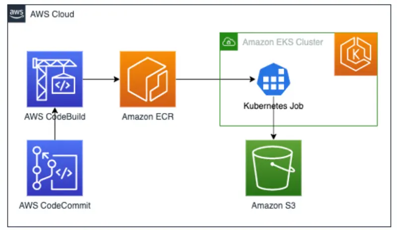
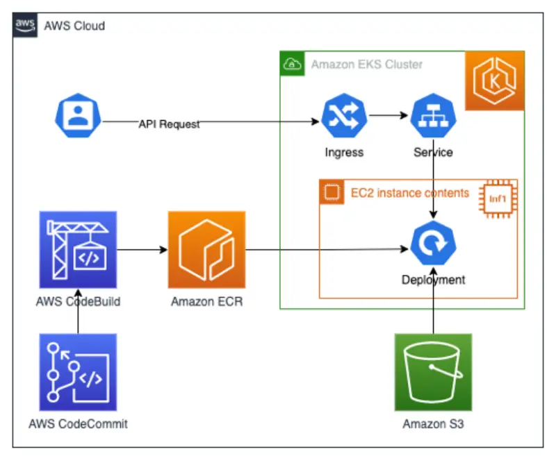

In the previous sections we've seen how we can use Amazon EKS to train models for AWS Inferentia and deploy models on EKS using Inferentia nodes. In both these examples we've executed Python code inside our containers from our command line. In a real world scenario we do not want to run these commands manually, but rather have the container execute the commands.

For training the model we would want to use the DLC container as our base image and add our Python code to it. We would then store this container image in our container repository like Amazon ECR. We would use a Kubernetes Job to run this container image on EKS and store the generated model to S3.

For running inference against our model we would want to modify our code to allow other applications or users to retrieve the classification results from the model. This could be done by creating a REST API that we can call and responds with our classification results. We would run this application as a Kubernetes Deployment within our cluster using the AWS Inferentia resource requirement: `aws.amazon.com/neuron`.

