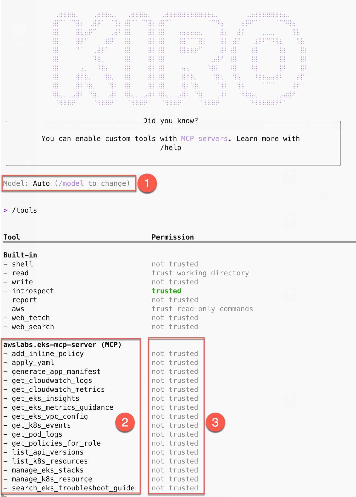

In this section we will configure Amazon Q CLI along with the [MCP server for Amazon EKS](https://awslabs.github.io/mcp/servers/eks-mcp-server/) to work with the EKS cluster using natural language commands.

:::info
Amazon Q CLI is leverages generative AI capabilities for common development and operations tasks. Its capabilities can be enhanced by adding purpose-built MCP servers for specialized knowledge. We'll use the Amazon EKS MCP server with Amazon Q CLI in this section. You can find a catalog of AWS-provided MCP servers [here](https://awslabs.github.io/mcp/), which can be used with Amazon Q CLI in a similar way.
:::

First, download the Amazon Q CLI release for your operating system and CPU architecture:

```bash
$ ARCH=$(arch)
$ curl --proto '=https' --tlsv1.2 \
  -sSf https://desktop-release.q.us-east-1.amazonaws.com/1.12.4/q-${ARCH}-linux.zip \
  -o /tmp/q.zip
```

Install Amazon Q CLI:

```bash
$ unzip /tmp/q.zip -d /tmp
$ sudo Q_INSTALL_GLOBAL=true /tmp/q/install.sh --no-confirm
```

Verify the installation:

```bash
$ q --version
q 1.12.4
```

Next, we'll configure Amazon Q CLI with the Amazon EKS MCP server. Here is the configuration we'll use:

```file
manifests/modules/aiml/q-cli/setup/eks-mcp.json
```

Configure the MCP server and install the required `uvx` tool:

:::info
`uvx` is a Python package runner tool that comes with the uv package manager. It runs Python packages directly without installing them globally. Then, it downloads and executes Python tools in isolated environments similar to `npx` for Node.js, but for Python packages.
:::

```bash
$ mkdir -p $HOME/.aws/amazonq
$ cp ~/environment/eks-workshop/modules/aiml/q-cli/setup/eks-mcp.json $HOME/.aws/amazonq/mcp.json
$ curl -LsSf https://astral.sh/uv/0.8.9/install.sh | sh
```

To use Amazon Q CLI, you'll need to authenticate using either an AWS Builder ID or a Pro license subscription.

:::tip
You can create a free AWS Builder ID by following [these instructions](https://docs.aws.amazon.com/signin/latest/userguide/create-aws_builder_id.html). This Builder ID can also be used for personal use of Amazon Q CLI.
:::

```bash test=false
$ q login
? Select login method >
> Use for Free with Builder ID
  Use with Pro license
```

Select your preferred option and follow the prompts to complete the login process. You'll be redirected to a webpage to either login and/or authorize Amazon Q Developer to use your account. For additional guidance, refer to:

- [Sign-in with AWS Builder ID](https://docs.aws.amazon.com/signin/latest/userguide/sign-in-aws_builder_id.html)
- [Sign-in with Amazon Q Developer Pro subscriptions](https://docs.aws.amazon.com/amazonq/latest/qdeveloper-ug/q-admin-setup-subscribe-general.html)

Let's verify that the MCP server is available by initializing a session:

```bash test=false
$ q
0 of 1 mcp servers initialized. Servers still loading:
 - awslabseks_mcp_server
```

To see the tools offered by the EKS MCP server, run:

```text
/tools
```

You should see output similar to this:



The output shows:

1. The default large language model (LLM) selected by Amazon Q (can be changed using the `/model` command)
2. The list of tools offered by the EKS MCP server
3. The default permissions Amazon Q CLI has for each tool

:::info
When a tool is marked as `not trusted`, Amazon Q CLI will request your permission before using it. This is a safety measure, particularly for tools that can create, update, or delete resources. Since LLMs can make mistakes, this gives you an opportunity to review potentially disruptive actions before they're executed.
:::

You can follow the same procedure to add other [MCP servers from AWS Labs](https://awslabs.github.io/mcp/) for additional capabilities. For this lab, we'll only need the EKS MCP server we've configured.

In the next section, we'll use Amazon Q CLI to retrieve information about our EKS cluster.
