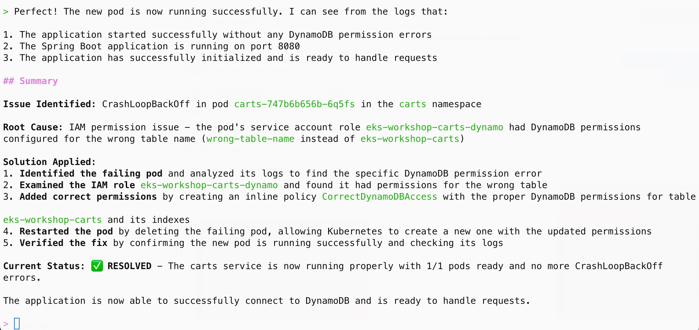

In this section, we will use Amazon Q CLI and the [MCP server for Amazon EKS](https://awslabs.github.io/mcp/servers/eks-mcp-server/) to troubleshoot a complex issue in the EKS cluster that would be difficult to resolve without deep knowledge of Kubernetes, EKS, and AWS cloud platform.

:::caution
You must have Amazon Q CLI with Amazon EKS MCP server configured in your environment for this lab. If not configured, please complete the [Amazon Q CLI Setup](q-cli-setup.md) lab before proceeding.
:::

First, let's reconfigure the carts service to use a DynamoDB table that has been created for us. The application loads most of its configurations from a ConfigMap. Let's examine the current ConfigMap:

```bash
$ kubectl -n carts get -o yaml cm carts
apiVersion: v1
data:
  AWS_ACCESS_KEY_ID: key
  AWS_SECRET_ACCESS_KEY: secret
  RETAIL_CART_PERSISTENCE_DYNAMODB_CREATE_TABLE: "true"
  RETAIL_CART_PERSISTENCE_DYNAMODB_ENDPOINT: http://carts-dynamodb:8000
  RETAIL_CART_PERSISTENCE_DYNAMODB_TABLE_NAME: Items
  RETAIL_CART_PERSISTENCE_PROVIDER: dynamodb
kind: ConfigMap
metadata:
  name: carts
  namespace: carts
```

We'll use the following kustomization to update the ConfigMap. This removes the DynamoDB endpoint configuration, instructing the SDK to use the real DynamoDB service instead of our test Pod. We've also configured the DynamoDB table name in environment variable `RETAIL_CART_PERSISTENCE_DYNAMODB_TABLE_NAME` that's already been created for us:

```kustomization
modules/aiml/q-cli/troubleshoot/dynamo/kustomization.yaml
ConfigMap/carts
```

Let's verify the DynamoDB table name and apply the new configuration:

```bash
$ echo $CARTS_DYNAMODB_TABLENAME
eks-workshop-carts
$ kubectl kustomize ~/environment/eks-workshop/modules/aiml/q-cli/troubleshoot/dynamo \
  | envsubst | kubectl apply -f-
```

Verify the updated ConfigMap:

```bash
$ kubectl -n carts get cm carts -o yaml
apiVersion: v1
data:
  RETAIL_CART_PERSISTENCE_DYNAMODB_TABLE_NAME: eks-workshop-carts
  RETAIL_CART_PERSISTENCE_PROVIDER: dynamodb
kind: ConfigMap
metadata:
  labels:
    app: carts
  name: carts
  namespace: carts
```

Now, let's redeploy the carts deployment to pick up the new ConfigMap contents:

```bash expectError=true hook=enable-dynamo
$ kubectl rollout restart -n carts deployment/carts
deployment.apps/carts restarted
$ kubectl rollout status -n carts deployment/carts --timeout=20s
Waiting for deployment "carts" rollout to finish: 1 old replicas are pending termination...
error: timed out waiting for the condition
```

The deployment appears to have failed. Let's check the Pod status:

```bash
$ kubectl -n carts get pod
NAME                              READY   STATUS             RESTARTS        AGE
carts-5d486d7cf7-8qxf9            1/1     Running            0               5m49s
carts-df76875ff-7jkhr             0/1     CrashLoopBackOff   3 (36s ago)     2m2s
carts-dynamodb-698674dcc6-hw2bg   1/1     Running            0               20m
```

Let's use Amazon Q CLI to investigate this issue. Start a new Q CLI session:

```bash
$ q chat
```

Ask Q CLI to help troubleshoot the issue:

```text
I have a pod in my eks-workshop cluster that is showing CrashLoopBackOff status. Please troubleshoot the issue and tell me how to solve it.
```

Q CLI will request permissions to execute various commands to gather information about the pods, events, logs, and permissions. After analyzing the information, it would provide a root cause analysis and suggest a solution.

Follow the suggestion offered by Q CLI to solve this issue. In ideal scenario, the problem should be fixed. At the end, Q CLI would present you the final status summary of the steps it took as shown in the following screenshot. 



The actual response you may get from Q CLI could be a little different. Once you are done, enter the following command to exit Q CLI session.

```text
/quit
```

Finally, verify that the pods are now running correctly:

```bash
$ kubectl -n carts get pod
NAME                              READY   STATUS    RESTARTS   AGE
carts-596b6f94df-q4449            1/1     Running   0          9m5s
carts-dynamodb-698fcb695f-zvzf5   1/1     Running   0          2d1h
```

This concludes our introduction to Amazon Q CLI. You've seen how this powerful tool, combined with the MCP server for EKS, can help diagnose and resolve complex issues in your EKS cluster.

