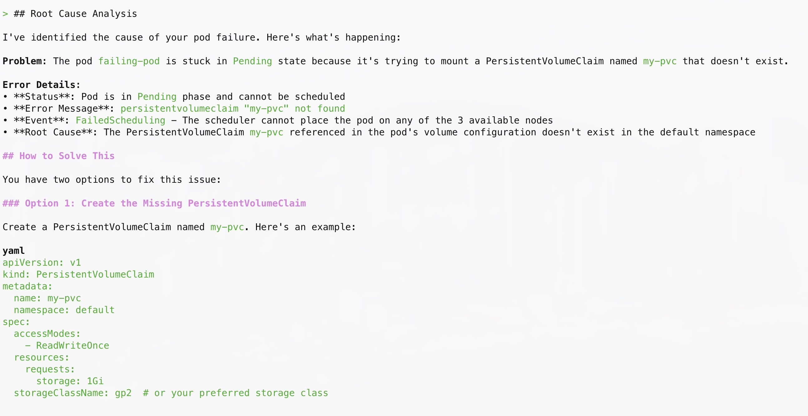

In this section, we'll use Amazon Q CLI and the [MCP server for Amazon EKS](https://awslabs.github.io/mcp/servers/eks-mcp-server/) to troubleshoot issues in the EKS cluster. 

:::caution
Amazon Q CLI with Amazon EKS MCP server must be configured in your environment for this lab. If you haven't set this up yet, please complete the [Amazon Q CLI Setup](q-cli-setup.md) lab before proceeding.
:::

Let's start by deploying a failing pod in your cluster, which we'll then troubleshoot using Amazon Q CLI.

::yaml{file="manifests/modules/aiml/q-cli/troubleshoot/failing-pod.yaml"}

```bash
$ kubectl apply -f ~/environment/eks-workshop/modules/aiml/q-cli/troubleshoot/failing-pod.yaml
```

Check the status of the pod:

```bash
$ kubectl get pods -n default 
NAME          READY   STATUS    RESTARTS   AGE
failing-pod   0/1     Pending   0          5m29s
```

As you can see, there's a pod in a pending state in the cluster. Let's use Q CLI to investigate the cause.

Start a new Q CLI session:

```bash
$ q chat
```

Ask Q CLI to help troubleshoot the issue by entering the following question:

```text
I have a failing pod in my eks-workshop cluster. Please find the cause of the failure and let me know how to solve it.
```

Q CLI will analyze the cluster state and provide a root cause analysis for the pod being in the pending state. The response you receive may vary, but it should look similar to this:



Now that we've identified the issue, let's clean up. First, exit the Q CLI session:

```text
/quit
```

Then remove the failing pod:

```bash
$ kubectl delete -f ~/environment/eks-workshop/modules/aiml/q-cli/troubleshoot/failing-pod.yaml --ignore-not-found
```

In the next section, we'll explore a more complex troubleshooting scenario.

