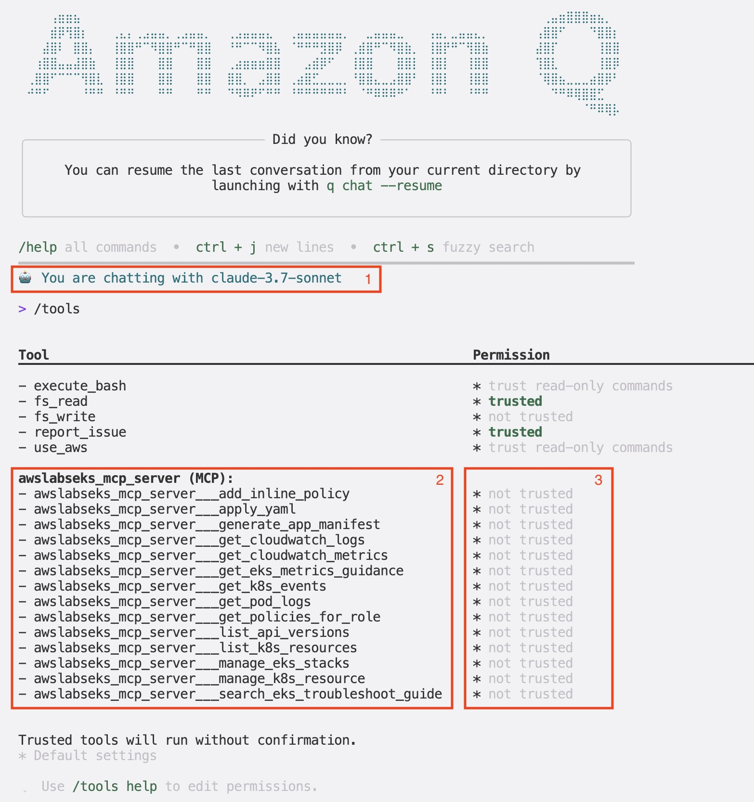

In this section we will configure Amazon Q CLI along with the [MCP server for Amazon EKS](https://awslabs.github.io/mcp/servers/eks-mcp-server/) to work with the EKS cluster in this environment using natural language. 

:::tip
Amazon Q CLI is a very powerful tool that uses generative AI agentic capabilities for many common development and operations tasks. Additionally, you can enhance its capabilities by adding purpose-built MCP servers for specialized knowledge. We are going to use one such MCP server with Amazon Q CLI for Amazon EKS in this section. You can find a big catalog of Amazon provided MCP servers [here](https://awslabs.github.io/mcp/), which you can use with Amazon Q CLI in the similar way.
:::

Run the following command to download Amazon Q CLI binary based on your operating system architecture:

```bash
$ ARCH=$(arch) && curl --proto '=https' --tlsv1.2 -sSf https://desktop-release.q.us-east-1.amazonaws.com/1.12.4/q-${ARCH}-linux.zip -o q.zip
```

Run the following commands to install Amazon Q CLI:

```bash
$ unzip q.zip
$ sudo Q_INSTALL_GLOBAL=true ./q/install.sh --no-confirm
```

Run the following command to verify the installation:

```bash
$ q --version
q 1.12.4
```

Now, we will equip Amazon Q CLI with Amazon EKS MCP server. Here is the Amazon EKS MCP server configuration that we will add to Amazon Q CLI:

```file
manifests/modules/aiml/q-cli/setup/eks-mcp.json
```

The following commands configure the MCP server and installs `uvx` tool required for EKS MCP server to function. 

```bash
$ mkdir -p $HOME/.aws/amazonq 
$ cp ~/environment/eks-workshop/modules/aiml/q-cli/setup/eks-mcp.json $HOME/.aws/amazonq/mcp.json
$ curl -LsSf https://astral.sh/uv/install.sh | sh
```

The installation of Amazon Q CLI with Amazon EKS MCP server configuration is complete with this step. To use Amazon Q CLI, you will need to login either using your AWS Builder ID or your Pro license subscription. 

:::tip
If you don't have any of the required credentials, you may create a new AWS Builder ID for free using [this reference](https://docs.aws.amazon.com/signin/latest/userguide/create-aws_builder_id.html). You may use this Builder ID to use Amazon Q CLI for your personal use as well. 
:::

```bash
$ q login
? Select login method >
> Use for Free with Builder ID
  Use with Pro license
```

Select the applicable option and follow the prompt to complete the login process. Depending on your chosen option, you will be redirected to a webpage to either login and/or authorize Amazon Q Developer to use your account. Use the following references if you need:

- [Sign-in with AWS Builder ID](https://docs.aws.amazon.com/signin/latest/userguide/sign-in-aws_builder_id.html)
- [Sign-in with Amazon Q Developer Pro subscriptions](https://docs.aws.amazon.com/amazonq/latest/qdeveloper-ug/q-admin-setup-subscribe-general.html)

After successful login, you will be able to use Amazon Q CLI with Amazon EKS MCP server. Let's verify if the MCP server is listed as one of the tools available for Amazon Q CLI.

For that, let's first initialize a session for Amazon Q CLI:

```bash
$ q 
0 of 1 mcp servers initialized. Servers still loading:
 - awslabseks_mcp_server
```

As you can see, the MCP server for Amazon EKS is initialized as one of the tools available for Amazon Q CLI. Now, run the following command to list the tools offered by the EKS MCP server.
```text
/tools
```
You should see the following output:



1. **The default large language model (LLM) selected by Amazon Q** - you can change this selection using `/model` command in Amazon Q CLI session.
2. **The list of tools offered by the EKS MCP server** - Amazon Q CLI will intelligently determine which tool can be used for which task. 
3. **The default permissions Amazon Q CLI has to use a listed tool** - When the permission listed as `not trusted`, Amazon Q CLI asks for your permission to use a tool for a given task. It is a good practice to not trust the tools that can perform either create, update, or delete operations. It is possible that LLMs can make mistakes. So by not trusting a tool, you can get a chance to review the disruptive action carefully and allow or deny the action .

Now as you have learned how to configure an MCP server to Amazon Q CLI, you can follow the same procedure to add several such [MCP servers for many other capabilities open-sourced by AWS Labs](https://awslabs.github.io/mcp/). For this lab, we will not need any other MCP server than the one we already configured. 

Now, let's proceed to the next section of this lab where we will use Amazon Q CLI to get our EKS cluster details.
