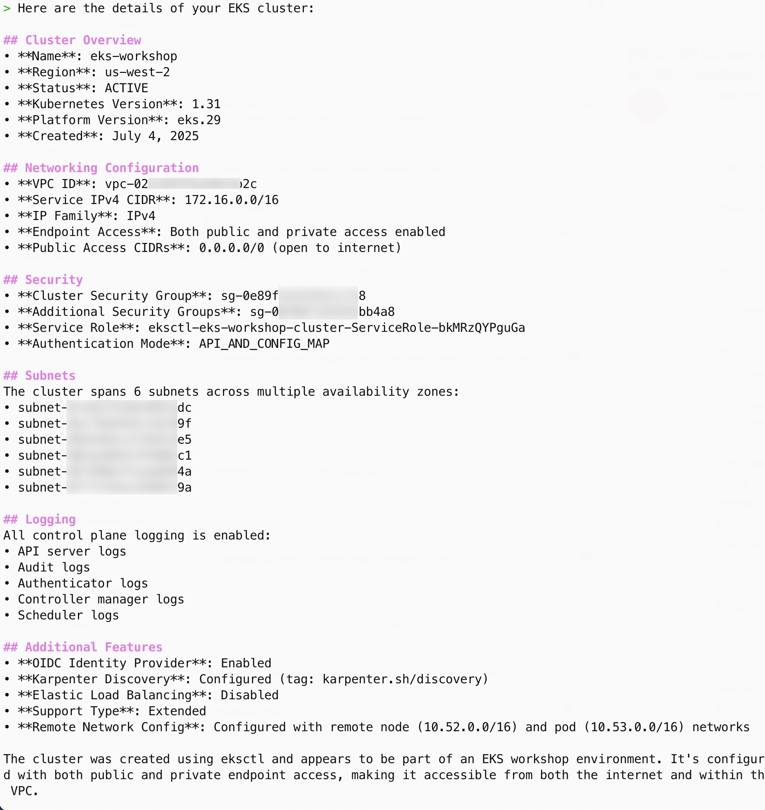

In this section we will use Amazon Q CLI along with the [MCP server for Amazon EKS](https://awslabs.github.io/mcp/servers/eks-mcp-server/) to retrieve details of the EKS cluster using natural language commands.

:::caution
You must have an active Amazon Q CLI session in your terminal for this lab. If you don't have one, please complete the [Amazon Q CLI Setup](q-cli-setup.md) lab before proceeding.
:::

:::info
The `>` symbol at the beginning of a command line indicates you have an active Amazon Q CLI session. You can type or paste the prompt text provided in this lab at this prompt. If you don't see the `>` prompt, restart your Amazon Q CLI session using the `q chat` command.
:::

Let's start by getting details about our EKS cluster. Enter the following prompt:

```text
Please provide me the details of the EKS cluster in my current context.
```

Observe how Amazon Q CLI processes this natural language command. You'll notice it executes various `aws` CLI commands, indicated by the caption `Using tool: use_aws`. For this request, Amazon Q CLI didn't need to use any tools from the EKS MCP server.

You should see an EKS cluster summary generated in Markdown format similar to the following:



Now, let's try a more complex query that requires the EKS MCP server:

```text
List all pods with their IP addresses along with the host names they are running on.
```

If the EKS MCP server is properly configured, you'll see the following line indicating the use of EKS MCP server tools:

```
🛠️ Using tool: list_k8s_resources from mcp server awslabseks_mcp_server
```

:::note
The first time you use an MCP server tool, Amazon Q CLI will ask for permission:

```
Allow this action? Use 't' to trust (always allow) this tool for the session. [y/n/t]:
```

You can press `t` and then `Enter` to trust this tool for the session, as it performs read-only operations.
:::

After approval, you'll see detailed output similar to:


Let's perform an even more complex task - deploying a test pod and checking internet connectivity:

```text
Deploy a test pod in my cluster and check if it can access internet. If the test is successful, remove the test pod. Otherwise, troubleshoot the issue and suggest solutions.
```

This complex task demonstrates several capabilities of Amazon Q CLI:
- Processing natural language commands
- Creating step-by-step execution plans
- Selecting appropriate tools from its toolkit
- Generating clear operation summaries

You should see output similar to:


To exit the Q CLI session, enter:

```text
/quit
```

In the next section, we'll explore how to use Amazon Q CLI for cluster troubleshooting.

