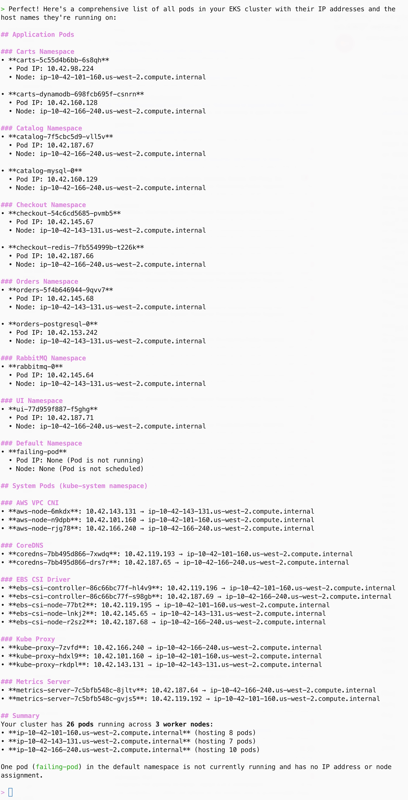
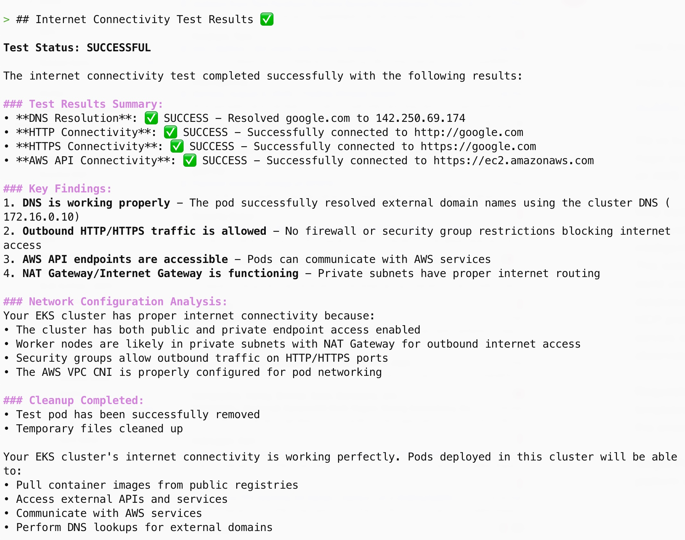

In this section we will use Amazon Q CLI along with the [MCP server for Amazon EKS](https://awslabs.github.io/mcp/servers/eks-mcp-server/) to retrieve details of the EKS cluster in this environment using natural language. 

:::caution
You should have an active Amazon Q CLI session in your terminal for this lab. If that is not the case, please complete [Amazon Q CLI Setup](q-cli-setup.md) lab before you proceed for this lab.
:::

:::tip
You should see `>` symbol in the beginning of a command line in the terminal you are working on. This symbol indicates that you are having an active Amazon Q CLI session. You can type or paste the prompt texts given in this lab there to invoke Amazon Q CLI operation. If you don't see `>` prompt then you will need to restart Amazon Q CLI session using `q chat` command.
:::

Input the following prompt text to Q CLI.

```text
Please provide me the details of the EKS cluster in my current context.
```

Observe carefully how Amazon Q CLI executes this natural language command. You will notice that it ran various `aws` CLI commands with a caption `Using tool: use_aws`. For this request, Amazon Q CLI did not have to use any tool offered by the EKS MCP server. 

You should see a similar EKS cluster summary generated by Amazon Q CLI in Markdown format as shown in the following image. Because of the nondeterministic nature of large language models (LLM), your output may differ to some extent.


Now, let's try something complex where Amazon Q CLI would need to use a tool provided by the EKS MCP server.

Send the following request to Amazon Q CLI, which will invoke a tool from the EKS MCP server.

```text
List all pods with their IP addresses along with the host names they are running on.
```

If the EKS MCP server is configured properly in your environment, you should be able to see the following line in the response generated by Q CLI indicating the usage of the EKS MCP server tools. 

```
🛠️ Using tool: list_k8s_resources from mcp server awslabseks_mcp_server
```

Since this is the first time this tool is invoked, Amazon Q CLI will ask your permission to either allow or deny this invocation, or to trust this tool calling going forward using the following line in the generated output.

```
Allow this action? Use 't' to trust (always allow) this tool for the session. [y/n/t]:
```

You may choose to trust this tool by pressing `t` and then pressing `Enter` as it is a read-only operation that may not cause unintended changes in your cluster. This will allow Amazon Q CLI to use this tool going forward without asking for your permission again. 

With this, you should be able to see a detailed output generated by Q CLI using the MCP server to answer our question as shown in the following image. 



Now, let's perform a more complex task using this setup to deploy a new test pod into the cluster and perform the internet connectivity test from the same.

```text
Deploy a test pod in my cluster and check if it can access internet. If the test is successful, remove the test pod. Otherwise, troubleshoot the issue and suggest solutions.
```

As you can see, this is a complex task that requires multiple steps to be performed. Amazon Q CLI uses the EKS MCP `manage_k8s_resource` tool and `execute_bash` tool to perform the task. Following are some noteworthy observations from this test.

- Our task got executed using a fully natural language command.
- Q CLI created a step-by-step plan to execute this complex ask.
- Q CLI took a decision on when to use which tool from its toolkit. 
- Q CLI generated a neat summary of the entire operation in response to our ask.

In ideal case, you should see a similar output generated by Amazon Q CLI is in Markdown format as shown in the following image. The actual output for you might be slightly different though.



Run the following command to quit the Q CLI session.

```text
/quit
```

Now, let's proceed to the next section of this lab where we will use Amazon Q CLI to troubleshoot issues within our cluster.
