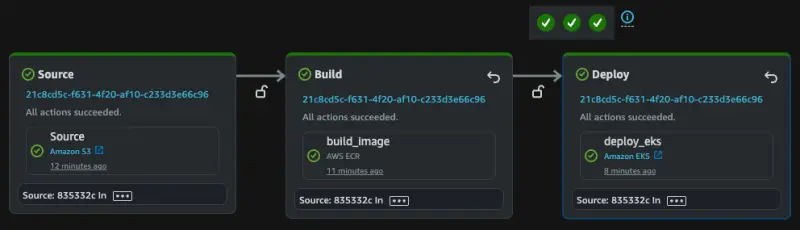
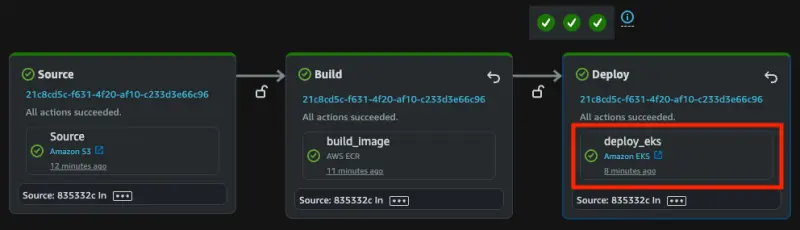

Before we can deploy the application lets delete the existing UI component and recreate the namespace:

```bash
$ kubectl delete namespace ui
$ kubectl create namespace ui
```

Now let's run the pipeline, which will build the image and deploy it to our EKS cluster.

```bash wait=20
$ git -C ~/environment/codepipeline add .
$ git -C ~/environment/codepipeline commit -am "Initial setup"
$ git -C ~/environment/codepipeline push --set-upstream origin main
```

It will take CodePipeline 3-5 minutes to build the image and deploy all changes to the EKS cluster. You can watch the pipeline progress in the AWS console or use these commands to wait until it has completed:

```bash timeout=900
$ while [[ "$(aws codepipeline list-pipeline-executions --pipeline-name ${EKS_CLUSTER_NAME}-retail-store-cd --query 'pipelineExecutionSummaries[0].trigger.triggerType' --output text)" != "CloudWatchEvent" ]]; do echo "Waiting for pipeline to start ..."; sleep 10; done && echo "Pipeline started."
$ while [[ "$(aws codepipeline list-pipeline-executions --pipeline-name ${EKS_CLUSTER_NAME}-retail-store-cd --query 'pipelineExecutionSummaries[0].status' --output text)" != "Succeeded" ]]; do echo "Waiting for pipeline execution to finish ..."; sleep 10; done && echo "Pipeline execution successful."
```

Once complete the pipeline will show the stages have succeeded.



Now we can review the changes that have been made by the pipeline. First we can check the ECR repository:

<ConsoleButton
  url="https://console.aws.amazon.com/ecr/private-registry/repositories"
  service="ecr"
  label="Open ECR console"
/>

Open the repository `retail-store-sample-ui` and inspect the image that has been pushed.


We can also verify that a Helm release has been installed in the cluster:

```bash hook=deployment
$ helm ls -n ui
NAME    NAMESPACE       REVISION        UPDATED                                 STATUS          CHART                                   APP VERSION
ui      ui              1               2025-07-01 05:16:56.016555446 +0000 UTC deployed        retail-store-sample-ui-chart-0.8.5
```

Check the values used to configure it to see that our custom image repository and tag were used:

```bash
$ helm get values -n ui ui
USER-SUPPLIED VALUES:
image:
  repository: 1234567890.dkr.ecr.us-west-2.amazonaws.com/retail-store-sample-ui-sm7zww
  tag: e37f1e7932270d24d7bd7583d484dc2a
```

This will have resulted in a deployment:

```bash
$ kubectl get deployment -n ui
NAME   READY   UP-TO-DATE   AVAILABLE   AGE
ui     1/1     1            1           42s
```

The pod will be using the image built in the pipeline:

```bash
$ kubectl get deployment -n ui ui -o json | jq -r '.spec.template.spec.containers[0].image'
1234567890.dkr.ecr.us-west-2.amazonaws.com/retail-store-sample-ui-sm7zww:e37f1e7932270d24d7bd7583d484dc2a
```

We can also click the `deploy_eks` action to view more details such as the logs:


