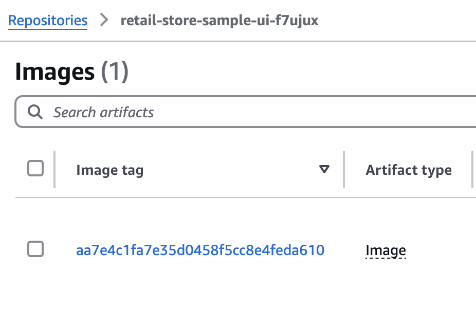
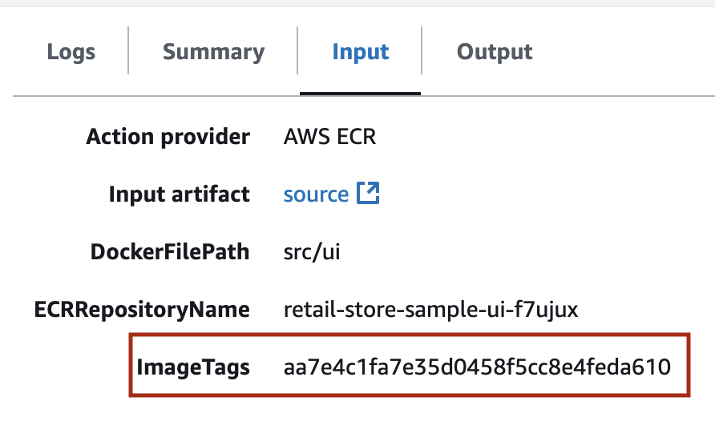
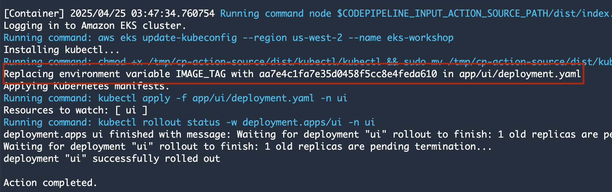
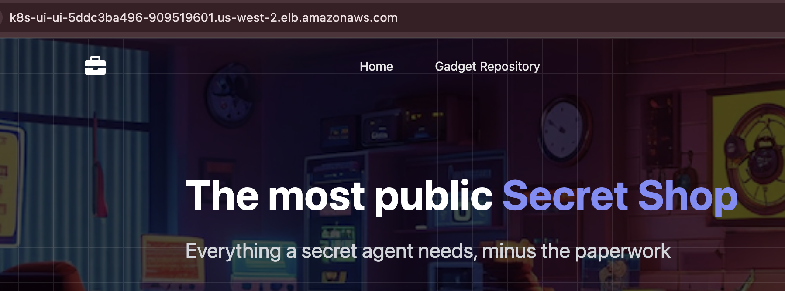
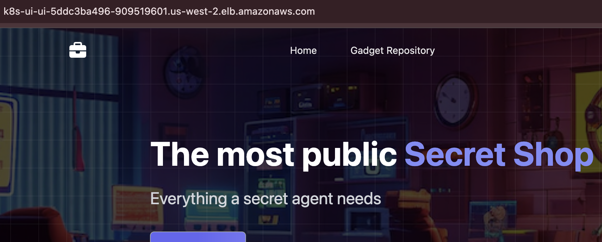
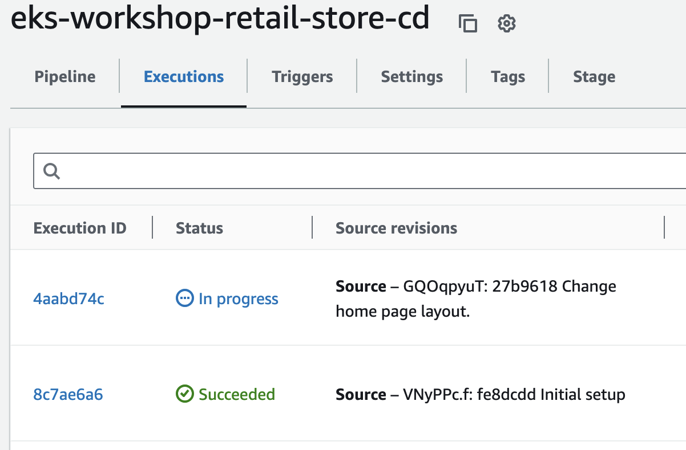

In this module, we will deploy the UI component using retail-store-sample-app with a CodePipeline pipeline.

## Run Pipeline

Now that the pipeline is set up, let's run the pipeline, which will build the image from retail-store-sample-app and deploy it to our EKS cluster.

```bash
$ git -C ~/environment/cd add .
$ git -C ~/environment/cd commit -am "Initial setup"
$ git -C ~/environment/cd remote add origin s3+zip://${EKS_CLUSTER_NAME}-${AWS_ACCOUNT_ID}-retail-store-sample-ui/my-repo
$ git -C ~/environment/cd push --set-upstream origin master
```

It will take CodePipeline 6-8 mins to build the image and deploy all changes to the EKS action.

```bash timeout=900
$ while [[ "$(aws codepipeline list-pipeline-executions --pipeline-name ${EKS_CLUSTER_NAME}-retail-store-cd --query 'pipelineExecutionSummaries[0].trigger.triggerType' --output text)" != "CloudWatchEvent" ]]; do echo "Waiting for pipeline to start ..."; sleep 10; done && echo "Pipeline started."
$ while [[ "$(aws codepipeline list-pipeline-executions --pipeline-name ${EKS_CLUSTER_NAME}-retail-store-cd --query 'pipelineExecutionSummaries[0].status' --output text)" != "Succeeded" ]]; do echo "Waiting for pipeline execution to finish ..."; sleep 10; done && echo "Pipeline execution successful."
```

We've now successfully migrated the UI component to deploy using CodePipeline.

We can see that the `build-image` action used a dynamic tag with random value (corresponding to S3 object ETag) and `deploy_eks` action replaced `$IMAGE_TAG` in `deployment.yaml` with same value.

  

### Add UI load balancer

Not let's visualize the output of our pipeline run.

We will provision an Application Load Balancer and configure it to route traffic to the Pods for the `ui` application.

```bash
$ kubectl apply -k ~/environment/eks-workshop/modules/automation/continuousdelivery/codepipeline/ci-ingress
$ sleep 10 && kubectl get ingress ui -n ui
NAME   CLASS   HOSTS   ADDRESS                                            PORTS   AGE
ui     alb     *       k8s-ui-ui-1268651632.us-west-2.elb.amazonaws.com   80      15s
```

We will wait 2-5 minutes while the Application Load Balancer is provisioned and check the UI page using the URL of the ingress.

```bash test=false
$ export UI_URL=$(kubectl get ingress -n ui ui -o jsonpath="{.status.loadBalancer.ingress[*].hostname}{'\n'}")
$ wait-for-lb $UI_URL
```

The UI will look like following:



### Adding a change in source application

Now let's make a code change to the home page.

We will remove the suffix `, minus the paperwork` in the home page header.

```bash
$ sed -i 's|Everything a secret agent needs, minus the paperwork|Everything a secret agent needs|' ~/environment/cd/src/ui/src/main/resources/templates/home.html
$ git -C ~/environment/cd add .
$ git -C ~/environment/cd commit -am "Change home page layout."
$ git -C ~/environment/cd push --set-upstream origin master
```

It will take CodePipeline 6-8 minutes to deploy all changes to EKS action.

```bash timeout=600
$ while [[ ! "$(aws codepipeline list-pipeline-executions --pipeline-name ${EKS_CLUSTER_NAME}-retail-store-cd --query 'pipelineExecutionSummaries[0].sourceRevisions[0].revisionSummary' --output text)" == *"layout." ]]; do echo "Waiting for pipeline to start ..."; sleep 10; done && echo "Pipeline started."
$ while [[ "$(aws codepipeline list-pipeline-executions --pipeline-name ${EKS_CLUSTER_NAME}-retail-store-cd --query 'pipelineExecutionSummaries[0].status' --output text)" != "Succeeded" ]]; do echo "Waiting for pipeline execution to finish ..."; sleep 10; done && echo "Pipeline execution successful."
```

The UI will look like following after the pipeline run:



You can view the history of changes to the source application in execution history.


