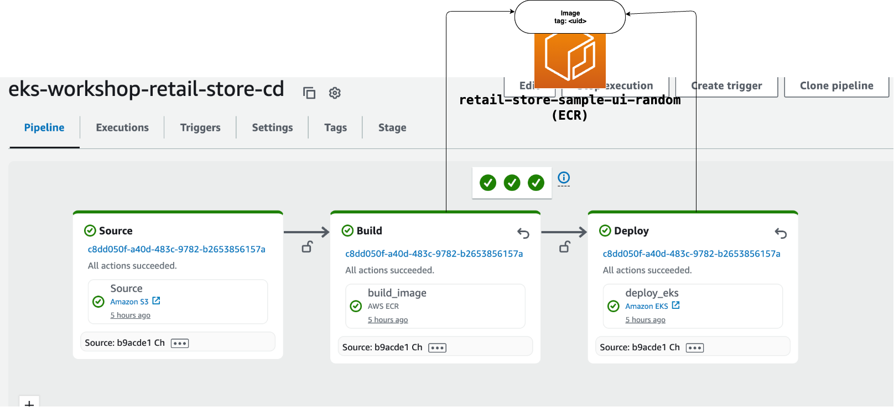

In this module, we will understand structure of CodePipeline pipeline.



Our pipeline consists of 3 stages, each containing a single action. The source stage consists of a source action that holds the source code and allows users to set up triggers on the pipeline. The build stage builds the ui application image using the Dockerfile provided in the source code in the S3 bucket and stores the image in Amazon ECR with random tag. The deploy stage applies the image with same tag to the EKS cluster using manifest files in the source.

Let’s set up each action in the pipeline.

### Setup source action

This module uses S3 as a source action.

#### NOTE : CodePipeline supports GitHub, GitLab, and Bitbucket through AWS CodeConnections as Git based source. In a real application, you should use these sources. However, since these sources require manual handshake with the third-party, we will use S3 as source action

To use S3 as source, we will use the [git-remote-s3](https://github.com/awslabs/git-remote-s3?tab=readme-ov-file#repo-as-s3-source-for-aws-codepipeline) library which can use a local Git repository whilst allowing S3 as a source in CodePipeline.

First, let's set up a local Git repository. The source of the pipeline will be a mono-repo with manifest files for the `ui` application under `/app` and the application source under `src/`. You can choose to separate these sources in separate source actions.

```text
.
├── app
│   └── ui
│       ├── deployment.yaml
├── src
...
│   ├── ui
│       ├── chart
│       ├── scripts
│       ├── src
│            └── main
│            ├── test
....
```

```bash timeout=120
$ mkdir ~/environment/cd && mkdir ~/environment/cd/app
$ git config --global user.email "you@eksworkshop.com"
$ git config --global user.name "Your Name"
$ git -C ~/environment/cd init
$ rm -rf ~/environment/retail-store-sample-app && git clone https://github.com/aws-containers/retail-store-sample-app ~/environment/retail-store-sample-app
$ cp -R ~/environment/retail-store-sample-app/src ~/environment/cd
$ cp -R ~/environment/eks-workshop/base-application/ui ~/environment/cd/app
```

### Setup build and deploy actions

Without parameterization, the `deploy_eks` action will always apply the same image `public.ecr.aws/aws-containers/retail-store-sample-ui:0.4.0` to the EKS cluster in each run. We will update the pipeline setup so that the `deploy_eks` action will apply images that were created by the `build_image` action as part of the pipeline run. Also, we would create new image tags only when the source application changes.

For this configuration, there will be 3 changes involved:

- Parameterize the image tag with a variable `$IMAGE_TAG` in the deployment.yaml.
- Update the `build_image` action with a dynamic image tag `#{Source.ETag}` - `#{Source.*}` indicates that this is a variable generated by S3 action with namespace `Source`. `ETag` is versioning identifier of S3 object, generated by CodePipeline S3 action.
- Update the `deploy_eks` action with environment variable - The variable name corresponds to the parameter in deployment.yaml, and value corresponds to the dynamic image tag in `build_image` action.

Let's apply these changes:

```bash
$ sed -i 's|image: "public.ecr.aws/aws-containers/retail-store-sample-ui:0.4.0"|image: "'$IMAGE_URI_UI':$IMAGE_TAG"|' ~/environment/cd/app/ui/deployment.yaml
$ aws codepipeline update-pipeline --cli-input-json "$(aws codepipeline get-pipeline --name ${EKS_CLUSTER_NAME}-retail-store-cd | jq 'del(.metadata) | {pipeline: .pipeline} | .pipeline.stages[1].actions[0].configuration.ImageTags = "#{Source.ETag}" | .pipeline.stages[2].actions[0].environmentVariables = [{name: "IMAGE_TAG",value:"#{Source.ETag}"}]')"
```

### Setup Cluster

Before we run the pipeline, lets set up the cluster for CodePipeline to deploy.

CodePipeline needs permission to perform operations (`kubectl` or `helm`) on the cluster. For this operation to succeed, we need to add the codepipeline pipeline service role as an access entry to cluster.

```bash
$ aws eks delete-access-entry --cluster-name ${EKS_CLUSTER_NAME} --principal-arn "arn:aws:iam::${AWS_ACCOUNT_ID}:role/${EKS_CLUSTER_NAME}-codepipeline-role" 2>/dev/null || true &&  aws eks create-access-entry --cluster-name ${EKS_CLUSTER_NAME} --principal-arn "arn:aws:iam::${AWS_ACCOUNT_ID}:role/${EKS_CLUSTER_NAME}-codepipeline-role" --type STANDARD
$ aws eks associate-access-policy --cluster-name ${EKS_CLUSTER_NAME} --principal-arn "arn:aws:iam::${AWS_ACCOUNT_ID}:role/${EKS_CLUSTER_NAME}-codepipeline-role" --policy-arn "arn:aws:eks::aws:cluster-access-policy/AmazonEKSClusterAdminPolicy" --access-scope '{"type":"cluster"}'
```
