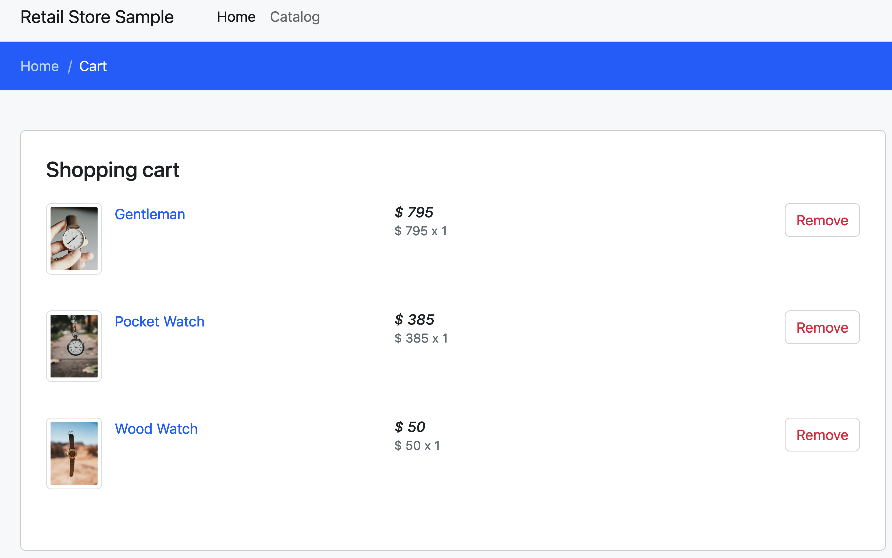
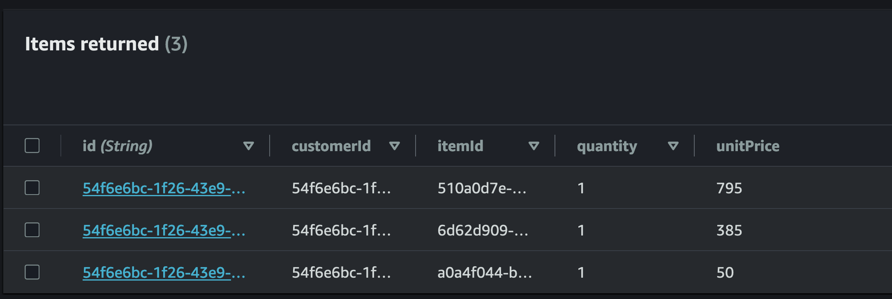

In general when new resources are created, application configuration also needs to be updated to use these new resources. A lot of application developers use environment variables to store configuration, and in Kubernetes it is fairly easy to pass environment variables to containers through the ```env``` spec when creating deployments.

Now, there are two ways to achieve this. First, Configmaps. Configmaps are a core resource in Kubernetes that allow us to pass configuration elements such as Environment variables, text fields and other items in a key-value format to be used in pod specs. Then, we have secrets (which are not encrypted by design - this is important to remember) to push things like passwords/secrets. 

The ACK `FieldExport` custom resource was designed to bridge the gap between managing the control plane of your ACK resources and using the *properties* of those resources in your application. This configures an ACK controller to export any `spec` or `status` field from an ACK resource into a Kubernetes ConfigMap or Secret. These fields are automatically updated when any field value changes. You are then able to mount the ConfigMap or Secret onto your Kubernetes Pods as environment variables that can ingest those values.

However, in the case of DynamoDB in this section of the lab, we will use a direct mapping of the API endpoint by using ConfigMaps, and simply updating the DynamoDB endpoint as an environment variable.

```file
manifests/modules/automation/controlplanes/ack/dynamodb/deployment.yaml
```

In the new Deployment manifest (which we've already applied), we're updating the ```env``` variable ```configMapRef``` to ```carts-ack```.

```file
manifests/modules/automation/controlplanes/ack/dynamodb/dynamodb-ack-configmap.yaml
```

And when we apply these manifests, the **Carts** component should already have been updated.


An NLB has been created to expose the sample application for testing:

```bash
$ kubectl get service -n ui ui-nlb -o jsonpath="{.status.loadBalancer.ingress[*].hostname}{'\n'}"
k8s-ui-uinlb-a9797f0f61.elb.us-west-2.amazonaws.com
```
:::info
Please note that the actual endpoint will be different when you run this command as a new Network Load Balancer endpoint will be provisioned.
:::


To wait until the load balancer has finished provisioning you can run this command:

```bash timeout=610
$ wait-for-lb $(kubectl get service -n ui ui-nlb -o jsonpath="{.status.loadBalancer.ingress[*].hostname}{'\n'}")
```

Once the load balancer is provisioned you can access it by pasting the URL in your web browser. You will see the UI from the web store displayed and will be able to navigate around the site as a user.

<browser url="http://k8s-ui-uinlb-a9797f0f61.elb.us-west-2.amazonaws.com">

</browser>

To verify that the **Carts** module is in fact using the DynamoDB table we just provisioned, try adding a few items to the cart.



And navigating to the Items table in the DynamoDB console to *Explore table items* shows



Congratulations! You've successfully created AWS Resources without leaving the confines of the Kubernetes API!

