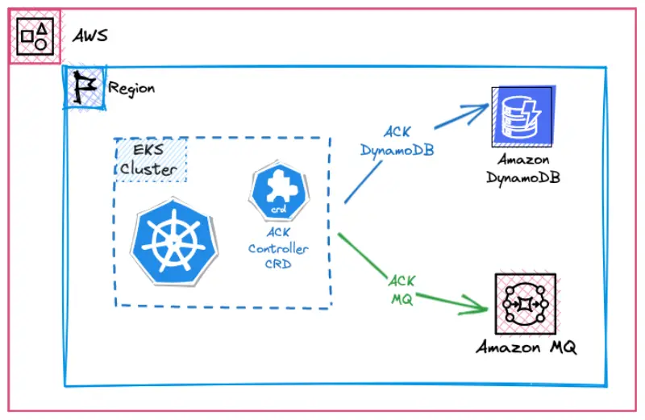

::required-time

:::tip Before you start
Prepare your environment for this section:

```bash timeout=300 wait=30
$ prepare-environment automation/controlplanes/ack
```

This will make the following changes to your lab environment:

- Install the AWS Controllers for DynamoDB in the Amazon EKS cluster

You can view the Terraform that applies these changes [here](https://github.com/VAR::MANIFESTS_OWNER/VAR::MANIFESTS_REPOSITORY/tree/VAR::MANIFESTS_REF/manifests/modules/automation/controlplanes/ack/.workshop/terraform).

:::

The [AWS Controllers for Kubernetes (ACK)](https://aws-controllers-k8s.github.io/community/) project enables you to define and use AWS service resources directly from Kubernetes using familiar YAML constructs.

With ACK, you can leverage AWS services such as databases ([RDS](https://aws-controllers-k8s.github.io/community/docs/tutorials/rds-example/) or others) and queues ([SQS](https://aws-controllers-k8s.github.io/community/docs/tutorials/sqs-example/) etc.) for your Kubernetes applications without manually defining resources outside of the cluster. This reduces the overall complexity of managing your application's dependencies.

While the sample application can run entirely within your cluster, including stateful workloads like databases and message queues (which is suitable for development), using AWS managed services such as Amazon DynamoDB and Amazon MQ in testing and production environments allows your team to focus on customers and business projects rather than administering databases or message brokers.

In this lab, we'll use ACK to provision these services and create secrets and configmaps containing the binding information to connect the application to these AWS managed services.

For learning purposes, we're using helm to install the ACK controller. Another option is to use Terraform that allows for rapid deployment of AWS Service Controllers to your cluster. For more information, see the [ACK Terraform module documentation](https://registry.terraform.io/modules/aws-ia/eks-ack-addons/aws/latest#module_dynamodb).


