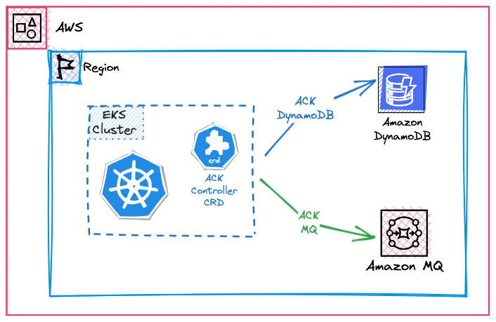

\::required-time

:::tip Before you start
Prepare your environment for this section:

```bash timeout=300 wait=30
$ prepare-environment automation/controlplanes/ack
```

This will make the following changes to your lab environment:

- Install the AWS Controllers for DynamoDB in the Amazon EKS cluster
- Install the AWS Load Balancer controller in the Amazon EKS cluster

You can view the Terraform that applies these changes [here](https://github.com/VAR::MANIFESTS_OWNER/VAR::MANIFESTS_REPOSITORY/tree/VAR::MANIFESTS_REF/manifests/modules/automation/controlplanes/ack/.workshop/terraform).

:::

The [AWS Controllers for Kubernetes (ACK)](https://aws-controllers-k8s.github.io/community/) project lets you define and use AWS service resources directly from Kubernetes using familiar YAML constructs.

With ACK, you can take advantage of using AWS services such as databases ([RDS](https://aws-controllers-k8s.github.io/community/docs/tutorials/rds-example/) or others) and/or queues ([SQS](https://aws-controllers-k8s.github.io/community/docs/tutorials/sqs-example/) etc) for your Kubernetes applications without having to define resources manually outside of the cluster. This reduces the overall complexity for managing the dependencies of your application.

The sample application could be run completely within your cluster, including stateful workloads like database and message queues. This is a good approach when you're developing the application. However, when the team wants to make the application available in other stages like testing and production, they will use AWS managed services such as Amazon DynamoDB databases and Amazon MQ brokers. This allows the team to focus on its customers and business projects and not have to administer and manage databases or message brokers.

In this lab, we'll leverage ACK to provision these services and create secrets and configmaps containing the binding information connecting the application to these AWS managed services.

An important point to note here is that during the provisioning process above, we're using the new ACK Terraform module which allows you to rapidly deploy AWS Service Controllers to your cluster. See [here](https://registry.terraform.io/modules/aws-ia/eks-ack-addons/aws/latest#module_dynamodb) for more information.


