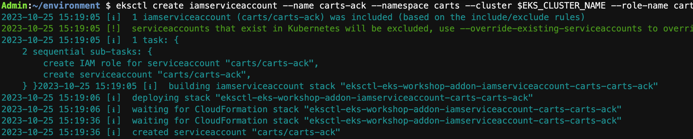
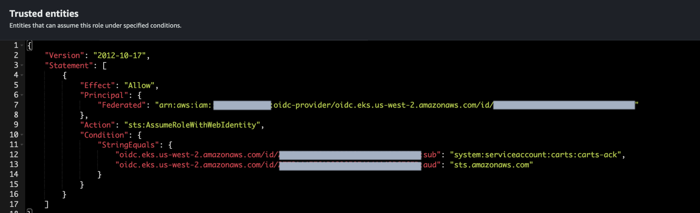

By default the **Carts** component in the sample application uses a DynamoDB local instance running as a pod in the EKS cluster called ```carts-dynamodb```. In this section of the lab, we'll provision an Amazon DynamoDB cloud based table for our application using Kubernetes custom resources and point the **Carts** deployment to use the newly provisioned DynamoDB table instead of the local copy.


The AWS Java SDK in the **Carts** component is able to use IAM Roles to interact with AWS services which means that we do not need to pass credentials, thus reducing the attack surfacec. In the EKS context, IRSA allows us to define per pod IAM Roles for applications to consume. To leverage IRSA, we first need to:

- Create a Kubernetes Service Account in the Carts namespace
- Create an IAM Role in AWS with the requisite DynamoDB permissions (by way of the right IAM Policy)
- Map the Service Account to use the IAM role using Annotations in the Service Account definition.

Fortunately, we have a handy one-line command to help with this. Run the below:

```bash

$ eksctl create iamserviceaccount --name carts-ack \ 
--namespace carts --cluster $EKS_CLUSTER_NAME \
--role-name carts-dynamodb-role \
--attach-policy-arn $DYNAMODB_POLICY_ARN --approve       

```
eksctl provisions a CloudFormation stack to help manage these resources which can be seen in this output



In the AWS Console, navigate to ```IAM -> Roles -> carts-dynamodb-role ``` and the Trust Relationships tab:



---


Now, let's explore how we'll create the DynamoDB Table via a Kubernetes manifest

```file
manifests/modules/automation/controlplanes/ack/dynamodb/dynamodb-create.yaml
```

:::info

Astute readers will notice the YAML Spec to be similar to the API endpoints and calls for DynamoDB such as ```tableName``` and ```attributeDefinitions```.

:::

Next, we will need to update the regional endpoint for DynamoDB within the Configmap used by the Kustomization to update the **Carts** deployment.

```file
manifests/modules/automation/controlplanes/ack/dynamodb/dynamodb-ack-configmap.yaml
```

Next we want to populate the environment variable within the manifest. Run

```bash

$ envsubst < ~/environment/eks-workshop/modules/automation/controlplanes/ack/dynamodb/dynamodb-ack-configmap.yaml \
| tee ~/environment/eks-workshop/modules/automation/controlplanes/ack/dynamodb/dynamodb-ack-configmap.yaml \
> /dev/null

```

:::info
This process uses the ```envsubst``` utility to rewrite the environment variable into the manifest to reflect the 
current region.
:::


We're now finally able to apply these configurations to the Amazon EKS cluster:

```bash wait=30
$ kubectl apply -k ~/environment/eks-workshop/modules/automation/controlplanes/ack/dynamodb
configmap/carts-ack created
table.dynamodb.services.k8s.aws/items created
deployment.apps/carts configured
```

The ACK controllers in the cluster will react to these new resources and provision the AWS infrastructure it has expressed. Using the AWS CLI, we can simply run

```bash
$ aws dynamodb list-tables
```

Creating a DynamoDB table is almost instantaneous, so you should see the Items table created. If not, wait a few seconds and try again.

In the AWS Console, navigate to ```DynamoDB --> Tables``` and you should see the new Table provisioned.