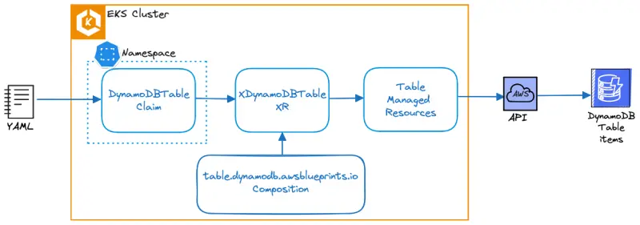

Once we've configured Crossplane with the details of the new XR, we can either create one directly or use a Claim. Typically, only the team responsible for configuring Crossplane (often a platform or SRE team) has permission to create XRs directly. Everyone else manages XRs via a lightweight proxy resource called a Composite Resource Claim (or claim for short).

With this claim, the developer only needs to specify a default **DynamoDB table name, hash keys, and global index name** to create the table. This allows the platform or SRE team to standardize aspects such as billing mode, default read/write capacity, projection type, and cost and infrastructure-related tags.

::yaml{file="manifests/modules/automation/controlplanes/crossplane/compositions/claim/claim.yaml" paths="metadata.name,spec.dynamoConfig.attribute.0,spec.dynamoConfig.attribute.1,spec.dynamoConfig.globalSecondaryIndex"}

1. Specify the DynamoDB table name using cluster name environment variable as prefix
2. Specify `id` as the Primary key attribute
3. Specify `customerId` as the Secondary attribute
4. Specify `idx_global_customerId` as the Global Secondary Index name.

Let's start by cleaning up the DynamoDB table created in the previous Managed Resource section:

```bash
$ kubectl delete tables.dynamodb.aws.upbound.io --all --ignore-not-found=true
$ kubectl wait --for=delete tables.dynamodb.aws.upbound.io --all --timeout=5m
```

Now, we can re-create the table by creating a `Claim`:

```bash timeout=400
$ cat ~/environment/eks-workshop/modules/automation/controlplanes/crossplane/compositions/claim/claim.yaml \
  | envsubst | kubectl -n carts apply -f -
dynamodbtable.awsblueprints.io/eks-workshop-carts-crossplane created
$ kubectl wait dynamodbtables.awsblueprints.io ${EKS_CLUSTER_NAME}-carts-crossplane -n carts \
  --for=condition=Ready --timeout=5m
```

It takes some time to provision AWS managed services, in the case of DynamoDB up to 2 minutes. Crossplane will report the status of the reconciliation in the `SYNCED` field of the Kubernetes Composite and Managed resource.

```bash
$ kubectl get table
NAME                                        READY   SYNCED   EXTERNAL-NAME                   AGE
eks-workshop-carts-crossplane-bt28w-lnb4r   True   True      eks-workshop-carts-crossplane   6s
```

Now, let's understand how the DynamoDB table is deployed using this claim:



When querying the claim `DynamoDBTable` deployed in the carts namespace, we can observe that it points to and creates a Composite Resource (XR) `XDynamoDBTable`:

```bash
$ kubectl get DynamoDBTable -n carts -o yaml | grep "resourceRef:" -A 3

    resourceRef:
      apiVersion: awsblueprints.io/v1alpha1
      kind: XDynamoDBTable
      name: eks-workshop-carts-crossplane-bt28w
```

The Composition `table.dynamodb.awsblueprints.io` shows Composite Resource Kind (XR-KIND) as `XDynamoDBTable`. This Composition informs Crossplane what to do when we create the `XDynamoDBTable` XR. Each Composition creates a link between an XR and a set of one or more Managed Resources.

```bash
$ kubectl get composition
NAME                              XR-KIND          XR-APIVERSION               AGE
table.dynamodb.awsblueprints.io   XDynamoDBTable   awsblueprints.io/v1alpha1   143m
```

When querying the `XDynamoDBTable` XR, which is not confined to any namespace, we can observe that it creates a DynamoDB managed resource `Table`:

```bash
$ kubectl get XDynamoDBTable -o yaml | grep "resourceRefs:" -A 3

    resourceRefs:
    - apiVersion: dynamodb.aws.upbound.io/v1beta1
      kind: Table
      name: eks-workshop-carts-crossplane-bt28w-lnb4r
```
