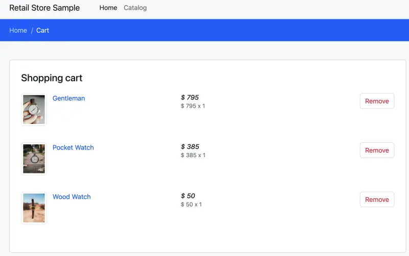

We've already configured the workload to use the correct table name in the previous section so lets just restart the pods:

```bash
$ kubectl rollout restart -n carts deployment/carts
$ kubectl rollout status -n carts deployment/carts --timeout=2m
deployment "carts" successfully rolled out
```

The load balancer used to access the application will be the same as the last section:

```bash
$ LB_HOSTNAME=$(kubectl -n ui get service ui-nlb -o jsonpath='{.status.loadBalancer.ingress[*].hostname}{"\n"}')
$ echo "http://$LB_HOSTNAME"
http://k8s-ui-uinlb-647e781087-6717c5049aa96bd9.elb.us-west-2.amazonaws.com
```

Access it by pasting the URL in your web browser. You will see the UI from the web store displayed and will be able to navigate around the site as a user.

<Browser url="http://k8s-ui-uinlb-a9797f0f61.elb.us-west-2.amazonaws.com">

</Browser>

To verify that the **Carts** module is in fact using the DynamoDB table we just provisioned, try adding a few items to the cart.



And to check if items are in the DynamoDB table as well, run:

```bash
$ aws dynamodb scan --table-name "${EKS_CLUSTER_NAME}-carts-crossplane"
```

We've now successfully created AWS resources using Crossplane Compositions!
