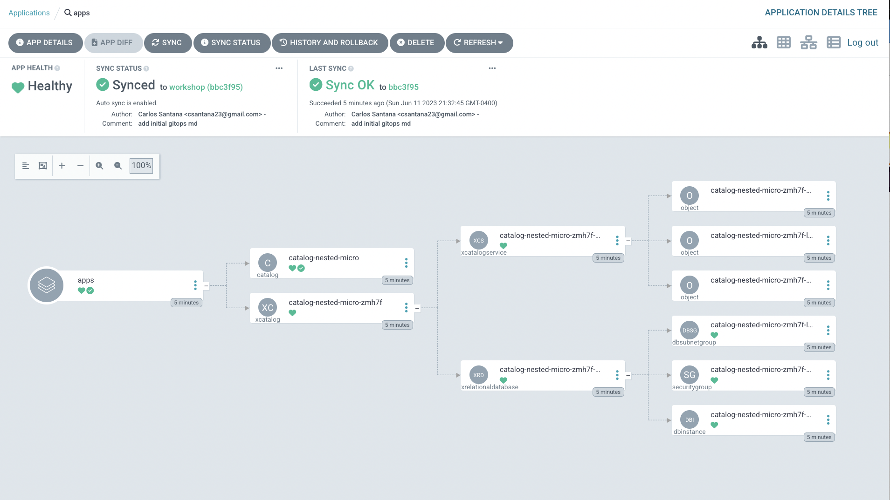

:::tip Before you start
Prepare your environment for this section:

```bash test=false
$ kubectl apply -f /workspace/modules/automation/controlplanes/crossplane/compositions/definition.yaml
$ kubectl apply -k /workspace/modules/automation/controlplanes/crossplane/compositions/composition
$ kubectl apply -f /workspace/modules/automation/controlplanes/crossplane/nested/composite/definition.yaml
$ kubectl apply -f /workspace/modules/automation/controlplanes/crossplane/nested/composition/composition.yaml
$ kubectl apply -f /workspace/modules/automation/controlplanes/crossplane/nested/service/composite/definition.yaml
$ kubectl apply -f /workspace/modules/automation/controlplanes/crossplane/nested/service/composition/composition.yaml
$ argocd login $(kubectl get svc argocd-server -n argocd -o json | jq --raw-output '.status.loadBalancer.ingress[0].hostname') --username admin --password $(kubectl -n argocd get secret argocd-initial-admin-secret -o jsonpath="{.data.password}" | base64 -d) --insecure
$ echo "ArgoCD Username=admin Password=$(kubectl -n argocd get secret argocd-initial-admin-secret -o jsonpath="{.data.password}" | base64 -d)"
$ echo "ArgoCD URL: http://$(kubectl get svc argocd-server -n argocd -o json | jq --raw-output '.status.loadBalancer.ingress[0].hostname')"
```
:::

## GitOpf for Infrastructure


Deploy the Catalog Service and RDS Dabate using GitOps.

```bash

$ argocd app create catalog --repo https://github.com/csantanapr/eks-workshop-v2 \
  --revision workshop \
  --dest-server https://kubernetes.default.svc \
  --dest-namespace nested \
  --sync-policy automated \
  --sync-option CreateNamespace=true \
  --set-finalizer \
  --upsert \
  --path environment/workspace/modules/automation/controlplanes/crossplane/nested/gitops

```

To verify that the provisioning is done you can check that the condition “Ready” is true using the Kubernetes CLI. Run the following commands and they will exit once the condition is met:

```bash timeout=1200
$ kubectl wait catalog.awsblueprints.io catalog-nested-micro -n nested --for=condition=Ready --timeout=20m
catalog.awsblueprints.io/catalog-nested condition met
```

Open ArgoCD UI to see the application progressing approximately:


Verify that the Catalog App deployed in the `nested` namespace connects to the RDS Database and returns products from the catalog

```bash
$ SERVICE_URL=$(kubectl get catalogs.awsblueprints.io catalog-nested-micro -n nested --template="{{.status.serviceURL}}")
$ kubectl exec -n ui deploy/ui -- curl -s $SERVICE_URL/catalogue | jq .
[
  {
    "id": "510a0d7e-8e83-4193-b483-e27e09ddc34d",
    "name": "Gentleman",
    "description": "Touch of class for a bargain.",
    "imageUrl": "/assets/gentleman.jpg",
    "price": 795,
    "count": 51,
    "tag": [
      "dress"
    ]
  },
  {
    "id": "6d62d909-f957-430e-8689-b5129c0bb75e",
    "name": "Pocket Watch",
    "description": "Properly dapper.",
    "imageUrl": "/assets/pocket_watch.jpg",
    "price": 385,
    "count": 33,
    "tag": [
      "dress"
    ]
  },
...
```

Delete the ArgoCD application, this will take approximately 5 minutes to delete RDS.

```bash test=false
$ argocd app delete catalog -y
```
