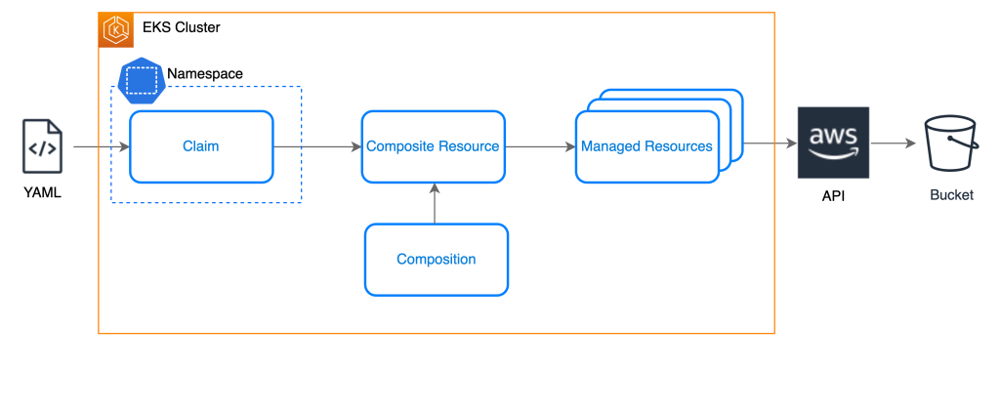

Running Crossplane in a cluster consists of two main parts:

1. The Crossplane controller which provides the core components
2. One or more Crossplane providers which each provide a controller and Custom Resource Definitions to integrate with a particular provider, such as AWS

The Crossplane controller, Upbound aws provider and  have been pre-installed in our EKS cluster, each running as a deployment in the `crossplane-system` namespace along with the `crossplane-rbac-manager`:

```bash
$ kubectl get deployment -n crossplane-system
NAME                                         READY   UP-TO-DATE   AVAILABLE   AGE
crossplane                                   1/1     1            1           3h7m
crossplane-rbac-manager                      1/1     1            1           3h7m
upbound-aws-provider-dynamodb-23a48a51e223   1/1     1            1           3h6m
upbound-provider-family-aws-1ac09674120f     1/1     1            1           21h
```

Here, `upbound-provider-family-aws` represents Crossplane provider for Amazon Web Services (AWS) developed and supported by Upbound. `upbound-aws-provider-dynamodb` is a subset of the prior dedicated to deploy DynamoDB via Crossplane.


Crossplane provides a simplified interface for developers to request infrastructure resources via Kubernetes manifests called claims. As shown in this diagram, claims are the only namespace-scoped Crossplane resources, serving as the developer interface and abstracting away implementation details. When a claim is deployed to the cluster, it creates a Composite Resource (XR), a Kubernetes custom resource representing one or more cloud resources defined through templates called Compositions. The Composite Resource creates one or more Managed Resources which interact with the AWS API to request the creation of the desired infrastructure resources. 


