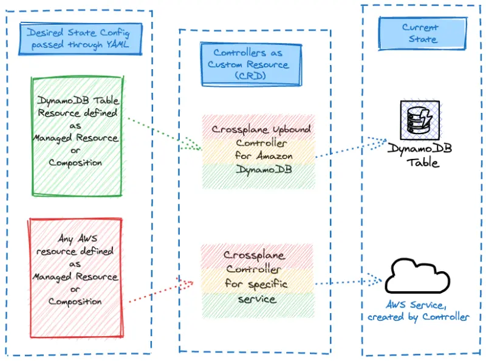

By default, the **Carts** component in the sample application uses a DynamoDB local instance running as a pod in the EKS cluster called `carts-dynamodb`. In this section of the lab, we'll provision an Amazon DynamoDB cloud-based table for our application using Crossplane managed resources and configure the **Carts** deployment to use the newly provisioned DynamoDB table instead of the local copy.



Let's explore how we'll create the DynamoDB table via a Crossplane managed resource manifest:

::yaml{file="manifests/modules/automation/controlplanes/crossplane/managed/table.yaml" paths="apiVersion,kind,metadata,spec.forProvider.attribute,spec.forProvider.hashKey,spec.forProvider.billingMode,spec.forProvider.globalSecondaryIndex,spec.providerConfigRef"}

1. Uses Upbound's AWS DynamoDB provider
2. Creates a DynamoDB table resource
3. Specify Kubernetes object with cluster-prefixed name and external name annotation 
4. Defines `id` and `customerId` as string (`S`) type attributes
5. Sets `id` as the primary partition key
6. Specifies the On-demand pricing model
7. Creates global secondary index on `customerId` with all attributes projected
8. References the AWS provider configuration for authentication

Now, we can create the configuration for the DynamoDB table using a `dynamodb.aws.upbound.io` resource.

```bash wait=10 timeout=400 hook=table
$ kubectl kustomize ~/environment/eks-workshop/modules/automation/controlplanes/crossplane/managed \
  | envsubst | kubectl apply -f-
table.dynamodb.aws.upbound.io/eks-workshop-carts-crossplane created
$ kubectl wait tables.dynamodb.aws.upbound.io ${EKS_CLUSTER_NAME}-carts-crossplane \
  --for=condition=Ready --timeout=5m
```

It takes some time to provision AWS managed services, in the case of DynamoDB up to 2 minutes. Crossplane will report the status of the reconciliation in the `status` field of the Kubernetes custom resources.

```bash
$ kubectl get tables.dynamodb.aws.upbound.io
NAME                                        READY  SYNCED   EXTERNAL-NAME                   AGE
eks-workshop-carts-crossplane               True   True     eks-workshop-carts-crossplane   6s
```

With this configuration applied, Crossplane will create a DynamoDB table in AWS, which can then be used by our application. In the next section, we'll update the application to use this newly created table.
