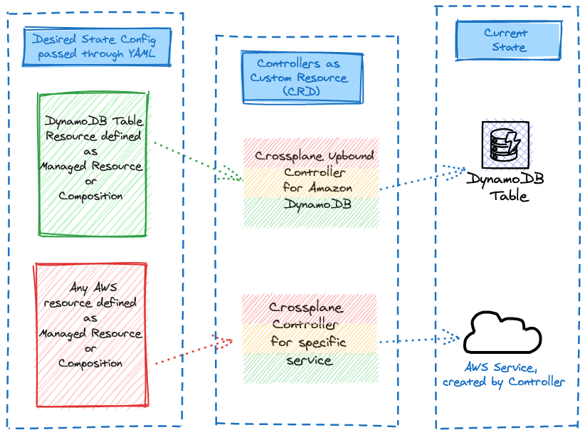
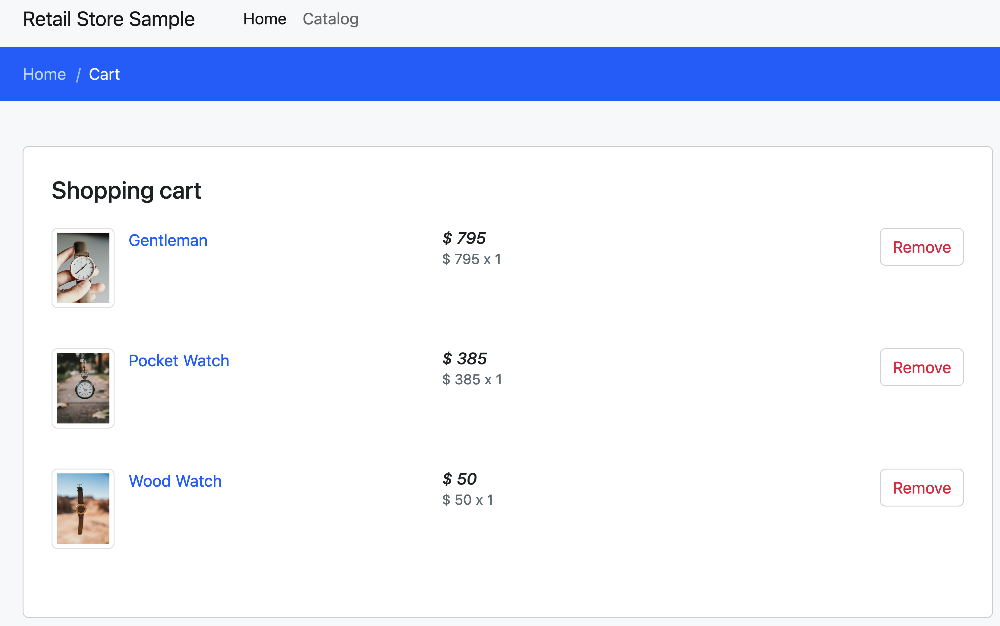

By default the **Carts** component in the sample application uses a DynamoDB local instance running as a pod in the EKS cluster called ```carts-dynamodb```. In this section of the lab, we'll provision an Amazon DynamoDB cloud based table for our application using Crossplane managed resources and point the **Carts** deployment to use the newly provisioned DynamoDB table instead of the local copy.



The AWS Java SDK in the **Carts** component is able to use IAM Roles to interact with AWS services which means that we do not need to pass credentials, thus reducing the attack surface. In the EKS context, IRSA allows us to define per pod IAM Roles for applications to consume. To leverage IRSA, we first need to:

- Create a Kubernetes Service Account in the Carts namespace
- Create an IAM Policy with necessary DynamoDB permissions
- Create an IAM Role in AWS with the above permissions
- Map the Service Account to use the IAM role using Annotations in the Service Account definition.

Fortunately, we have a handy one-liner to help with this process. Run the below:

```bash

$ eksctl create iamserviceaccount --name carts-crossplane \
  --namespace carts --cluster $EKS_CLUSTER_NAME \
  --role-name carts-dynamodb-role \
  --attach-policy-arn $DYNAMODB_POLICY_ARN --approve
  
2023-10-30 12:45:17 [ℹ]  1 iamserviceaccount (carts/carts-crossplane) was included (based on the include/exclude rules)
2023-10-30 12:45:17 [!]  serviceaccounts that exist in Kubernetes will be excluded, use --override-existing-serviceaccounts to override
2023-10-30 12:45:17 [ℹ]  1 task: { 
    2 sequential sub-tasks: { 
        create IAM role for serviceaccount "carts/carts-crossplan",
        create serviceaccount "carts/carts-crossplane",
    } }2023-10-30 12:45:17 [ℹ]  building iamserviceaccount stack "eksctl-eks-workshop-addon-iamserviceaccount-carts-carts-crossplane"
2023-10-30 12:45:18 [ℹ]  deploying stack "eksctl-eks-workshop-addon-iamserviceaccount-carts-carts-crossplane"
2023-10-30 12:45:18 [ℹ]  waiting for CloudFormation stack "eksctl-eks-workshop-addon-iamserviceaccount-carts-carts-crossplane"

```
```eksctl``` provisions a CloudFormation stack to help manage these resources which can be seen in the  output above.

To learn more about how IRSA works, check out the [IRSA Lab](../../../security/iam-roles-for-service-accounts/index.md).

---

Now, let's explore how we'll create the DynamoDB Table via a Crossplane managed resource manifest

```file
manifests/modules/automation/controlplanes/crossplane/managed/table.yaml
```

Finally, we can create the configuration for the DynamoDB itself with a `dynamodb.aws.upbound.io` resource.

```bash wait=30
$ kubectl apply -k ~/environment/eks-workshop/modules/automation/controlplanes/crossplane/managed
table.dynamodb.aws.upbound.io/items created
```

It takes some time to provision the AWS managed services, in the case of DynamoDB up to 2 minutes. Crossplane will report the status of the reconciliation in the `status` field of the Kubernetes custom resources.

```bash
$ kubectl get table'
```
When new resources are created or updated, application configurations also need to be updated to use these new resources. 
Update the application to use the DynamoDB endpoint:

```bash
$ kubectl apply -k ~/environment/eks-workshop/modules/automation/controlplanes/crossplane/application
namespace/carts unchanged
serviceaccount/carts unchanged
configmap/carts unchanged
configmap/carts-crossplane created
service/carts unchanged
service/carts-dynamodb unchanged
deployment.apps/carts configured
deployment.apps/carts-dynamodb unchanged
$ kubectl rollout restart -n carts deployment/carts
$ kubectl rollout status -n carts deployment/carts --timeout=30s
```

----

Now, how do we know that the application is working with the new DynamoDB table?

An NLB has been created to expose the sample application for testing, allowing us to directly interact with the application through the browser:

```bash
$ kubectl get service -n ui ui-nlb -o jsonpath="{.status.loadBalancer.ingress[*].hostname}{'\n'}"
k8s-ui-uinlb-a9797f0f61.elb.us-west-2.amazonaws.com
```
:::info
Please note that the actual endpoint will be different when you run this command as a new Network Load Balancer endpoint will be provisioned.
:::


To wait until the load balancer has finished provisioning you can run this command:

```bash timeout=610
$ wait-for-lb $(kubectl get service -n ui ui-nlb -o jsonpath="{.status.loadBalancer.ingress[*].hostname}{'\n'}")
```

Once the load balancer is provisioned you can access it by pasting the URL in your web browser. You will see the UI from the web store displayed and will be able to navigate around the site as a user.

<browser url="http://k8s-ui-uinlb-a9797f0f61.elb.us-west-2.amazonaws.com">

</browser>

To verify that the **Carts** module is in fact using the DynamoDB table we just provisioned, try adding a few items to the cart.



And to check if items are in the cart as well, run

```bash
aws dynamodb scan --table-name items
```


Congratulations! You've successfully created AWS Resources without leaving the confines of the Kubernetes API!