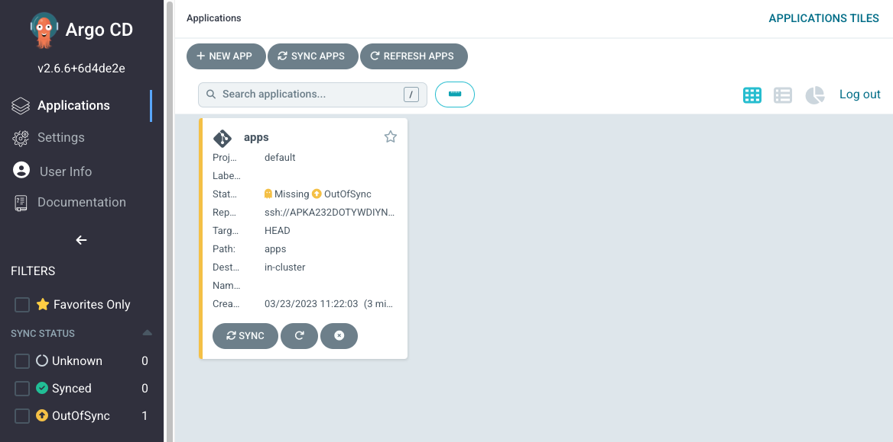

This example shows how to use Helm to create a configuration for a particular (for example DEV) environment.
A typical layout of your Git repository for this might be:

```
.
|-- app
|   |-- application.yaml
|   `-- kustomization.yaml
|-- apps-config
|   |-- ...
`-- apps-kustomization
    ...
```

First, we need to define an Argo CD `App of Apps Application`:

```file
automation/gitops/argocd-app-of-apps/app/application.yaml
```

Let's break down the manifest above:

- First we tell ArgoCD what will be the `name` of our `Application`
- Next we define than when we delete `App of Apps Application` `finalizers` will delete all the applications which belong to this `Application`
- After that we define which Git repository `source` to use to get the desired state of our application. We define `repoUrl` of the Git repository and a the repository branch with `targetRevision`
- Finally we define a `path` to an application configuration within the Git repository

Next, we create templates for each child app:

```
.
|-- app
|   |-- ...
|-- apps-config
|   |-- Chart.yaml
|   |-- templates
|   |   |-- assets.yaml
|   |   |-- carts.yaml
|   |   |-- catalog.yaml
|   |   |-- checkout.yaml
|   |   |-- orders.yaml
|   |   |-- other.yaml
|   |   |-- rabbitmq.yaml
|   |   `-- ui.yaml
|   `-- values.yaml
`-- apps-kustomization
    ...
```

`Chart.yaml` is boiler-plate. `templates` contains one file for each child app, for example:

```file
automation/gitops/argocd-app-of-apps/apps-config/templates/ui.yaml
```

`values.yaml` contains values which are specific for a particular (DEV) environment and which will be applied to all app templates.

```file
automation/gitops/argocd-app-of-apps/apps-config/values.yaml
```

The Git repository in AWS CodeCommit has already been created for you.

<!-- To access Argo CD UI please use these [instructions](/docs/automation/gitops/argocd/access_argocd) -->

```bash
$ GITOPS_REPO_URL=ssh://${GITOPS_IAM_SSH_KEY_ID}@git-codecommit.${AWS_DEFAULT_REGION}.amazonaws.com/v1/repos/${EKS_CLUSTER_NAME}-gitops
$ echo $GITOPS_REPO_URL > ~/environment/gitops_repo_url
```

Let's clone the Git repository.

```bash
$ git clone $(cat ~/environment/gitops_repo_url) ~/environment/gitops
$ cd ~/environment/gitops && git checkout -b main
Switched to a new branch 'main'
$ (cd ~/environment/gitops && \
touch .gitkeep && \
git add . && \
git commit -am "Initial commit" && \
git push --set-upstream origin main)
```

Create an Argo CD repository `Secret` to store `sshPrivateKey` for access to the Git repository `url`:

```bash
$ kubectl -n argocd delete secret git-repo --ignore-not-found && \
kubectl -n argocd create secret generic git-repo \
--from-literal=type=git \
--from-literal=insecure="true" \
--from-literal=url="$(cat ~/environment/gitops_repo_url)" \
--from-file=sshPrivateKey=${HOME}/.ssh/gitops_ssh.pem \
&& kubectl -n argocd label secret git-repo "argocd.argoproj.io/secret-type=repository"
secret/git-repo created
secret/git-repo labeled
```

Copy `Application` configuration which we described above:

```bash
$ cd ~/environment/gitops
$ cp -R /workspace/modules/automation/gitops/argocd-app-of-apps/app ~/environment/gitops/
$ cp ~/environment/gitops_repo_url ~/environment/gitops/app/gitops_repo_url
$ cp -R /workspace/modules/automation/gitops/argocd-app-of-apps/apps-config ~/environment/gitops/
$ yq -i '.spec.source.repoURL = load("./app/gitops_repo_url")' ~/environment/gitops/apps-config/values.yaml

```

Apply `Application` configuration:

```bash
$ kubectl apply -k ~/environment/gitops/app
application.argoproj.io/apps created
$ (cd ~/environment/gitops && \
git add . && \
git commit -am "Adding the App of Apps configuration" && \
git push)
```

Open the Argo CD UI and navigate to the `apps` application.



Notice that the application might be in `OutOfSync` state. This means that the application is not yet deployed and not in sync with the desired state.

It will take Argo CD some time to notice changes in the Git repository and reconcile. You can use the Argo CD UI to `Sync Apps` and `Refresh Apps` for our new `apps` configuration to appear.

Our applications, except Argo CD `App of Apps Application`, are in `Unknown` state because we didn't deploy their configuration yet.


We have Argo CD `App of Apps Application` deployed and synced


We will deploy applications configurations for the applications in the next step
