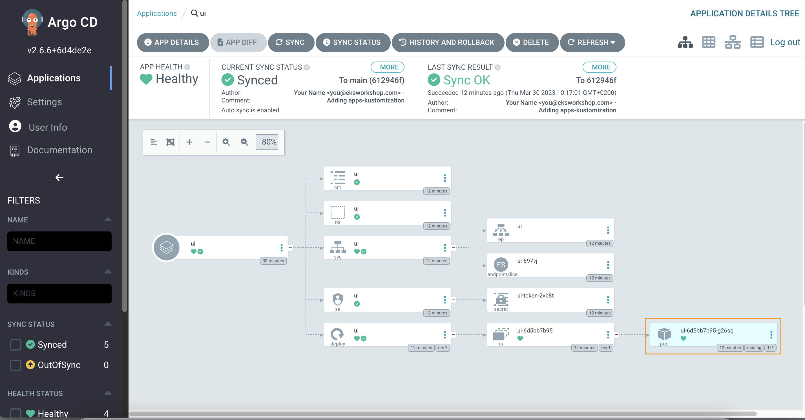

We have successfully configured Argo CD on our cluster so now we can deploy an environment specific customization for the set of application.

First let's remove the existing Applications so we can replace it:

```bash
$ kubectl delete -k /workspace/manifests --ignore-not-found=true
namespace "assets" deleted
namespace "carts" deleted
namespace "catalog" deleted
namespace "checkout" deleted
namespace "orders" deleted
namespace "other" deleted
namespace "rabbitmq" deleted
namespace "ui" deleted
...
```

We will then need to create a customization for each application:

```
.
|-- app
|   |-- ...
|-- apps-config
|   |-- ...
`-- apps-kustomization
    |-- assets
    |   `-- kustomization.yaml
    |-- carts
    |   `-- kustomization.yaml
    |-- catalog
    |   `-- kustomization.yaml
    |-- checkout
    |   `-- kustomization.yaml
    |-- orders
    |   `-- kustomization.yaml
    |-- other
    |   `-- kustomization.yaml
    |-- rabbitmq
    |   `-- kustomization.yaml
    `-- ui
        |-- deployment-patch.yaml
        `-- kustomization.yaml
```

```file
automation/gitops/argocd-app-of-apps/apps-kustomization/ui/kustomization.yaml
```

We define a path to `Common manifests` for an application, in this case `ui`, using `resources`
We also define which configuration should be applied to `ui` in our cluster using `patches`

```file
automation/gitops/argocd-app-of-apps/apps-kustomization/ui/deployment-patch.yaml
```

We would like to have `1` replica for `ui` application. All other application will use base configuration from `Common manifests`

Copy files to the Git repository directory:

```bash
$ cp -R /workspace/modules/automation/gitops/argocd-app-of-apps/apps-kustomization ~/environment/gitops/
```

You final Git directory should now look something like this which you can validate by running `tree ~/environment/gitops`:

```
|-- app
|   |-- application.yaml
|   |-- gitops_repo_url
|   `-- kustomization.yaml
|-- apps-config
|   |-- Chart.yaml
|   |-- templates
|   |   |-- assets.yaml
|   |   |-- carts.yaml
|   |   |-- catalog.yaml
|   |   |-- checkout.yaml
|   |   |-- orders.yaml
|   |   |-- other.yaml
|   |   |-- rabbitmq.yaml
|   |   `-- ui.yaml
|   `-- values.yaml
`-- apps-kustomization
    |-- assets
    |   `-- kustomization.yaml
    |-- carts
    |   `-- kustomization.yaml
    |-- catalog
    |   `-- kustomization.yaml
    |-- checkout
    |   `-- kustomization.yaml
    |-- orders
    |   `-- kustomization.yaml
    |-- other
    |   `-- kustomization.yaml
    |-- rabbitmq
    |   `-- kustomization.yaml
    `-- ui
        |-- deployment-patch.yaml
        `-- kustomization.yaml

12 directories, 22 files
```

Finally we can push our configuration to the Git repository

```bash
$ (cd ~/environment/gitops && \
git add . && \
git commit -am "Adding apps-kustomization" && \
git push)
```

It will take Argo CD some time to notice the changes in the Git repository and reconcile. You can use the Argo CD UI to `Sync Apps` and `Refresh Apps` and wait for our new `apps` configuration to appear

We've now successfully migrated the all the applications to deploy using Argo CD, and any further changes pushed to the Git repository will be automatically reconciled to our EKS cluster.

All our applications are in `Synced` state now


You should also have all the resources related to the UI services deployed. To verify, run the following commands:

```bash
$ kubectl get deployment -n ui ui
NAME   READY   UP-TO-DATE   AVAILABLE   AGE
ui     1/1     1            1           61s
$ kubectl get pod -n ui
NAME                  READY   STATUS    RESTARTS   AGE
ui-6d5bb7b95-rjfxd   1/1     Running   0          62s
```


