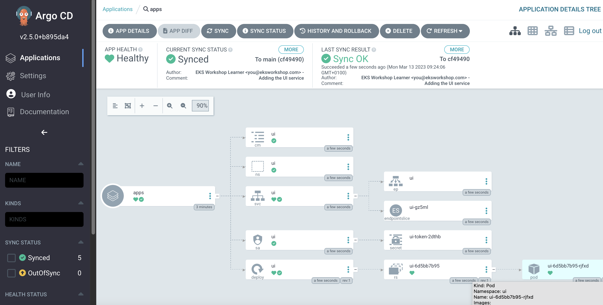

We have successfully configured Argo CD on our cluster so now we can deploy an application. To demonstrate the difference between a GitOps-based delivery of an application and other methods, we'll migrate the UI component of the sample application which is currently using the `kubectl apply -k` approach to the new Argo CD deployment approach.

First let's remove the existing UI component so we can replace it:

```bash
$ kubectl delete -k /workspace/manifests/ui
namespace "ui" deleted
serviceaccount "ui" deleted
configmap "ui" deleted
service "ui" deleted
deployment.apps "ui" deleted
```

Next, clone the CodeCommit repository:

```bash
$ git clone $(cat ~/environment/argocd-application/gitops_repo_url) ~/environment/gitops-argocd
$ cd ~/environment/gitops-argocd && git checkout -b main
Switched to a new branch 'main'
```

Now, let's get into the cloned repository and start creating our GitOps configuration. Copy the existing kustomize configuration for the UI service:

```bash
$ mkdir ~/environment/gitops-argocd/apps
$ cp -R /workspace/manifests/ui ~/environment/gitops-argocd/apps
```

We'll then need to create a kustomization in the `apps` directory:

```file
automation/gitops/argocd-codecommit/kustomization.yaml
```

Copy this file to the Git repository directory:

```bash
$ cp /workspace/modules/automation/gitops/argocd-codecommit/kustomization.yaml ~/environment/gitops-argocd/apps/kustomization.yaml
```

You Git directory should now look something like this which you can validate by running `tree ~/environment/gitops-argocd`:

```
.
└── apps
    ├── kustomization.yaml
    └── ui
        ├── configMap.yaml
        ├── deployment.yaml
        ├── kustomization.yaml
        ├── namespace.yaml
        ├── serviceAccount.yaml
        └── service.yaml

2 directories, 7 files
```

Finally we can push our configuration to AWS CodeCommit:

```bash
$ (cd ~/environment/gitops-argocd && \
git add . && \
git commit -am "Adding the UI service" && \
git push --set-upstream origin main)
```

It will take Argo CD some time to notice the changes in CodeCommit and reconcile. You can use the Argo CD UI to `Refresh` and `Sync` for our new `apps` kustomization to appear.

:::info
If you need to reset Argo CD `admin` password, the sequence of commands below can be used:
:::

```bash
$ kubectl -n argocd patch secret argocd-secret -p '{"data": {"admin.password": null, "admin.passwordMtime": null}}'
$ kubectl -n argocd rollout restart deployment/argocd-server
$ kubectl -n argocd rollout status deploy/argocd-server
$ echo "ArgoCD admin password: $(kubectl -n argocd get secret argocd-initial-admin-secret -o jsonpath="{.data.password}" | base64 -d)"
```

Get Argo CD UI url and `admin` password

```bash
$ echo "ArgoCD URL: http://$(kubectl get svc argocd-server -n argocd -o json | jq --raw-output '.status.loadBalancer.ingress[0].hostname')"
$ echo "ArgoCD admin password: $(kubectl -n argocd get secret argocd-initial-admin-secret -o jsonpath="{.data.password}" | base64 -d)"
```

Now, let's login to Argo CD UI with `admin`, explore, `Refresh` and `Sync` changes:



That shows that Argo CD created the basic kustomization, and that it's in sync with the cluster.

We've now successfully migrated the UI component to deploy using Argo CD, and any further changes pushed to the Git repository will be automatically reconciled to our EKS cluster.

You should now have all the resources related to the UI services deployed once more. To verify, run the following commands:

```bash
$ kubectl get deployment -n ui ui
NAME   READY   UP-TO-DATE   AVAILABLE   AGE
ui     1/1     1            1           61s
$ kubectl get pod -n ui
NAME                  READY   STATUS    RESTARTS   AGE
ui-6d5bb7b95-rjfxd   1/1     Running   0          62s
```
