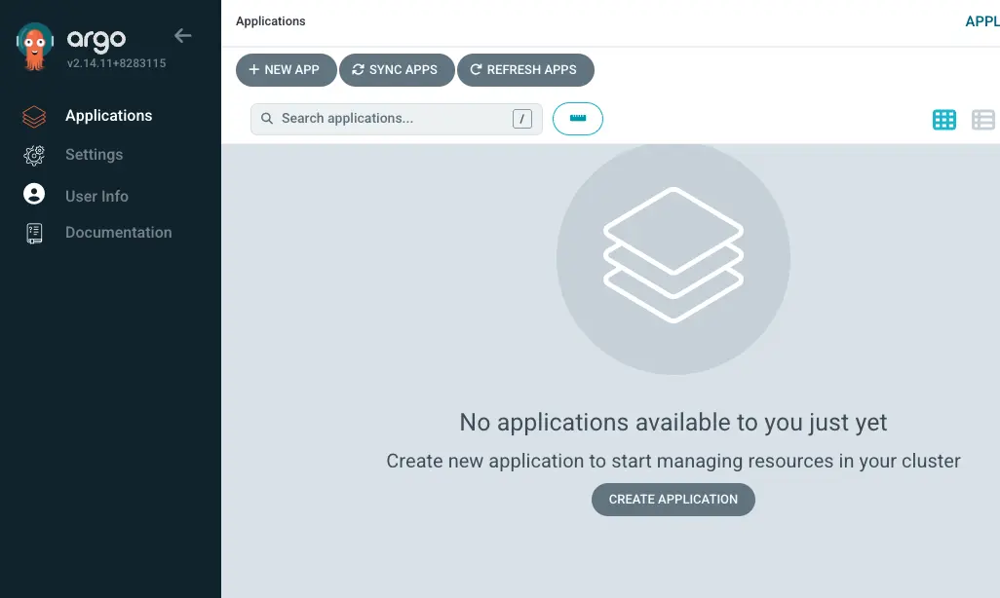

Let's begin by installing Argo CD in our cluster:

```bash
$ helm repo add argo-cd https://argoproj.github.io/argo-helm
$ helm upgrade --install argocd argo-cd/argo-cd --version "${ARGOCD_CHART_VERSION}" \
  --namespace "argocd" --create-namespace \
  --values ~/environment/eks-workshop/modules/automation/gitops/argocd/values.yaml \
  --wait
NAME: argocd
LAST DEPLOYED: [...]
NAMESPACE: argocd
STATUS: deployed
REVISION: 2
TEST SUITE: None
NOTES:
[...]
```

For the purpose of this lab, the Argo CD server UI has been configured to be accessible outside of the cluster using a Kubernetes service with a load balancer. To obtain the URL, execute the following commands:

```bash
$ export ARGOCD_SERVER=$(kubectl get svc argocd-server -n argocd -o json | jq --raw-output '.status.loadBalancer.ingress[0].hostname')
$ echo "Argo CD URL: https://$ARGOCD_SERVER"
Argo CD URL: https://acfac042a61e5467aace45fc66aee1bf-818695545.us-west-2.elb.amazonaws.com
```

The load balancer will take some time to provision. Use this command to wait until Argo CD responds:

```bash timeout=600 wait=60
$ curl --head -X GET --retry 20 --retry-all-errors --retry-delay 15 \
  --connect-timeout 5 --max-time 10 -k \
  https://$ARGOCD_SERVER
curl: (6) Could not resolve host: acfac042a61e5467aace45fc66aee1bf-818695545.us-west-2.elb.amazonaws.com
Warning: Problem : timeout. Will retry in 15 seconds. 20 retries left.
[...]
HTTP/1.1 200 OK
Accept-Ranges: bytes
Content-Length: 788
Content-Security-Policy: frame-ancestors 'self';
Content-Type: text/html; charset=utf-8
X-Frame-Options: sameorigin
X-Xss-Protection: 1
```

For authentication, the default username is `admin` and the password is auto-generated. Retrieve the password with the following command:

```bash
$ export ARGOCD_PWD=$(kubectl -n argocd get secret argocd-initial-admin-secret -o jsonpath="{.data.password}" | base64 -d)
$ echo "Argo CD admin password: $ARGOCD_PWD"
```

Use the URL and credentials you just obtained to log in to the Argo CD UI. You'll see an interface that looks like this:



In addition to the UI, Argo CD provides a powerful CLI tool called `argocd` for managing applications.

:::info
For this lab, the `argocd` CLI has already been installed for you. You can learn more about installing the CLI tool by following the [instructions](https://argo-cd.readthedocs.io/en/stable/cli_installation/).
:::

To interact with Argo CD using the CLI, you need to authenticate with the Argo CD server:

```bash
$ argocd login $ARGOCD_SERVER --username admin --password $ARGOCD_PWD --insecure
'admin:login' logged in successfully
Context 'acfac042a61e5467aace45fc66aee1bf-818695545.us-west-2.elb.amazonaws.com' updated
```

Finally, register the Git repository with Argo CD to provide access:

```bash
$ export GITEA_SSH_HOSTNAME=$(kubectl get svc -n gitea gitea-ssh -o jsonpath="{.status.loadBalancer.ingress[*].hostname}")
$ argocd repo add ssh://git@${GITEA_SSH_HOSTNAME}:2222/workshop-user/argocd.git \
  --ssh-private-key-path ${HOME}/.ssh/gitops_ssh.pem \
  --insecure-ignore-host-key --upsert --name git-repo
Repository 'ssh://...' added
```
