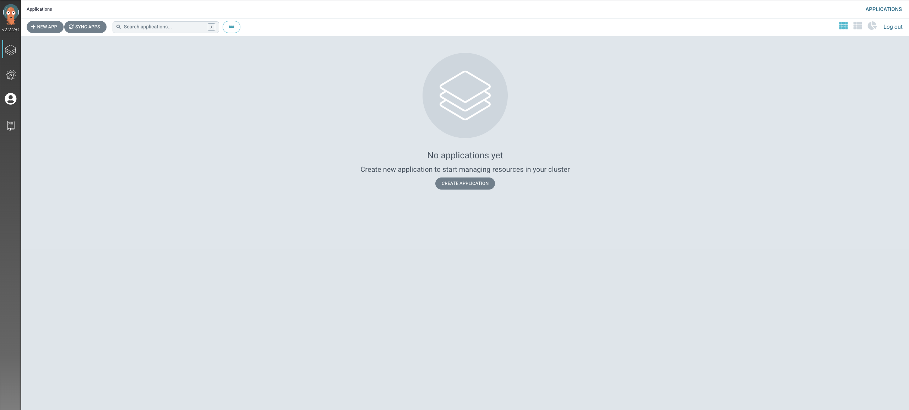

First lets install Argo CD in our cluster:

```bash
$ helm repo add argo-cd https://argoproj.github.io/argo-helm
$ helm upgrade --install argocd argo-cd/argo-cd --version "${ARGOCD_CHART_VERSION}" \
  --namespace "argocd" --create-namespace \
  --values ~/environment/eks-workshop/modules/automation/gitops/argocd/values.yaml \
  --wait
NAME: argocd
LAST DEPLOYED: [...]
NAMESPACE: argocd
STATUS: deployed
REVISION: 2
TEST SUITE: None
NOTES:
[...]
```

For the purpose of this lab the Argo CD server UI has been exposed outside of the cluster using Kubernetes Service of `Load Balancer` type. To get the URL from Argo CD service run the following command:

```bash
$ export ARGOCD_SERVER=$(kubectl get svc argocd-server -n argocd -o json | jq --raw-output '.status.loadBalancer.ingress[0].hostname')
$ echo "ArgoCD URL: https://$ARGOCD_SERVER"
ArgoCD URL: https://acfac042a61e5467aace45fc66aee1bf-818695545.us-west-2.elb.amazonaws.com
```

The load balancer will take some time to provision so use this command to wait until ArgoCD responds:

```bash timeout=600
$ curl --head -X GET --retry 20 --retry-all-errors --retry-delay 15 \
  --connect-timeout 5 --max-time 10 -k \
  https://$ARGOCD_SERVER
curl: (6) Could not resolve host: acfac042a61e5467aace45fc66aee1bf-818695545.us-west-2.elb.amazonaws.com
Warning: Problem : timeout. Will retry in 15 seconds. 20 retries left.
[...]
HTTP/1.1 200 OK
Accept-Ranges: bytes
Content-Length: 788
Content-Security-Policy: frame-ancestors 'self';
Content-Type: text/html; charset=utf-8
X-Frame-Options: sameorigin
X-Xss-Protection: 1
```

The initial username is `admin` and the password is auto-generated. You can get it by running the following command:

```bash
$ export ARGOCD_PWD=$(kubectl -n argocd get secret argocd-initial-admin-secret -o jsonpath="{.data.password}" | base64 -d)
$ echo "ArgoCD admin password: $ARGOCD_PWD"
```

Log in to the Argo CD UI using the URL and credentials you just obtained. You will be presented with a screen that looks like this:



Argo CD also provides a powerful CLI tool called `argocd` that can be used to manage applications.

:::info
For the purpose of this lab, `argocd` CLI has been installed for you. You can learn more about installing the CLI tool by following the [instructions](https://argo-cd.readthedocs.io/en/stable/cli_installation/).
:::

In order to interact with Argo CD objects using CLI, we need to login to the Argo CD server by running the following commands:

```bash
$ argocd login $ARGOCD_SERVER --username admin --password $ARGOCD_PWD --insecure
'admin:login' logged in successfully
Context 'acfac042a61e5467aace45fc66aee1bf-818695545.us-west-2.elb.amazonaws.com' updated
```
