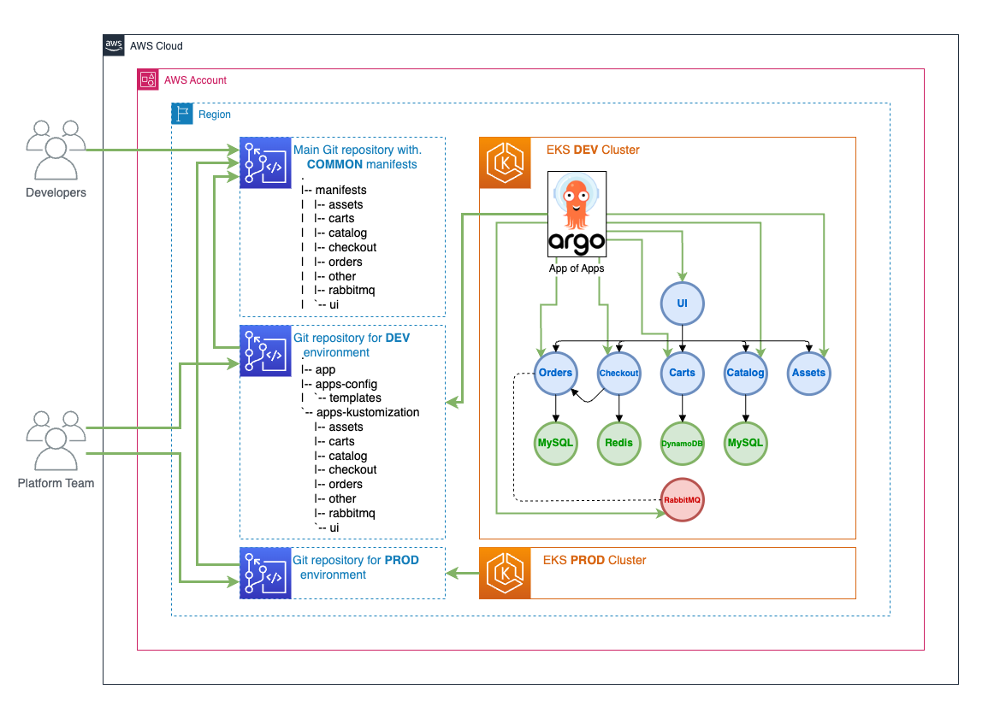
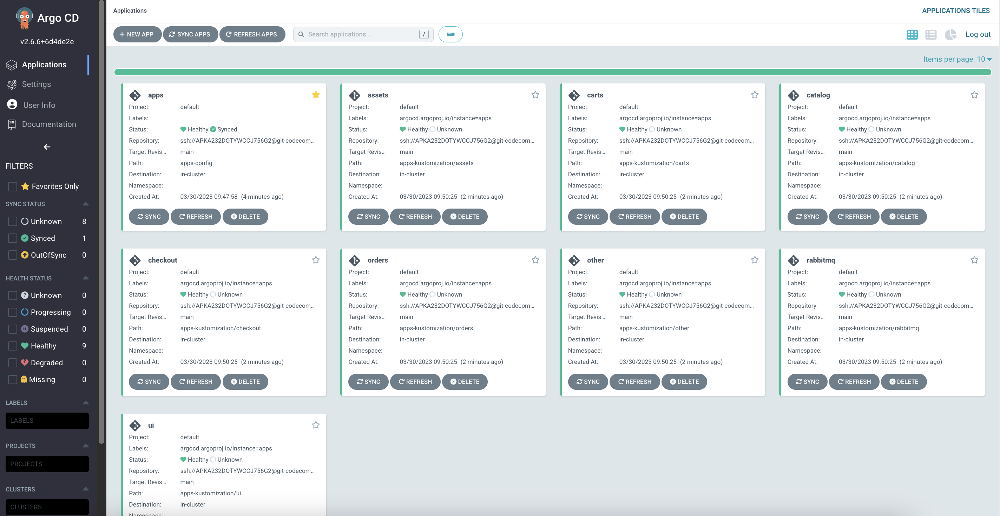

[Argo CD](https://argoproj.github.io/cd/) can be used to deploy a set of applications to different environments (DEV, TEST, PROD ...) using common set of Kubernetes manifest and customizations specific to an environment.

We can use [Argo CD App of Apps pattern](https://argo-cd.readthedocs.io/en/stable/operator-manual/cluster-bootstrapping/) to implement this use case. This pattern allows us to specify one Argo CD Application that consists of other applications.



We use [EKS Workshop Git repository](https://github.com/aws-samples/eks-workshop-v2/tree/main/environment/workspace/manifests) as a Git repository with Common Manifest. This repository will be used as a basis for each environment.

```
.
|-- manifests
| |-- assets
| |-- carts
| |-- catalog
| |-- checkout
| |-- orders
| |-- other
| |-- rabbitmq
| `-- ui
```

This example shows how to use Helm to create a configuration for a particular, for example DEV, environment.
A typical layout of a Git repository could be:

```
.
|-- app-of-apps
|   |-- ...
`-- apps-kustomization
    ...
```

We create templates for each child application:

```
.
|-- app-of-apps
|   |-- Chart.yaml
|   |-- templates
|   |   |-- assets.yaml
|   |   |-- carts.yaml
|   |   |-- catalog.yaml
|   |   |-- checkout.yaml
|   |   |-- orders.yaml
|   |   |-- other.yaml
|   |   |-- rabbitmq.yaml
|   |   `-- ui.yaml
|   `-- values.yaml
`-- apps-kustomization
    ...
```

`Chart.yaml` is a boiler-plate. `templates` contains one file for each child application, for example:

```file
automation/gitops/argocd/app-of-apps/templates/ui.yaml
```

`values.yaml` contains values which are specific for a particular environment and which will be applied to all application templates.

```file
automation/gitops/argocd/app-of-apps/values.yaml
```

First, copy `App of Apps` configuration which we described above to the Git repository directory:

```bash
$ cd ~/environment
$ cp -R /workspace/modules/automation/gitops/argocd/app-of-apps ~/environment/argocd/
$ yq -i '.spec.source.repoURL = load("./argocd_repo_url")' ~/environment/argocd/app-of-apps/values.yaml

```

Next, push changes to the Git repository:

```bash
$ git -C ~/environment/argocd add .
$ git -C ~/environment/argocd commit -am "Adding App of Apps"
$ git -C ~/environment/argocd push
```

Finally, we need to update `--upsert` existing an Argo CD `Application` to support `App of Apps` pattern.
We define a new path to Argo CD `Application` using `--path app-of-apps`.

```bash
$ argocd app create apps --repo $(cat ~/environment/argocd_repo_url) \
  --dest-server https://kubernetes.default.svc \
  --sync-policy automated --self-heal --auto-prune \
  --set-finalizer \
  --upsert --path app-of-apps
 application 'apps' updated
```

Open the Argo CD UI and navigate to the `apps` application.


We can also use the `Refresh` button to sync an application.

We have Argo CD `App of Apps Application` deployed and synced.

Our applications, except Argo CD `App of Apps Application`, are in `Unknown` state because we didn't deploy their configuration yet.



We will deploy application configurations for the applications in the next step.
