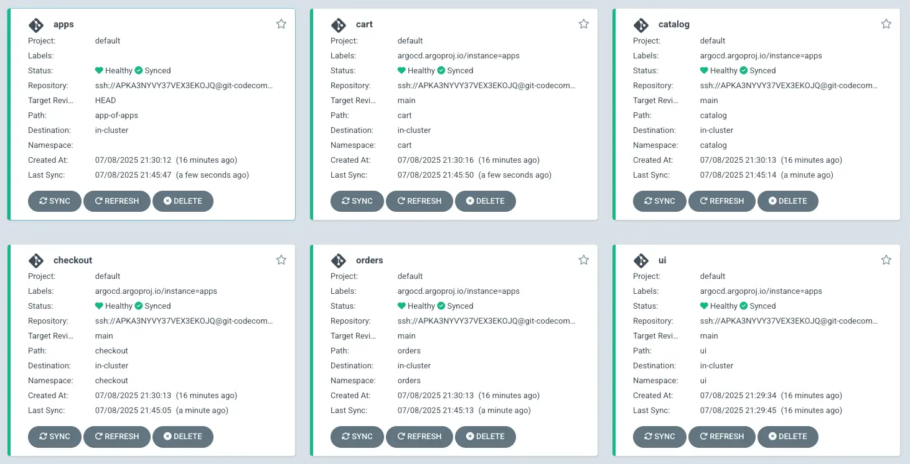

Now that we've set up the foundation of the App of Apps pattern, we can add the additional workload Helm charts to the Git repository.

The repository structure will look like this after adding the application charts:

```text
.
|-- app-of-apps
|   |-- ...
|-- carts
|   `-- Chart.yaml
|-- catalog
|   `-- Chart.yaml
|-- checkout
|   `-- Chart.yaml
|-- orders
|   `-- Chart.yaml
`-- ui
    `-- Chart.yaml
```

Let's copy the application chart files to our Git repository directory:

```bash
$ cp -R ~/environment/eks-workshop/modules/automation/gitops/argocd/app-charts/* \
  ~/environment/argocd/
```

Next, commit and push these changes to the Git repository:

```bash
$ git -C ~/environment/argocd add .
$ git -C ~/environment/argocd commit -am "Adding apps charts"
$ git -C ~/environment/argocd push
```

Sync the apps application:

```bash
$ argocd app sync apps
$ argocd app wait -l app.kubernetes.io/created-by=eks-workshop
```

When Argo CD completes the process, all our applications will be in the `Synced` state as shown in the Argo CD UI:



We should now see a set of new namespaces with each application component deployed:

```bash hook=deploy
$ kubectl get namespaces
NAME              STATUS   AGE
argocd            Active   18m
carts             Active   28s
catalog           Active   28s
checkout          Active   28s
default           Active   8h
gitea             Active   19m
kube-node-lease   Active   8h
kube-public       Active   8h
kube-system       Active   8h
orders            Active   28s
ui                Active   11m
```

Let's examine one of the deployed workloads more closely. For example, we can check the carts component:

```bash
$ kubectl get deployment -n carts
NAME    READY   UP-TO-DATE   AVAILABLE   AGE
carts   1/1     1            1           46s
```

This confirms that our GitOps-based deployment using the App of Apps pattern has successfully deployed all microservices to our cluster.
