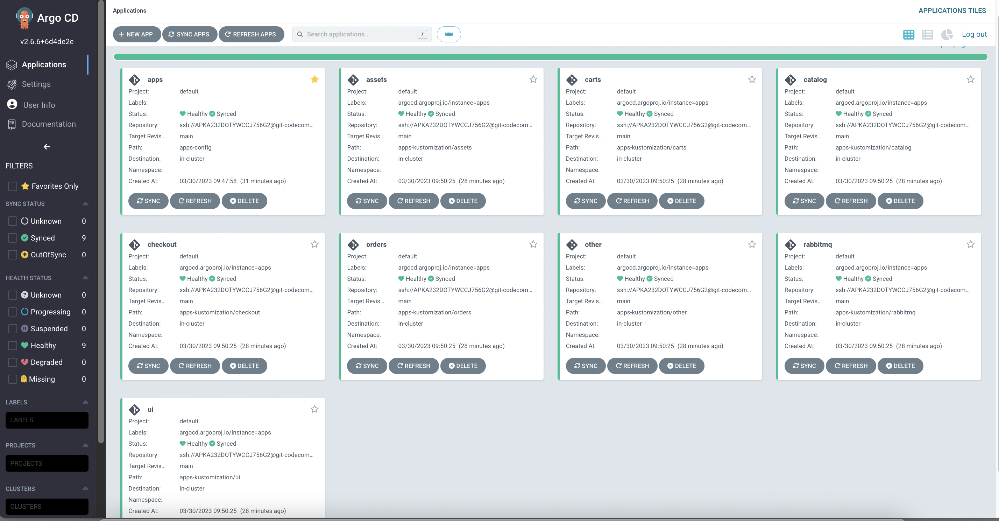
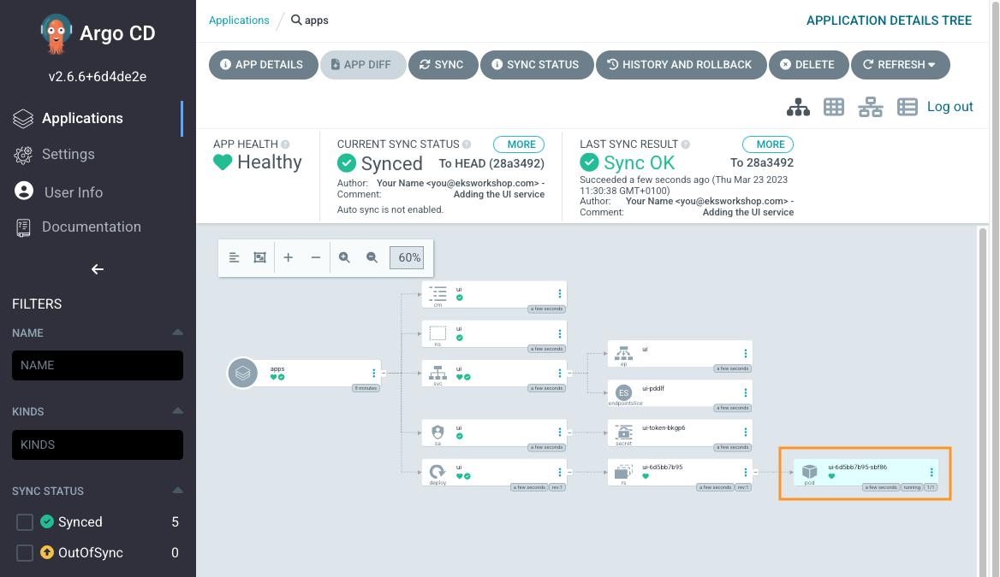

We have successfully configured Argo CD App of Apps, so now we can deploy an environment specific customization for the set of application.

First let's remove the existing Applications so we can replace it:

```bash
$ kubectl delete -k /workspace/manifests --ignore-not-found=true
namespace "assets" deleted
namespace "carts" deleted
namespace "catalog" deleted
namespace "checkout" deleted
namespace "orders" deleted
namespace "other" deleted
namespace "rabbitmq" deleted
namespace "ui" deleted
...
```

We will then need to create a customization for each application:

```
.
|-- app-of-apps
|   |-- ...
`-- apps-kustomization
    |-- assets
    |   `-- kustomization.yaml
    |-- carts
    |   `-- kustomization.yaml
    |-- catalog
    |   `-- kustomization.yaml
    |-- checkout
    |   `-- kustomization.yaml
    |-- orders
    |   `-- kustomization.yaml
    |-- other
    |   `-- kustomization.yaml
    |-- rabbitmq
    |   `-- kustomization.yaml
    `-- ui
        |-- deployment-patch.yaml
        `-- kustomization.yaml
```

```file
automation/gitops/argocd/apps-kustomization/ui/kustomization.yaml
```

We define a path to `base` Kubernetes manifests for an application, in this case `ui`, using `resources`. We also define which configuration should be applied to `ui` application in EKS cluster using `patches`.

```file
automation/gitops/argocd/apps-kustomization/ui/deployment-patch.yaml
```

We would like to have `1` replica for `ui` application. All other application will use configuration from `base` Kubernetes manifests.

Copy files to the Git repository directory:

```bash
$ cp -R /workspace/modules/automation/gitops/argocd/apps-kustomization ~/environment/argocd/
```

Your final Git directory should now look like this. You can validate it by running `tree ~/environment/argocd`:

```
|-- app-of-apps
|   |-- Chart.yaml
|   |-- templates
|   |   |-- assets.yaml
|   |   |-- carts.yaml
|   |   |-- catalog.yaml
|   |   |-- checkout.yaml
|   |   |-- orders.yaml
|   |   |-- other.yaml
|   |   |-- rabbitmq.yaml
|   |   `-- ui.yaml
|   `-- values.yaml
|-- apps
|   |-- ...
`-- apps-kustomization
    |-- assets
    |   `-- kustomization.yaml
    |-- carts
    |   `-- kustomization.yaml
    |-- catalog
    |   `-- kustomization.yaml
    |-- checkout
    |   `-- kustomization.yaml
    |-- orders
    |   `-- kustomization.yaml
    |-- other
    |   `-- kustomization.yaml
    |-- rabbitmq
    |   `-- kustomization.yaml
    `-- ui
        |-- deployment-patch.yaml
        `-- kustomization.yaml

13 directories, 27 files
```

Push changes to the Git repository:

```bash
$ git -C ~/environment/argocd add .
$ git -C ~/environment/argocd commit -am "Adding apps kustomization"
$ git -C ~/environment/argocd push
```

It will take Argo CD some time to notice the changes in the Git repository and reconcile.
We can also use the `Refresh` button or the `argocd` CLI to `Sync` the application:

```bash timeout=300
$ argocd app sync apps --prune
$ argocd app sync ui --prune
```

We've now successfully migrated the all the applications to deploy using Argo CD, and any further changes pushed to the Git repository will be automatically reconciled to EKS cluster.

When Argo CD finish the sync, all our applications will be in `Synced` state.



You should also have all the resources related to the `ui` application deployed. To verify, run the following commands:

```bash hook=deploy
$ kubectl get deployment -n ui ui
NAME   READY   UP-TO-DATE   AVAILABLE   AGE
ui     1/1     1            1           61s
$ kubectl get pod -n ui
NAME                 READY   STATUS   RESTARTS   AGE
ui-6d5bb7b95-rjfxd   1/1     Running  0          62s
```


