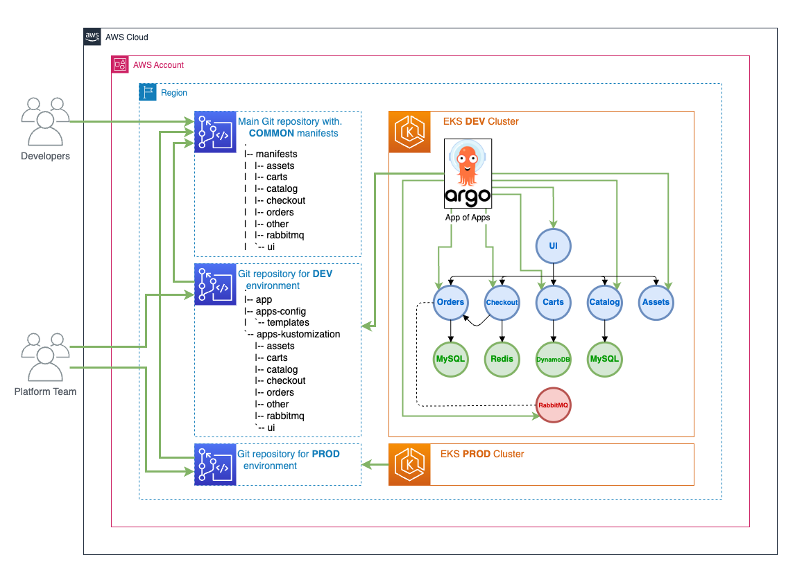

[Argo CD](https://argoproj.github.io/cd/) can deploy a set of applications to different environments (DEV, TEST, PROD ...) using `base` Kubernetes manifests for applications and customizations specific to an environment.

We can leverage [Argo CD App of Apps pattern](https://argo-cd.readthedocs.io/en/stable/operator-manual/cluster-bootstrapping/) to implement this use case. This pattern allows us to specify one Argo CD Application that consists of other applications.



We reference [EKS Workshop Git repository](https://github.com/aws-samples/eks-workshop-v2/tree/main/environment/workspace/manifests) as a Git repository with `base` manifests for your Kubernetes resources. This repository will contain an initial resource state for each application.

```
.
|-- manifests
| |-- assets
| |-- carts
| |-- catalog
| |-- checkout
| |-- orders
| |-- other
| |-- rabbitmq
| `-- ui
```

This example shows how to use Helm to create a configuration for a particular, for example DEV, environment.
A typical layout of a Git repository could be:

```
.
|-- app-of-apps
|   |-- ...
`-- apps-kustomization
    ...
```
