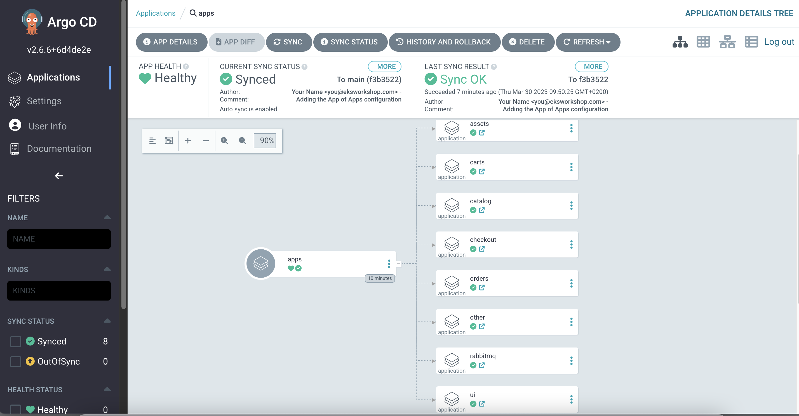
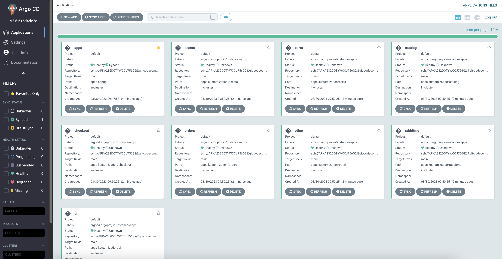

Before we start to setup Argo CD applications, let's delete Argo CD `Application` which we created for `ui`:

```bash wait=30
$ argocd app delete apps --cascade -y
```

We create templates for set of AroCD applications using DRY approach in Helm charts:

```
.
|-- app-of-apps
|   |-- Chart.yaml
|   |-- templates
|   |   |-- _application.yaml
|   |   `-- application.yaml
|   `-- values.yaml
`-- apps-kustomization
    ...
```

`Chart.yaml` is a boiler-plate. `templates` contains a template file which will be used to create applications defined in values.yaml.

`values.yaml` also contains values which are specific for a particular environment and which will be applied to all application templates.

```file
automation/gitops/argocd/app-of-apps/values.yaml
```

First, copy `App of Apps` configuration which we described above to the Git repository directory:

```bash
$ cp -R /workspace/modules/automation/gitops/argocd/app-of-apps ~/environment/argocd/
$ yq -i ".spec.source.repoURL = env(GITOPS_REPO_URL_ARGOCD)" ~/environment/argocd/app-of-apps/values.yaml

```

Next, push changes to the Git repository:

```bash wait=10
$ git -C ~/environment/argocd add .
$ git -C ~/environment/argocd commit -am "Adding App of Apps"
$ git -C ~/environment/argocd push
```

Finally, we need to create new Argo CD `Application` to support `App of Apps` pattern.
We define a new path to Argo CD `Application` using `--path app-of-apps`.

We also enable ArgoCD Application to automatically [synchronize](https://argo-cd.readthedocs.io/en/stable/user-guide/auto_sync/) the state in the cluster with the configuration in the Git repository using `--sync-policy automated`

```bash
$ argocd app create apps --repo $GITOPS_REPO_URL_ARGOCD \
  --dest-server https://kubernetes.default.svc \
  --sync-policy automated --self-heal --auto-prune \
  --set-finalizer \
  --upsert \
  --path app-of-apps
 application 'apps' created
```

The default `Refresh` interval is 3 minutes (180 seconds). You could change the interval by updating the "timeout.reconciliation" value in the argocd-cm config map. If the interval is to 0 then Argo CD will not poll Git repositories automatically and alternative methods such as webhooks and/or manual syncs should be used.

For training purposes, let's set `Refresh` interval to 5s and restart argocd application controller to deploy our changes faster

```bash wait=30
$ kubectl patch configmap/argocd-cm -n argocd --type merge \
  -p '{"data":{"timeout.reconciliation":"5s"}}'
$ kubectl -n argocd rollout restart deploy argocd-repo-server
$ kubectl -n argocd rollout status deploy/argocd-repo-server
$ kubectl -n argocd rollout restart statefulset argocd-application-controller
$ kubectl -n argocd rollout status statefulset argocd-application-controller
```

Open the Argo CD UI and navigate to the `apps` application.



Click `Refresh` and `Sync` in ArgoCD UI, use `argocd` CLI to `Sync` the application or wait until automatic `Sync` will be finished:

```bash
$ argocd app sync apps
```

We have Argo CD `App of Apps Application` deployed and synced.

Our applications, except Argo CD `App of Apps Application`, are in `Unknown` state because we didn't deploy their configuration yet.



We will deploy application configurations for the applications in the next step.
