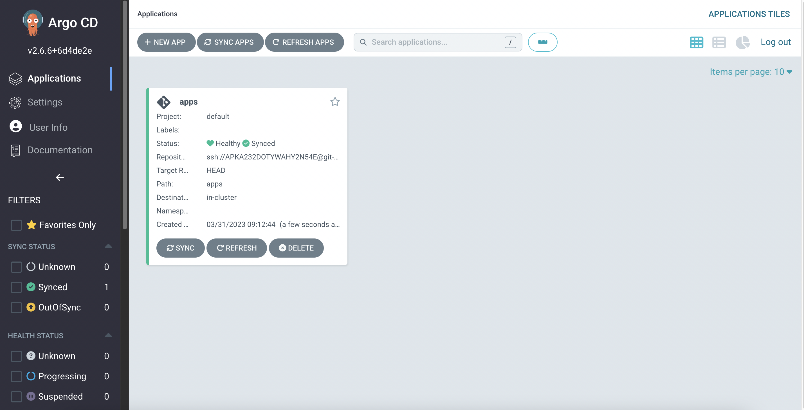

Argo CD applies the `GitOps` methodology to Kubernetes. It uses Git as a source of truth for your cluster's desired state. You can use Argo CD to deploy applications, monitor their health, and sync them with the desired state. Kubernetes manifests can be specified in several ways:

- Kustomize applications
- Helm charts
- Jsonnet files
- Plain directories of Kubernetes YAML files

In this lab exercise, we will deploy an applications specified in Kustomize using Argo CD. We will use the `ui` application from [EKS Workshop](https://github.com/aws-samples/eks-workshop-v2/tree/stable/environment/workspace/manifests/ui) repository.

The Git repository in AWS CodeCommit has already been created for you.

:::info
If you want to use your own GitHub private repository you could re define

```
GITOPS_REPO_URL=https://github.com/username/reponame
echo $GITOPS_REPO_URL > ~/environment/argocd_repo_url
```

and use [those instructions](https://argo-cd.readthedocs.io/en/stable/user-guide/private-repositories/) to create an Argo CD secret to give access to the Git repository from Argo CD
:::

```bash
$ GITOPS_REPO_URL=ssh://${GITOPS_IAM_SSH_KEY_ID}@git-codecommit.${AWS_DEFAULT_REGION}.amazonaws.com/v1/repos/${EKS_CLUSTER_NAME}-argocd
$ echo $GITOPS_REPO_URL > ~/environment/argocd_repo_url
```

Let's clone the Git repository.

```bash
$ git clone $(cat ~/environment/argocd_repo_url) ~/environment/argocd
$ git -C ~/environment/argocd checkout -b main
Switched to a new branch 'main'
$ mkdir ~/environment/argocd/apps && touch ~/environment/argocd/apps/.gitkeep
$ git -C ~/environment/argocd add .
$ git -C ~/environment/argocd commit -am "Initial commit"
$ git -C ~/environment/argocd push --set-upstream origin main
```

Create an Argo CD secret to give access to the Git repository from Argo CD:

```bash
$ argocd repo add $(cat ~/environment/argocd_repo_url) --ssh-private-key-path ${HOME}/.ssh/gitops_ssh.pem --insecure-ignore-host-key --upsert --name git-repo
Repository 'ssh://APKA232DOTYWDIYNGJC6@git-codecommit.eu-central-1.amazonaws.com/v1/repos/eks-workshop-argocd' added
```

Argo CD application is a CRD Kubernetes resource object representing a deployed application instance in an environment. It defines key information about the application, such as the application name, the Git repository, and the path to the Kubernetes manifests. The application resource also defines the desired state of the application, such as the target revision, the sync policy, and the health check policy.

As the next step let's create an Argo CD Application which automatically `Sync` application with desired state in the Git repository:

```bash
$ argocd app create apps --repo $(cat ~/environment/argocd_repo_url) \
  --path apps --dest-server https://kubernetes.default.svc \
  --sync-policy automated --self-heal --auto-prune
 application 'apps' created
```

Verify that the application has been created:

```bash
$ argocd app list
NAME         CLUSTER                         NAMESPACE  PROJECT  STATUS  HEALTH   SYNCPOLICY  CONDITIONS  REPO                                                                                               PATH  TARGET
argocd/apps  https://kubernetes.default.svc             default  Synced  Healthy  Auto-Prune  <none>      ssh://APKA232DOTYWAHY2N54E@git-codecommit.eu-central-1.amazonaws.com/v1/repos/eks-workshop-argocd  apps
```

We can also see this Application in the ArgoCD UI now:



Alternatively, you can also interact with Argo CD objects in the cluster using the `kubectl` command:

```bash
$ kubectl get apps -n argocd
NAME   SYNC STATUS   HEALTH STATUS
apps   Synced        Healthy
```
