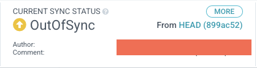

We have successfully configured Argo CD on our cluster so now we can deploy an application. To demonstrate the difference between a GitOps-based delivery of an application and other methods, we'll migrate the UI component of the sample application which is currently using the `kubectl apply -k` approach to the new Argo CD deployment approach.

First let's remove the existing UI component so we can replace it:

```bash
$ kubectl delete -k /workspace/manifests/ui --ignore-not-found=true
namespace "ui" deleted
serviceaccount "ui" deleted
configmap "ui" deleted
service "ui" deleted
deployment.apps "ui" deleted
```

Now, let's get into the cloned Git repository and start creating our GitOps configuration. Copy the existing kustomize configuration for the UI service:

```bash
$ cp -R /workspace/manifests/ui ~/environment/gitops/apps
```

We'll then need to create a kustomization in the `apps` directory:

```file
automation/gitops/argocd/kustomization.yaml
```

Copy this file to the Git repository directory:

```bash
$ cp /workspace/modules/automation/gitops/argocd/kustomization.yaml ~/environment/gitops/apps/kustomization.yaml
```

You Git directory should now look something like this which you can validate by running `tree ~/environment/gitops`:

```
.
└── apps
    ├── kustomization.yaml
    └── ui
        ├── configMap.yaml
        ├── deployment.yaml
        ├── kustomization.yaml
        ├── namespace.yaml
        ├── serviceAccount.yaml
        └── service.yaml

2 directories, 7 files
```

Finally we can push our configuration to the Git repository:

```bash
$ (cd ~/environment/gitops && \
git add . && \
git commit -am "Adding the UI service" && \
git push)
```

Open the Argo CD UI and navigate to the `apps` application.



Notice that the application might be in `OutOfSync` state. This means that the application is not deployed and not in sync with the desired state.


It will take Argo CD some time to notice the changes in the Git repository and reconcile. You can use the Argo CD UI to `Refresh` and `Sync` for our new `apps` kustomization to appear.

Now, we're going to `Sync` the application. This will deploy the application to the cluster and bring it to the desired state.

Click on the `Sync` button in the UI of the app.


Or, you can also use the `argocd` CLI:

```bash
$ argocd app sync apps --prune
```

After a short period of time, the application should be in `Synced` state and the resources should be deployed, the UI should look like this:


That shows that Argo CD created the basic kustomization, and that it's in sync with the cluster.

We've now successfully migrated the UI component to deploy using Argo CD, and any further changes pushed to the Git repository will be automatically reconciled to our EKS cluster.

You should now have all the resources related to the UI services deployed. To verify, run the following commands:

```bash
$ kubectl get deployment -n ui ui
NAME   READY   UP-TO-DATE   AVAILABLE   AGE
ui     1/1     1            1           61s
$ kubectl get pod -n ui
NAME                  READY   STATUS    RESTARTS   AGE
ui-6d5bb7b95-rjfxd   1/1     Running   0          62s
```
