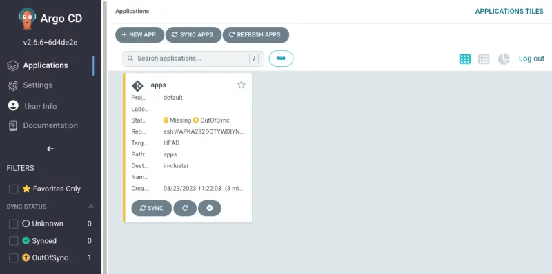
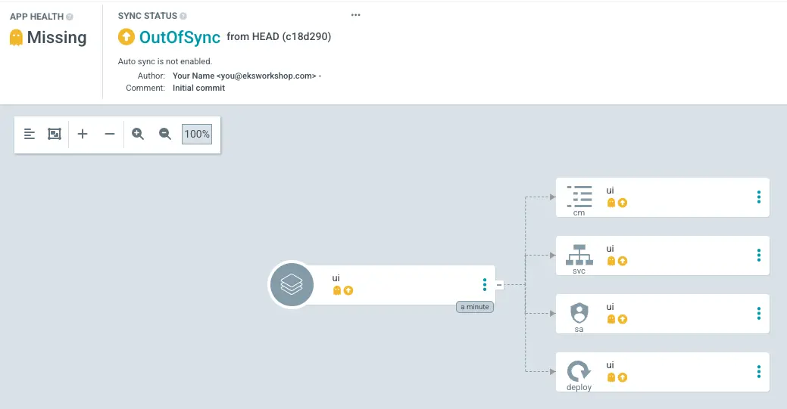
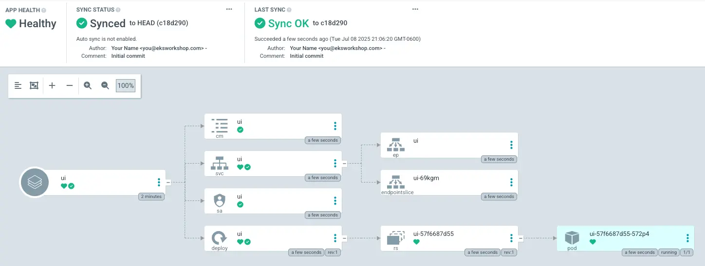

Now that we have successfully configured Argo CD on our cluster, let's deploy an application. To demonstrate the difference between a GitOps-based delivery approach and traditional deployment methods, we'll migrate the UI component of our sample application from using the `kubectl apply -k` approach to an Argo CD-managed deployment.

An Argo CD application is a Custom Resource Definition (CRD) that represents a deployed application instance in an environment. It defines key information such as the application name, Git repository location, and path to the Kubernetes manifests. The application resource also specifies the desired state, target revision, sync policy, and health check policy.

First, let's remove the existing sample application from the cluster:

```bash
$ kubectl delete namespace -l app.kubernetes.io/created-by=eks-workshop
namespace "carts" deleted
namespace "catalog" deleted
namespace "checkout" deleted
namespace "orders" deleted
namespace "other" deleted
namespace "ui" deleted
```

Now we'll populate our Git repository with a simple Helm chart which wraps the published chart for the UI component by using it as a Helm dependency:

::yaml{file="manifests/modules/automation/gitops/argocd/Chart.yaml" paths="name,type,version,dependencies.0"}

1. The name of the wrapper Helm chart
2. Indicates this chart deploys an application
3. Specify a version for the chart
4. Specify the name, alias and version of the retail store UI component from AWS's public OCI registry as the dependency of the wrapper Helm chart

Let's copy this file to our Git directory:

```bash
$ mkdir -p ~/environment/argocd/ui
$ cp ~/environment/eks-workshop/modules/automation/gitops/argocd/Chart.yaml \
  ~/environment/argocd/ui
```

Our Git directory should now have this structure:

```bash
$ tree ~/environment/argocd
`-- ui
    `-- Chart.yaml
```

Now we'll push our configuration to the Git repository:

```bash
$ git -C ~/environment/argocd add .
$ git -C ~/environment/argocd commit -am "Adding the UI service"
$ git -C ~/environment/argocd push
```

Next, let's create an Argo CD Application configured to use our Git repository:

```bash
$ argocd app create ui --repo ssh://git@${GITEA_SSH_HOSTNAME}:2222/workshop-user/argocd.git \
  --path ui --dest-server https://kubernetes.default.svc \
  --dest-namespace ui --sync-option CreateNamespace=true
application 'ui' created
```

We can verify that the application has been created:

```bash
$ argocd app list
NAME         CLUSTER                         NAMESPACE  PROJECT  STATUS     HEALTH   SYNCPOLICY  CONDITIONS
argocd/ui    https://kubernetes.default.svc  ui         default  OutOfSync  Missing  Manual      <none>
```

This application is now visible in the Argo CD UI:



Alternatively, we can also interact with Argo CD objects directly using the `kubectl` command:

```bash
$ kubectl get applications.argoproj.io -n argocd
NAME   SYNC STATUS   HEALTH STATUS
apps   OutOfSync     Missing
```

If you open the Argo CD UI and navigate to the `apps` application, you'll see:



In Argo CD, "out of sync" indicates that the desired state defined in your Git repository doesn't match the actual state in your Kubernetes cluster. Although Argo CD is capable of automated synchronization, for now we'll manually trigger this process:

```bash
$ argocd app sync ui
$ argocd app wait ui --timeout 120
```

After a short period, the application should reach the `Synced` state, with all resources deployed. The UI should look like this:



This confirms that Argo CD has successfully installed the Helm chart and it's now in sync with the cluster.

We've now successfully migrated the UI component to be deployed using Argo CD. Any future changes pushed to the Git repository will be automatically reconciled to our EKS cluster.

To verify that all resources related to the UI service are deployed, run the following commands:

```bash hook=deploy
$ kubectl get deployment -n ui ui
NAME   READY   UP-TO-DATE   AVAILABLE   AGE
ui     1/1     1            1           61s
$ kubectl get pod -n ui
NAME                 READY   STATUS   RESTARTS   AGE
ui-6d5bb7b95-rjfxd   1/1     Running  0          62s
```
