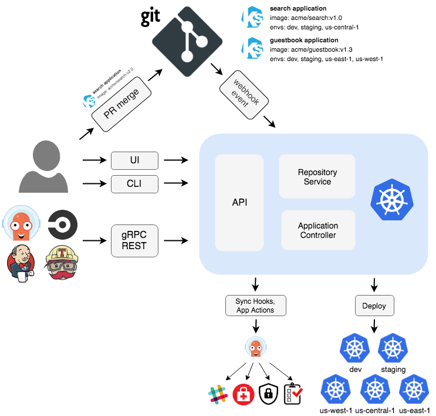

{}

:::tip Before you start
Prepare your environment for this section:

```bash timeout=300 wait=120 hook=install
$ prepare-environment automation/gitops/argocd
```

This will make the following changes to your lab environment:
- Create an AWS CodeCommit repository
- Install ArgoCD in the Amazon EKS cluster

You can view the Terraform that applies these changes [here](https://github.com/VAR::MANIFESTS_OWNER/VAR::MANIFESTS_REPOSITORY/tree/VAR::MANIFESTS_REF/manifests/modules/automation/gitops/argocd/.workshop/terraform).

:::

[Argo CD](https://argoproj.github.io/cd/) is a declarative, GitOps continuous delivery tool for Kubernetes. Argo CD controller in Kubernetes cluster continuously monitors the state of your cluster and compares it with the desired state defined in Git. If the cluster state does not match the desired state, Argo CD reports the deviation and provides visualizations to help developers manually or automatically sync the cluster state with the desired state.

Argo CD offers 3 ways to manage your application state:

- CLI - A powerful CLI that lets you create YAML resource definitions for your applications and sync them with your cluster.
- User Interface - A web-based UI that lets you do the same things that you can do with the CLI. It also lets you visualize the Kubernetes resources belongs to the Argo CD applications that you create.
- Kubernetes manifests and Helm charts applied to the cluster.


