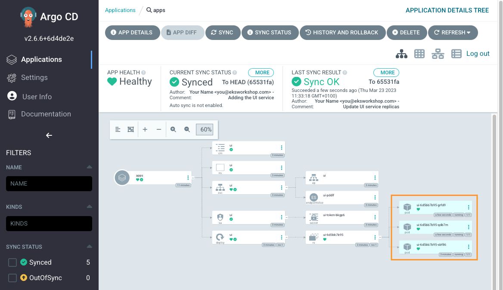

Now we can use Argo CD and Kustomize to deploy patches to our application manifests using GitOps
For example, lets increase the number of `replicas` for `ui` deployment to `3`

```kustomization
automation/gitops/argocd/update-application/deployment-patch.yaml
Deployment/ui
```

Copy patch file to the Git repository directory:

```bash
$ cp /workspace/modules/automation/gitops/argocd/update-application/deployment-patch.yaml ~/environment/gitops/apps/deployment-patch.yaml
```

You can review planned changes in the file `/gitops/apps/deployment-patch.yaml`

To apply the patch edit the file `/gitops/apps/kustomization.yaml` like in the example below:

```file
automation/gitops/argocd/update-application/kustomization.yaml
```

You can execute commands to add necessary changes to the file `/gitops/apps/kustomization.yaml`:

```bash
$ echo "patches:" >> ~/environment/gitops/apps/kustomization.yaml
$ echo "- deployment-patch.yaml" >> ~/environment/gitops/apps/kustomization.yaml
```

Push changes to CodeCommit

```bash
$ (cd ~/environment/gitops && \
git add . && \
git commit -am "Update UI service replicas" && \
git push)
```

Go to Argo CD UI, `Refresh` and `Sync` and you should now have all the changes the UI services deployed once more.
We should have now 3 pods in `ui` deployment



To verify, run the following commands:

```bash
$ kubectl get deployment -n ui ui
NAME   READY   UP-TO-DATE   AVAILABLE   AGE
ui     3/3     3            3           3m33s
$ kubectl get pod -n ui
NAME                  READY   STATUS    RESTARTS   AGE
ui-6d5bb7b95-hzmgp   1/1     Running   0          61s
ui-6d5bb7b95-j28ww   1/1     Running   0          61s
ui-6d5bb7b95-rjfxd   1/1     Running   0          3m34s
```
