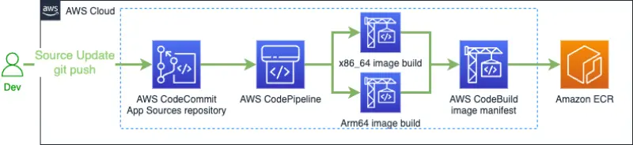
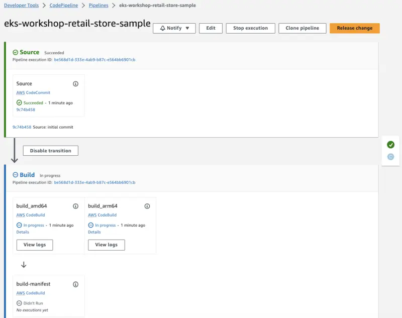
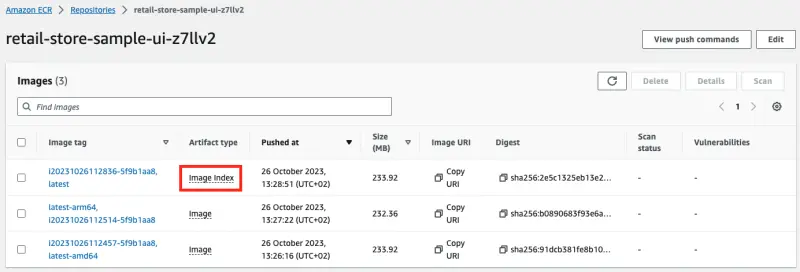
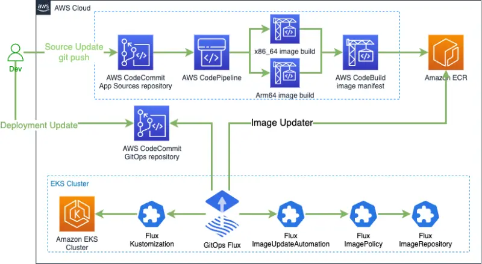
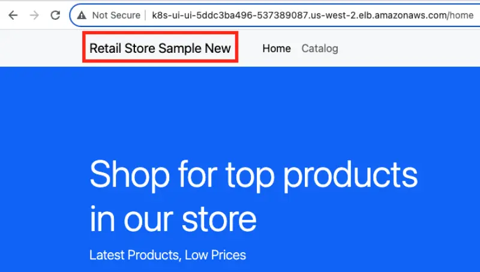

We have successfully bootstrapped Flux on EKS cluster and deployed the application. To demonstrate how to make changes in the source code an application, build a new container images and leverage GitOps to deploy a new image to a cluster we introduce Continuous Integration pipeline. We will leverage AWS Developer Tools and [DevOps principles](https://aws.amazon.com/devops/what-is-devops/) to build [multi-architecture container images](https://aws.amazon.com/blogs/containers/introducing-multi-architecture-container-images-for-amazon-ecr/) for Amazon ECR.

We created Continuous Integration Pipeline during the prepare environment step and now we need to make it up and running.



First, clone CodeCommit repository for the application sources:

```bash
$ git clone ssh://${GITOPS_IAM_SSH_KEY_ID}@git-codecommit.${AWS_REGION}.amazonaws.com/v1/repos/${EKS_CLUSTER_NAME}-retail-store-sample ~/environment/retail-store-sample-codecommit
```

Next, populate the CodeCommit repository with the sources from the public repository of the [Sample application](https://github.com/aws-containers/retail-store-sample-app):

```bash
$ git clone https://github.com/aws-containers/retail-store-sample-app ~/environment/retail-store-sample-app
$ git -C ~/environment/retail-store-sample-app checkout 0.4.0
$ git -C ~/environment/retail-store-sample-codecommit checkout -b main
$ cp -R ~/environment/retail-store-sample-app/src ~/environment/retail-store-sample-codecommit
```

We use AWS CodeBuild and define `buildspec.yml` to build new `x86_64` and `arm64` images in parallel.

```file
manifests/modules/automation/gitops/flux/buildspec.yml
```

```bash
$ cp ~/environment/eks-workshop/modules/automation/gitops/flux/buildspec.yml \
  ~/environment/retail-store-sample-codecommit/buildspec.yml
```

We use AWS CodeBuild also to build `Image Index` for `multi-architecture image` using `buildspec-manifest.yml`

```file
manifests/modules/automation/gitops/flux/buildspec-manifest.yml
```

```bash
$ cp ~/environment/eks-workshop/modules/automation/gitops/flux/buildspec-manifest.yml \
  ~/environment/retail-store-sample-codecommit/buildspec-manifest.yml
```

Now we are ready to push our changes to CodeCommit and start the CodePipeline

```bash
$ git -C ~/environment/retail-store-sample-codecommit add .
$ git -C ~/environment/retail-store-sample-codecommit commit -am "initial commit"
$ git -C ~/environment/retail-store-sample-codecommit push --set-upstream origin main
```

You can navigate to `CodePipeline` in AWS Console and explore `eks-workshop-retail-store-sample` pipeline:

<ConsoleButton url="https://console.aws.amazon.com/codesuite/codepipeline/pipelines/eks-workshop-retail-store-sample/view" service="codepipeline" label="Open CodePipeline console"/>

It should look something like this:



As a result of a CodePipeline run with CodeBuild you will have a new image in ECR

```bash
$ echo IMAGE_URI_UI=$IMAGE_URI_UI
```

The suffix `z7llv2` in the name `retail-store-sample-ui-z7llv2` is random and will be different in your case.



While we are waiting for pipeline to create new images (5-10 minutes), let's [automate image updates to Git](https://fluxcd.io/flux/guides/image-update/) using Flux Image Automation Controller which we installed during the initial Flux bootstrap process.

Next, edit file `deployment.yaml` and add placeholder for new container image URL:

```bash
$ git -C ~/environment/flux pull
$ sed -i 's/^\(\s*\)image: "public.ecr.aws\/aws-containers\/retail-store-sample-ui:0.4.0"/\1image: "public.ecr.aws\/aws-containers\/retail-store-sample-ui:0.4.0" # {"$imagepolicy": "flux-system:ui"}/' ~/environment/flux/apps/ui/deployment.yaml
$ less ~/environment/flux/apps/ui/deployment.yaml | grep imagepolicy
          image: "public.ecr.aws/aws-containers/retail-store-sample-ui:0.4.0" # {"$imagepolicy": "flux-system:ui"}
```

This will change the image in the pod specification to:

```text
image: "public.ecr.aws/aws-containers/retail-store-sample-ui:0.4.0" `# {"$imagepolicy": "flux-system:ui"}`
```

Commit these changes to deployment:

```bash
$ git -C ~/environment/flux add .
$ git -C ~/environment/flux commit -am "Adding ImagePolicy"
$ git -C ~/environment/flux push
$ flux reconcile kustomization apps --with-source
```

We need to deploy custom resource definitions (ImageRepository, ImagePolicy, ImageUpdateAutomation) for Flux to enable monitoring of new container images in ECR and automated deployment using GitOps.

An `ImageRepository`:

```file
manifests/modules/automation/gitops/flux/imagerepository.yaml
```

An `ImagePolicy`:

```file
manifests/modules/automation/gitops/flux/imagepolicy.yaml
```

An `ImageUpdateAutomation`:

```file
manifests/modules/automation/gitops/flux/imageupdateautomation.yaml
```

Add these files to the application repository and apply them:

```bash
$ cp ~/environment/eks-workshop/modules/automation/gitops/flux/image*.yaml \
  ~/environment/retail-store-sample-codecommit/
$ yq -i ".spec.image = env(IMAGE_URI_UI)" \
  ~/environment/retail-store-sample-codecommit/imagerepository.yaml
$ less ~/environment/retail-store-sample-codecommit/imagerepository.yaml | grep image:
$ kubectl apply -f ~/environment/retail-store-sample-codecommit/imagerepository.yaml
$ kubectl apply -f ~/environment/retail-store-sample-codecommit/imagepolicy.yaml
$ kubectl apply -f ~/environment/retail-store-sample-codecommit/imageupdateautomation.yaml
```

We created the following architecture:



Now, lets reconcile the changes.

```bash
$ flux reconcile image repository ui
$ flux reconcile kustomization apps --with-source
$ kubectl wait deployment -n ui ui --for condition=Available=True --timeout=120s
$ git -C ~/environment/flux pull
$ kubectl -n ui get pods
```

We can check that `image:` in the `deployment` has been updated to a new tag.

```bash
$ kubectl -n ui describe deployment ui | grep Image
```

To access `UI` using a browser we need to expose it by creating an Ingress resource with the following manifest:

```file
manifests/modules/automation/gitops/flux/ci-ingress/ingress.yaml
```

This will cause the AWS Load Balancer Controller to provision an Application Load Balancer and configure it to route traffic to the Pods for the `ui` application.

```bash timeout=180 wait=10
$ kubectl apply -k ~/environment/eks-workshop/modules/automation/gitops/flux/ci-ingress
```

Let's inspect the Ingress object created:

```bash
$ kubectl get ingress ui -n ui
NAME   CLASS   HOSTS   ADDRESS                                            PORTS   AGE
ui     alb     *       k8s-ui-ui-1268651632.us-west-2.elb.amazonaws.com   80      15s
```

We wait 2-5 minutes until Application Load Balancer will be provisioned and check the UI page using URL of the ingress.

```bash timeout=300
$ export UI_URL=$(kubectl get ingress -n ui ui -o jsonpath="{.status.loadBalancer.ingress[*].hostname}{'\n'}")
$ wait-for-lb $UI_URL
```


Let's introduce changes to the source code of the Sample Application.

Edit the file:

```bash
$ sed -i 's/\(^\s*<a class="navbar-brand" href="\/home">\)Retail Store Sample/\1Retail Store Sample New/' \
  ~/environment/retail-store-sample-codecommit/src/ui/src/main/resources/templates/fragments/layout.html
$ less ~/environment/retail-store-sample-codecommit/src/ui/src/main/resources/templates/fragments/layout.html | grep New
```

Change line 24

`<a class="navbar-brand" href="/home">Retail Store Sample</a>` to `<a class="navbar-brand" href="/home">Retail Store Sample New</a>`

Commit changes.

```bash wait=30
$ git -C ~/environment/retail-store-sample-codecommit status
$ git -C ~/environment/retail-store-sample-codecommit add .
$ git -C ~/environment/retail-store-sample-codecommit commit -am "Update UI src"
$ git -C ~/environment/retail-store-sample-codecommit push
```

Lets wait until the CodePipeline execution has finished:

```bash timeout=900 wait=30
$ kubectl -n ui describe deployment ui | grep Image
$ while [[ "$(aws codepipeline get-pipeline-state --name ${EKS_CLUSTER_NAME}-retail-store-sample --query 'stageStates[1].actionStates[0].latestExecution.status' --output text)" != "InProgress" ]]; do echo "Waiting for pipeline to start ..."; sleep 10; done && echo "Pipeline started."
$ while [[ "$(aws codepipeline get-pipeline-state --name ${EKS_CLUSTER_NAME}-retail-store-sample --query 'stageStates[1].actionStates[2].latestExecution.status' --output text)" != "Succeeded" ]]; do echo "Waiting for pipeline to reach 'Succeeded' state ..."; sleep 10; done && echo "Pipeline has reached the 'Succeeded' state."
```

Then we can trigger Flux to make sure it reconciles the new image:

```bash
$ flux reconcile image repository ui
$ sleep 5
$ flux reconcile kustomization apps --with-source
$ kubectl wait deployment -n ui ui --for condition=Available=True --timeout=120s
```

If we pull the Git repository we can see the changes made in the log:

```bash
$ git -C ~/environment/flux pull
$ git -C ~/environment/flux log
commit f03661ddb83f8251036e2cc3c8ca70fe32f2df6c (HEAD -> main, origin/main, origin/HEAD)
Author: fluxcdbot <fluxcdbot@users.noreply.github.com>
Date:   Fri Nov 3 17:18:08 2023 +0000

    1234567890.dkr.ecr.us-west-2.amazonaws.com/retail-store-sample-ui-c5nmqe:i20231103171720-ac8730e8
[...]
```

Similarly the CodeCommit commits view will show activity:

<ConsoleButton url="https://console.aws.amazon.com/codesuite/codecommit/repositories/eks-workshop-gitops/commits" service="codecommit" label="Open CodeCommit console"/>

We can also check the pods to see the image has been update:

```bash
$ kubectl -n ui get pods
$ kubectl -n ui describe deployment ui | grep Image
```

After successful build and deployment (5-10 minutes) we will have the new version of UI application up and running.


