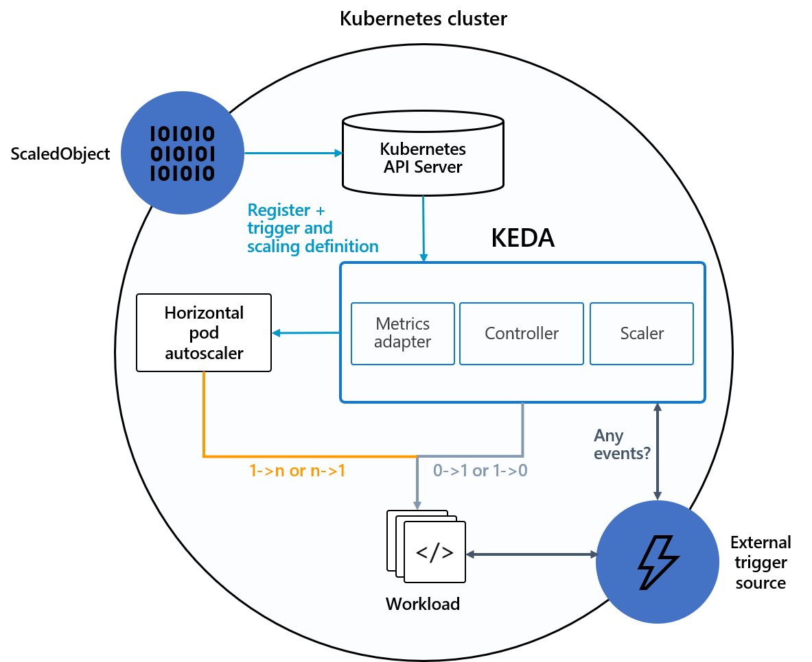

Most container applications use Horizontal Pod Autoscaler (HPA) to scale number of its pods. HPA uses the observed metrics in the controllers (deployment) such as average CPU utilization, average memory utilization or any other custom metrics to scale up or scale down the number of pods replicas linked to the controller.

However, many applications relies on external events like message in AWS SQS, KAFKA topics or AWS CloudWatch to scale their pods in order to support the coming requests.

### KEDA

*KEDA* is a Kubernetes based Event Driven Autoscaler. With KEDA, you can drive the scaling of any container in Kubernetes based on the number of events needing to be processed.
It performs two key roles within Kubernetes:

1. *Agent* — KEDA activates and deactivates Kubernetes Deployments <https://kubernetes.io/docs/concepts/workloads/controllers/deployment> to scale to and from zero on no events. This is one of the primary roles of the keda-operator container that runs when you install KEDA.
2. *Metrics* — KEDA acts as a Kubernetes metrics server <https://kubernetes.io/docs/tasks/run-application/horizontal-pod-autoscale/#support-for-custom-metrics> that exposes rich event data like queue length or stream lag to the Horizontal Pod Autoscaler to drive scale out. It is up to the Deployment to consume the events directly from the source. This preserves rich event integration and enables gestures like completing or abandoning queue messages to work out of the box. The metric serving is the primary role of the keda-operator-metrics-apiserver container that runs when you install KEDA.

KEDA has a wide range of *scalers* <https://keda.sh/scalers> that can both detect if a deployment should be activated or deactivated, and feed custom metrics for a specific event source.

This diagram shows how KEDA will use events from an external trigger source (scalers). KEDA uses the ScaledObject definition to map between the external source and the target controller (deployment, statefulset). Then trigger the HPA configuration based of length of queue.
