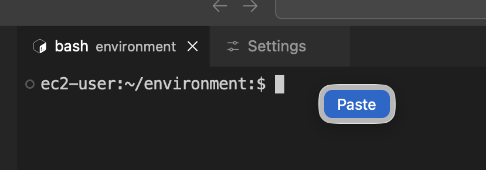
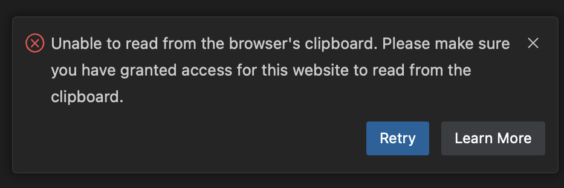

import Tabs from '@theme/Tabs';
import TabItem from '@theme/TabItem';

Let’s review how to navigate this website and the content provided.

## Structure

The content of this workshop is made up of:

1. Individual lab exercises
2. Supporting content that explains concepts related to the labs

The lab exercises are designed in a way that you can run any modules as a self-contained exercise. Lab exercises will be displayed in the sidebar to the left and are designated by the `LAB` icon.

## Opening the IDE

If you haven't done so yet, you can open the IDE from the *Event outputs* section at the bottom of the start page.

 

## Prepare Environment

The `prepare-environment` tool helps you set up and configure your lab environment for each section. Simply run:

```
$ prepare-environment $MODULE_NAME
```

### Basic Usage Patterns
```
$ prepare-environment $MODULE_NAME/$LAB
```

:::caution
You should start each lab from the page indicated by "BEFORE YOU START" badge. Starting in the middle of a lab will cause unpredictable behavior.
:::

## Tips

### Copy/Paste Permission
Depending on your browser, you may need to copy/paste content differently in to the Code Server terminal. 

<Tabs>
  <TabItem value="Google Chrome" label="Google Chrome (Recommended)" default>
    First time when you try to paste content in the terminal, you will see a browser pop-up that looks like this:

    

    Click **Allow** button to enable this functionality. After this, the subsequent copy/paste will be straight forward. For this workshop, we recommend using Google Chrome if possible.
  </TabItem>
  <TabItem value="Firefox/Safari" label="Firefox/Safari">
    Every time when you try to paste content in the terminal, you will see a small button as shown in the following screenshot adjacent to your mouse pointer. You will need to click on it to actually paste the copied content. 

    

    Additionally, you may also see the following pop-up box on the bottom-right corner of your editor window, which you may close and ignore. 

    
  </TabItem>
</Tabs>

### Terminal commands

Most of the interaction you will do in this workshop will be done with terminal commands, which you can either manually type or copy/paste to the IDE terminal. You will see this terminal commands displayed like this:

```bash test=false
$ echo "This is an example command"
```

Hover your mouse over `echo "This is an example command"` and click to copy that command to your clipboard.

You will also come across commands with sample output like this:

```bash test=false
$ date
Fri Aug 30 12:25:58 MDT 2024
```

Using the 'click to copy' function will only copy the command and ignore the sample output.

Another pattern used in the content is presenting several commands in a single terminal:

```bash test=false
$ echo "This is an example command"
This is an example command
$ date
Fri Aug 30 12:26:58 MDT 2024
```

In this case you can either copy each command individually or copy all of the commands using the clipboard icon in the top right corner of the terminal window. Give it a shot!

### Using Kustomize

[Kustomize](https://kustomize.io/) allows you to manage Kubernetes manifest files using declarative "kustomization" files. It provides the ability to express "base" manifests for your Kubernetes resources and then apply changes using composition, customization and easily making cross-cutting changes across many resources.

In this workshop, you will see the following two types of commands involving Kustomize.

1. `kubectl kustomize some-deployment.yaml` - This command **generates** the customized version of the yaml using Kustomize configuration. It does not deploy the resource.

1. `kubectl apply -k some-deployment.yaml` - This command directly **applies** the customized version of the yaml using Kustomize configuration and deploys the resource.

You can learn more about Kustomize at https://kustomize.io/.

### Using Kustomize

[Kustomize](https://kustomize.io/) allows you to manage Kubernetes manifest files using declarative "kustomization" files. It provides the ability to express "base" manifests for your Kubernetes resources and then apply changes using composition, customization and easily making cross-cutting changes across many resources.

In this workshop, you will see the following two types of commands involving Kustomize.

1. `kubectl kustomize some-deployment.yaml` - This command **generates** the customized version of the yaml using Kustomize configuration. It does not deploy the resource.

1. `kubectl apply -k some-deployment.yaml` - This command directly **applies** the customized version of the yaml using Kustomize configuration and deploys the resource.

You can learn more about Kustomize at https://kustomize.io/.

## Next Steps

Now that you're familiar with the format of this workshop, pick one of the two options to define your learning journey.

<div style={{display: 'flex', gap: '2rem', marginTop: '2rem', flexWrap: 'wrap'}}>
  <a href="./basics" style={{textDecoration: 'none', color: 'inherit', flex: '1', minWidth: '280px', maxWidth: '400px'}}>
    <div style={{border: '2px solid #ddd', borderRadius: '8px', padding: '2rem', height: '100%', cursor: 'pointer'}}>
      <h3 style={{marginTop: 0}}>Kubernetes Basics</h3>
      <p>Learn Kubernetes basics before diving deeper into EKS.</p>
    </div>
  </a>
    <a href="./getting-started" style={{textDecoration: 'none', color: 'inherit', flex: '1', minWidth: '280px', maxWidth: '400px'}}>
    <div style={{border: '2px solid #ddd', borderRadius: '8px', padding: '2rem', height: '100%', cursor: 'pointer'}}>
      <h3 style={{marginTop: 0}}>Developer/Operator Essentials</h3>
      <p>Learn essential EKS features for either being a developer or an operator.</p>
    </div>
  </a>
</div>