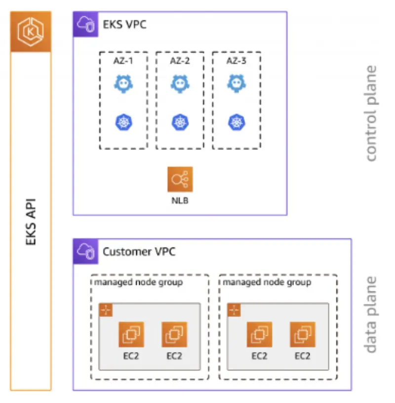

An EKS cluster contains one or more EC2 nodes that Pods are scheduled on. EKS nodes run in your AWS account and connect to the control plane of your cluster through the cluster API server endpoint. You deploy one or more nodes into a node group. A node group is one or more EC2 instances that are deployed in an EC2 Auto Scaling group.

EKS nodes are standard Amazon EC2 instances. You're billed for them based on EC2 prices. For more information, see [Amazon EC2 pricing](https://aws.amazon.com/ec2/pricing/).

[Amazon EKS managed node groups](https://docs.aws.amazon.com/eks/latest/userguide/managed-node-groups.html) automate the provisioning and lifecycle management of nodes for Amazon EKS clusters. This greatly simplifies operational activities such as rolling updates for new AMIs or Kubernetes version deployments.

Advantages of running Amazon EKS managed node groups include:

- Create, automatically update, or terminate nodes with a single operation using the Amazon EKS console, `eksctl`, AWS CLI, AWS API, or infrastructure as code tools including AWS CloudFormation and Terraform
- Provisioned nodes run using the latest Amazon EKS optimized AMIs
- Nodes provisioned as part of a MNG are automatically tagged with metadata such as availability zones, CPU architecture and instance type
- Node updates and terminations automatically and gracefully drain nodes to ensure that your applications stay available
- No additional costs to use Amazon EKS managed node groups, pay only for the AWS resources provisioned

The labs in this section deal with various ways that EKS managed node groups can be used to provide compute capacity to a cluster.
