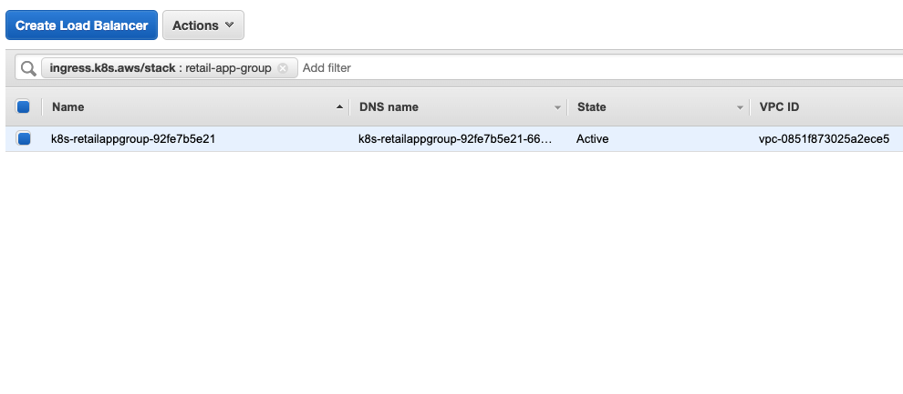
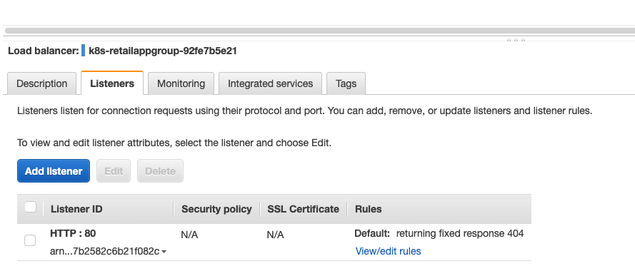
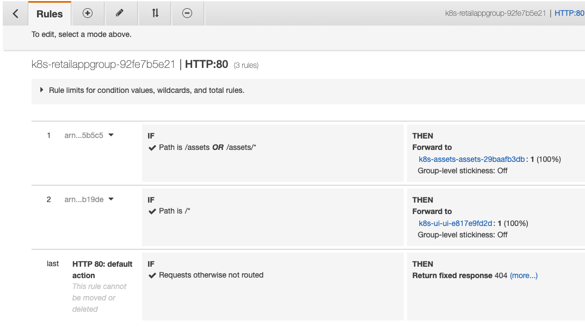

It is common to leverage multiple `Ingress` objects in the same EKS cluster, for example to expose multiple different workloads. By default each `Ingress` will result in the creation of a separate ALB, but we can leverage the IngressGroup feature which enables you to group multiple Ingress resources together. The controller will automatically merge Ingress rules for all Ingresses within IngressGroup and support them with a single ALB. In addition, most annotations defined on an Ingress only apply to the paths defined by that Ingress.

In this example we'll expose the `assets` service out through the same ALB as the `ui` component, leveraging path-based routing to dispatch requests to the appropriate Kubernetes service.

The first thing we will do is re-create the `Ingress` for `ui` component adding the annotation `alb.ingress.kubernetes.io/group.name`:

```file
exposing/ingress/multiple-ingress/ingress-ui.yaml
```

Now we can create a separate `Ingress` for the `assets` component that also leverages the same `group.name`:

```file
exposing/ingress/multiple-ingress/ingress-assets.yaml
```

This ingress is also configuring rules to route requests prefixed with `/assets` to the `assets` component.

Apply these manifests to the cluster:

```bash timeout=180 hook=multiple-ingress hookTimeout=430
$ kubectl apply -k /workspace/modules/exposing/ingress/multiple-ingress
```


(ADD ingress stuff)


The ALB provisioned for this ingress will have changes we can look at:

https://us-west-2.console.aws.amazon.com/ec2/home?region=us-west-2#LoadBalancers:tag:ingress.k8s.aws/stack=retail-app-group;sort=loadBalancerName

Notice that the load balancer name now includes the `group.name` used in the annotation on the `Ingress`:



Select the *Listeners* tab and click the link *View/edit rules*:



The rules will show that requests with a path starting with `/assets` will be routed to the `assets` component and all other requests will be routed to the `ui` component:

