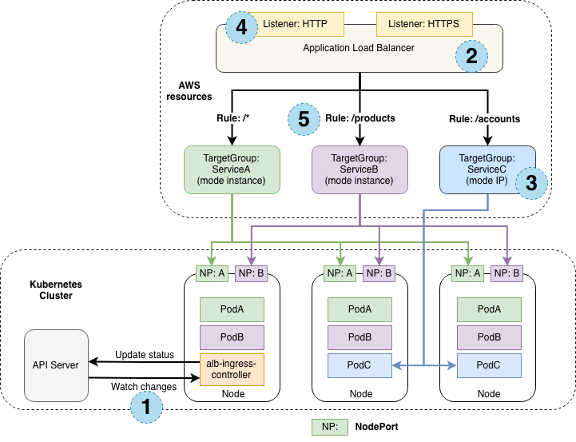

As mentioned previously, the NLB we have created is operating in "instance mode". Instance target mode supports pods running on AWS EC2 instances. In this mode, AWS NLB sends traffic to the instances and the `kube-proxy` on the individual worker nodes forward it to the pods through one or more worker nodes in the Kubernetes cluster.

The AWS Load Balancer Controller also supports creating NLBs operating in "IP mode". In this mode, the AWS NLB sends traffic directly to the Kubernetes pods behind the service, eliminating the need for an extra network hop through the worker nodes in the Kubernetes cluster. IP target mode supports pods running on both AWS EC2 instances and AWS Fargate.



There are several reasons why we might want to configure the NLB to operate in IP target mode:

1. It creates a more efficient network path for inbound connections, bypassing `kube-proxy` on the EC2 worker node
2. It removes the need to consider aspects such as `externalTrafficPolicy` and the trade-offs of its various configuration options
3. An application is running on Fargate instead of EC2

### Re-configuring the NLB

Let's reconfigure our NLB to use IP mode and look at the effect it has on the infrastructure.

This is the patch we'll be applying to re-configure the Service:

```kustomization
exposing/load-balancer/ip-mode/nlb.yaml
Service/ui-nlb
```

Apply the manifest with kustomize:

```bash
$ kubectl apply -k /workspace/modules/exposing/load-balancer/ip-mode
```

It will take a few minutes for the configuration of the load balancer to be updated. Run the following command to ensure the annotation is updated:

```bash
$ kubectl describe service/ui-nlb -n ui
...
Annotations:              service.beta.kubernetes.io/aws-load-balancer-nlb-target-type: ip
...
```

You should be able to access the application using the same URL as before, with the NLB now using IP mode to expose your application.

```bash
$ ALB_ARN=$(aws elbv2 describe-load-balancers --query 'LoadBalancers[?contains(LoadBalancerName, `k8s-ui-uinlb`) == `true`].LoadBalancerArn' | jq -r '.[0]')
$ TARGET_GROUP_ARN=$(aws elbv2 describe-target-groups --load-balancer-arn $ALB_ARN | jq -r '.TargetGroups[0].TargetGroupArn')
$ aws elbv2 describe-target-health --target-group-arn $TARGET_GROUP_ARN
{
    "TargetHealthDescriptions": [
        {
            "Target": {
                "Id": "10.42.10.197",
                "Port": 8080,
                "AvailabilityZone": "us-west-2a"
            },
            "HealthCheckPort": "8080",
            "TargetHealth": {
                "State": "initial",
                "Reason": "Elb.RegistrationInProgress",
                "Description": "Target registration is in progress"
            }
        }
    ]
}
```

Notice that we've gone from the 3 targets we observed in the previous section to just a single target. Why is that? Instead of registering the EC2 instances in our EKS cluster the load balancer controller is now registering individual Pods and sending traffic directly, taking advantage of the AWS VPC CNI and the fact that Pods each have a first-class VPC IP address.

Let's scale up the ui component to 3 replicas see what happens:

```bash
$ kubectl scale -n ui deployment/ui --replicas=3
$ kubectl wait --for=condition=Ready pod -n ui -l app.kubernetes.io/name=ui --timeout=60s
```

Now check the load balancer targets again:

```bash
$ ALB_ARN=$(aws elbv2 describe-load-balancers --query 'LoadBalancers[?contains(LoadBalancerName, `k8s-ui-uinlb`) == `true`].LoadBalancerArn' | jq -r '.[0]')
$ TARGET_GROUP_ARN=$(aws elbv2 describe-target-groups --load-balancer-arn $ALB_ARN | jq -r '.TargetGroups[0].TargetGroupArn')
$ aws elbv2 describe-target-health --target-group-arn $TARGET_GROUP_ARN
{
    "TargetHealthDescriptions": [
        {
            "Target": {
                "Id": "10.42.12.102",
                "Port": 8080,
                "AvailabilityZone": "us-west-2c"
            },
            "HealthCheckPort": "8080",
            "TargetHealth": {
                "State": "initial",
                "Reason": "Elb.RegistrationInProgress",
                "Description": "Target registration is in progress"
            }
        },
        {
            "Target": {
                "Id": "10.42.10.197",
                "Port": 8080,
                "AvailabilityZone": "us-west-2a"
            },
            "HealthCheckPort": "8080",
            "TargetHealth": {
                "State": "healthy"
            }
        },
        {
            "Target": {
                "Id": "10.42.10.169",
                "Port": 8080,
                "AvailabilityZone": "us-west-2a"
            },
            "HealthCheckPort": "8080",
            "TargetHealth": {
                "State": "initial",
                "Reason": "Elb.RegistrationInProgress",
                "Description": "Target registration is in progress"
            }
        }
    ]
}
```

As expected we now have 3 targets, matching the number of replicas in the ui Deployment.

If you want to wait to make sure the application still functions the same, run the following command. Otherwise you can proceed to the next module.

```bash timeout=240
$ wait-for-lb $(kubectl get service -n ui ui-nlb -o jsonpath="{.status.loadBalancer.ingress[*].hostname}{'\n'}")
```
