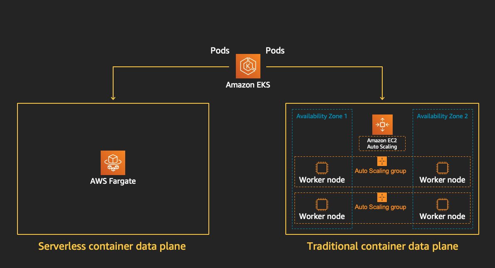

:::tip Before you start
Prepare your environment for this section:

```bash timeout=300 wait=30
$ reset-environment 
```

:::

In the previous module we saw how to provision EC2 compute instances to run Pods in our EKS cluster, and how managed node groups help reduce the operational burden. However, in this model you’re still responsible for the availability, capacity, and maintenance of the underlying infrastructure.

[AWS Fargate](https://aws.amazon.com/fargate/)  is a technology that provides on-demand, right-sized compute capacity for containers. With AWS Fargate, you don't have to provision, configure, or scale groups of virtual machines on your own to run containers. You also don't need to choose server types, decide when to scale your node groups, or optimize cluster packing. You can control which Pods start on Fargate and how they run with Fargate profiles. Fargate profiles are defined as part of your Amazon EKS cluster.



Amazon EKS integrates Kubernetes with AWS Fargate by using controllers that are built by AWS using the upstream, extensible model provided by Kubernetes. These controllers run as part of the Amazon EKS managed Kubernetes control plane and are responsible for scheduling native Kubernetes Pods onto Fargate. The Fargate controllers include a new scheduler that runs alongside the default Kubernetes scheduler in addition to several mutating and validating admission controllers. When you start a Pod that meets the criteria for running on Fargate, the Fargate controllers that are running in the cluster recognize, update, and schedule the Pod onto Fargate.

The benefits of Fargate include:
* AWS Fargate enables you to focus on your applications. You define your application content, networking, storage, and scaling requirements. There is no provisioning, patching, cluster capacity management, or infrastructure management required.
* AWS Fargate supports all of the common container use cases including microservices architecture applications, batch processing, machine learning applications, and migrating on-premises applications to the cloud.
* Choose AWS Fargate for its isolation model and security. You should also select Fargate if you want to launch containers without having to provision or manage EC2 instances. If you require greater control of your EC2 instances or broader customization options, then use ECS or EKS without Fargate.
