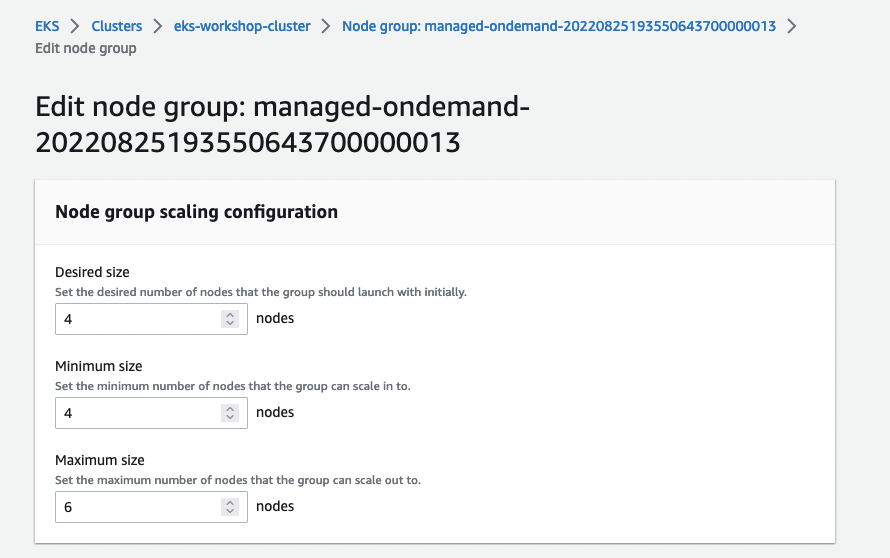

While working with your cluster, you may need to update your managed node group configuration to add additional nodes to support the needs of your workloads. A nodegroup can be scaled using Amazon EKS Console OR  using `eksctl scale nodegroup` command.

 To edit your managed node group configuration using Amazon EKS Console, navigate to the Amazon EKS console at [https://console.aws.amazon.com/eks/home#/clusters](https://console.aws.amazon.com/eks/home#/clusters).

Next, click the `eks-workshop`, select the **Compute** tab, and select the node group to edit and choose **Edit**.

On the **Edit node group** page, you can see the following settings under **Node group scaling configuration**: **Desired size**, **Minimum size** and **Maximum size**. Bump the **Minimum size** *and* **Desired size** from `2` to `3`. Scroll down and hit **Save changes**.





**Alternatively**, you can also change nodegroup configuration using `eksctl` command. To change your nodegroup configuration using `eksctl` command, first let's retrieve the current nodegroup scaling configuration and look at **minimum size**, **maximum size** and **desired capacity** of nodes using eksctl command below:

```bash
$ eksctl get nodegroup --name $EKS_DEFAULT_MNG_NAME --cluster $EKS_CLUSTER_NAME
```

We'll scale the nodegroup in `eks-workshop` by changing the node count from `2` to `3` for **minimum size** and **desired capacity** using below command:
>Note: You do not need to run below command if you have changed the size of nodegroup using `Amazon EKS Console`.

```bash
$ eksctl scale nodegroup --name $EKS_DEFAULT_MNG_NAME --cluster $EKS_CLUSTER_NAME --nodes 3 --nodes-min 3 --nodes-max 6
```

:::tip
A node group can also be updated using the `aws` CLI with the following command. See the [docs](https://docs.aws.amazon.com/cli/latest/reference/eks/update-nodegroup-config.html) for more info.

```
aws eks update-nodegroup-config --cluster-name $EKS_CLUSTER_NAME --nodegroup-name $EKS_DEFAULT_MNG_NAME --scaling-config minSize=3,maxSize=6,desiredSize=3
```
:::

After making changes to the node group via `Amazon EKS Console` or `eksctl` command, it may take up to **2-3 minutes** for node provisioning and configuration changes to take effect. Let's retrieve the nodegroup configuration again and look at **minimum size**, **maximum size** and **desired capacity** of nodes using eksctl command below:

```bash
$ eksctl get nodegroup --name $EKS_DEFAULT_MNG_NAME --cluster $EKS_CLUSTER_NAME
```

You can also review changed worker node count with following command, which lists all nodes in our managed node group by using the label as a filter.

```bash
$ kubectl get nodes -l eks.amazonaws.com/nodegroup=$EKS_DEFAULT_MNG_NAME
NAME                                         STATUS     ROLES    AGE   VERSION
ip-10-42-10-11.us-west-2.compute.internal    Ready      <none>   22m   v1.23.9-eks-ba74326
ip-10-42-11-143.us-west-2.compute.internal   Ready      <none>   22m   v1.23.9-eks-ba74326
ip-10-42-12-117.us-west-2.compute.internal   NotReady   <none>   10s   v1.23.9-eks-ba74326
```

Notice that the node shows a status of `NotReady`, which happens when the new node is still in the process of joining the cluster. We can also use `kubectl wait` to watch until all the nodes report `Ready`:

```bash
$ kubectl wait --for=condition=Ready nodes --all --timeout=300s
```
